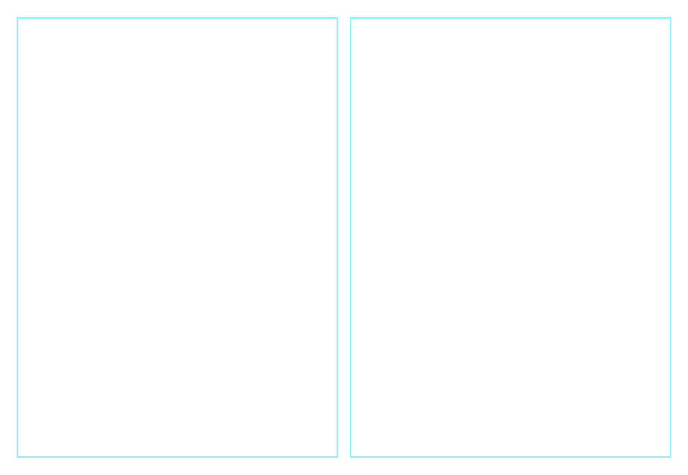

<p align="center">
    <a href="https://github.com/vmware/versatile-data-kit/pulse" alt="Activity">
        </a>
    <a href="https://github.com/vmware/versatile-data-kit/contributors" alt="Last Activity">
        </a>
    <a href="https://github.com/vmware/versatile-data-kit/blob/main/LICENSE" alt="License">
        </a>
    <a href="https://github.com/pre-commit/pre-commit">
        </a>
    <a href="https://github.com/vmware/versatile-data-kit">
        </a>
    <a href="https://twitter.com/intent/tweet?text=Wow: @VDKProject">
        </a>
     <a href="https://www.youtube.com/channel/UCasf2Q7X8nF7S4VEmcTHJ0Q">
        </a>

<!-- TODO: code coverage -->
</p>


# Overview

Versatile Data Kit (VDK) is a data framework that enables Data Engineers to
- 🧑‍💻develop,
- ▶️run,
- 📊and manage data workloads, aka [data jobs](https://github.com/vmware/versatile-data-kit/wiki/dictionary#data-job)


Its Lego-like design consists of lightweight Python modules installed via `pip` package manager. All VDK plugins are easy to combine.

VDK CLI can generate a data job and run your Python code and SQL queries.

**🎯VDK SDK makes your code shorter, more readable, and faster to create.**<br>
**🚦Ready-to-use data ETL/ELT patterns make Data Engineering with VDK efficient.**

Data Engineers use VDK to implement automatic pull ingestion (E in ELT) and batch data transformation (T in ELT) into a database or any other data storage.


# Data Journey and Versatile Data Kit

VDK creates data processing workflows to:

- Ingest data (extract)
- Transform data (transform)
- Export data (load)


# Solve common data engineering problems
- Ingest data from different sources, including CSV files, JSON objects, and data from REST API services.
- Use Python/SQL and VDK templates to transform data.
- Ensure data applications are packaged, versioned, and deployed correctly while dealing with credentials, retries, and reconnects.
- Provide built-in monitoring and smart notification capabilities.
- Track both code and data modifications and the relationship between them, allowing quicker troubleshooting and version rollback.

<!-- This is going to be transferred to the VDK CLI page to be linked: -->
### A preview of the VDK CLI commands:
- `vdk create`
- `vdk run`
- `vdk deploy`<br>
  <br> 


# VDK components

<p>

</p>


# Getting Started

## Create and run data jobs locally

```
pip install quickstart-vdk
```

This installs the core vdk packages and the vdk command line interface. You can
use them to run jobs in your local shell environment.

See also the [Getting
Started](https://github.com/vmware/versatile-data-kit/wiki/getting-started)
section of the wiki

## Run the Control Service locally with Docker and Kubernetes

Using Kubernetes for your data jobs workflow provides additional benefits, such
as continuous delivery, easier collaboration, streamlined data job
orchestration, high availability, security, and job runtime isolation

More info https://kubernetes.io/docs/concepts/overview/

**Prerequisites**
- [helm](https://helm.sh/docs/intro/install)
- [docker](https://docs.docker.com/get-docker)
- [kind](https://kind.sigs.k8s.io/docs/user/quick-start/#installation) (version 0.11.1 or later)

```
vdk server --install
```

You can then use the vdk cli to create and deploy jobs and the UI to manage
them.

# Next Steps

🏃 [Getting Started](https://github.com/vmware/versatile-data-kit/wiki/getting-started)</br>
📖 [VDK Examples](https://github.com/vmware/versatile-data-kit/wiki/Examples) try VDK yourself</br>
🪜 [A step-by-step guide building a Web App with Streamlit and VDK](https://towardsdatascience.com/how-to-build-a-web-app-with-data-ingested-through-versatile-data-kit-ddae43b5f62d](https://towardsdatascience.com/how-to-build-a-web-app-with-data-ingested-through-versatile-data-kit-ddae43b5f62d )</br>
▶️ [VDK UI - Installation and Getting Started](https://www.youtube.com/watch?v=DLRGCCGUp0U)</br>
🗣️ Get to know us and ask questions at our [community meeting](https://github.com/vmware/versatile-data-kit/wiki/Community-and-Resources)</br>

# Additional Resources
🔍 [Documentation](https://github.com/vmware/versatile-data-kit/wiki/Introduction) for VDK.</br>
📖 [Running in production](https://github.com/vmware/versatile-data-kit/wiki/Installation#install-versatile-data-kit-control-service)</br>
▶️ [VDK Operations UI Overview](https://www.youtube.com/watch?v=9BkAOSvXuUg)</br>

# Contributing
Create an [issue](https://github.com/vmware/versatile-data-kit/issues) or [pull request](https://github.com/vmware/versatile-data-kit/pulls) on GitHub to submit suggestions or changes. If you are interested in contributing as a developer, visit the [contributing](https://github.com/vmware/versatile-data-kit/blob/main/CONTRIBUTING.md) page.

# Contacts
- Connect on Slack by:
    - Joining the [CNCF Slack workspace](https://communityinviter.com/apps/cloud-native/cncf).
    - Joining the [#versatile-data-kit](https://cloud-native.slack.com/archives/C033PSLKCPR) channel.
- Follow us on [Twitter](https://twitter.com/VDKProject).
- Subscribe to the [Versatile Data Kit YouTube Channel](https://www.youtube.com/channel/UCasf2Q7X8nF7S4VEmcTHJ0Q).
- Join our [development mailing list](mailto:join-versatiledatakit@groups.vmware.com), used by developers and maintainers of VDK.

# Code of Conduct
Everyone involved in working on the project's source code, or engaging in any issue trackers, Slack channels, and mailing lists is expected to be familiar with and follow the [Code of Conduct](https://github.com/vmware/versatile-data-kit/blob/main/CODE_OF_CONDUCT.md).
