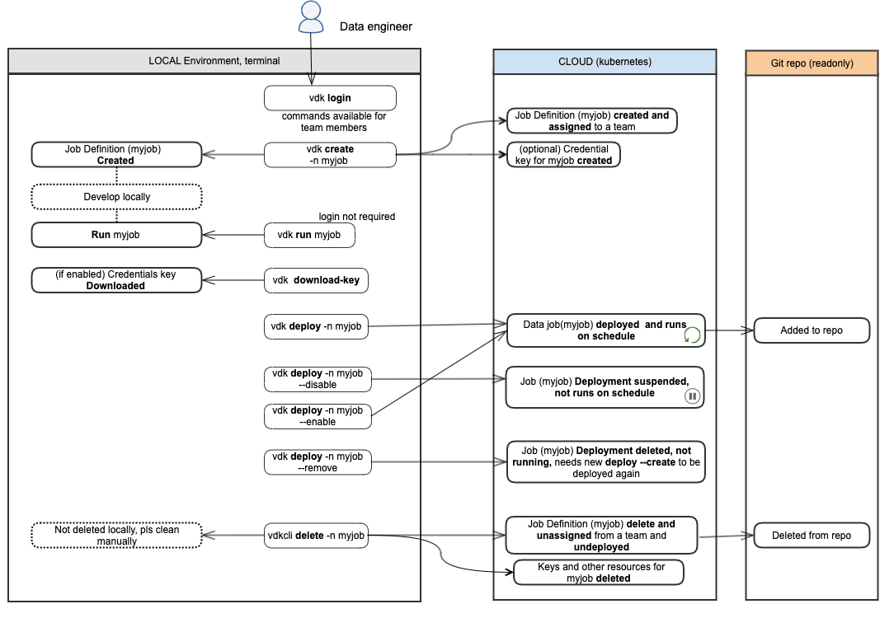

> :warning: IN PROGRESS

- [Overview](#overview)
- [Installation](#installation)
- [Data Job Types](#data-job-types)
- [Data Job Structure](#data-job-structure)
- [Python steps (.py)](#python-steps--py-)
- [Ingesting data](#ingesting-data)
- [Data Job Properties](#data-job-properties)
- [Data Job Configuration](#data-job-configuration)
- [Python dependencies (requirements.txt)](#python-dependencies--requirementstxt-)
- [Data Job Execution](#data-job-execution)
- [Resiliency](#resiliency)
- [Data Jobs Development Workflow](#data-jobs-development-workflow)

<!-- Table of contents generated with markdown-toc: http://ecotrust-canada.github.io/markdown-toc -->

# Overview 

Versatile Data Kit feature allows you to implement automated pull ingestion and batch data processing. Typical use cases are:

- ingest data from another system, database, or API;
- clean and transform ingested data into a schema convenient for reporting (such as a data warehouse model);
- refresh or aggregate data on a scheduled basis;
- reuse/expose a simplified / use-case-specific / cleaned-up schema to third parties.

These can be achieved by running parameterized SQL queries and Python scripts in an automated manner on top of Kubernetes infrastructure in the form of Data Ingestion and Data Processing Jobs.

Versatile Data Kit supports quering multiple databases using its [Plugin framework](https://github.com/vmware/versatile-data-kit/wiki/dictionary#vdk-plugins). You can see supported plugins [here](https://github.com/vmware/versatile-data-kit/tree/main/projects/vdk-core/plugins). [Open a new ticket](https://github.com/vmware/versatile-data-kit/issues/new?assignees=&labels=enhancement&template=feature_request.md&title=) if your database is missing.

This user guide is primarily focused on Data Developers of Data Jobs.
For Operators operating Control Service see [[Operator Guide]]

# Installation
See [[Installation]]

# Data Job Types
There are can be different types of Data Jobs depending on what they do:

- Ingestion jobs - jobs that add data to a database
- Processing jobs - jobs that process data from one database and populate another database
- Publishing jobs - jobs that update and publish the end-user facing report or export data for user-facing app consumption


You can read more about the differences in data between those at [[Business Intelligence journey|bi journey]]

A typical Ingestion job:
- Reads from some API or database
- Does NOT do any transformations on the data (besides formating the payload to be accepted by target (e.g json serialization)). 
- Pushes the data to some Ingestion target

A typical Processing job:

- Creates a materialised view
- Data comes from a source database
- Data goes to a target database
- Data in the target database is in a star schema
- Schema is populated using standard fact/dimension loading strategies (relevant ones are implemented in the platform, so it is 1-liner in terms of Data Job code)

A typical Publishing Job 
- Pull data into memory and create (tableau) extract or publishes SQL query/view to a reporting system
- Caches data into caching service so that it can be used by User facing UI (for example)


# Data Job Structure

```
example/
├── 10_ensure_example_table_exists.sql (optional)
├── 20_add_data_to_example_table.py (optional)
├── 30_sql_step.sql (optional)
├── config.ini
├── requirements.txt (optional)
example.keytab (optional)
```

## Data Job steps
Data Job steps exist as .sql and/or .py files in a directory along with the job configuration. Scripts are executed in alphabetical order, e.g. if we have a Data Job that consists of file1.sql and file2.py , then file1.sql will be executed first, followed by file2.py.

### SQL Steps

SQL steps (.sql)
SQL scripts are standard SQL scripts. They are executed against configured database. (run vdk config-help to see how to configure it)

Common uses of SQL steps are:

- aggregating data from other tables to a new one 
- creating a table or a view that is needed for the python steps

Queries in .sql files can be parametrised. A valid query parameter looks like → {parameter}. Parameters will be automatically replaced if there is a corresponding value existing in the [[Data Job properties|dictionary#data-job-properties]] or (if used) [[Data Job Arguments|dictionary#data-job-arguments]].

# Python steps (.py)
This is the structure of a python step:

```python
def run(job_input: IJobInput):
    job_input.do_something()
```

See the [documentation of the job_input object methods](https://github.com/vmware/versatile-data-kit/blob/main/projects/vdk-core/src/vdk/api/job_input.py) for details about the capabilities.

Only scripts which have implemented run(job_input) method will be executed.<br>
Any other python files will not be executed by VDK and can be used to store common code (libraries) to be reused in job steps.

Note: Query parameter substitution works the same way for SQL scripts and Python: job_input.execute_query() method.

# Ingesting data  
As usual - it is a one-liner, e.g.:

Example: send any JSON-able Python object for ingestion
```python
job_input.send_object_for_ingestion( {'some number': 4098, 'some text': "hi!"}, "name_of_table_that_receives_the_data" ) # Every Python object is a dictionary, so we are showing an example with a dictionary here.
```
For real-life production examples you can check [[examples]], e.g. example-ingest-from-api.

# Data Job Properties
Data jobs support properties stored in Control Service API by default (plugins can extend this). Job properties serve to:

- store credentials securely
- store Data Job state
- store job deployment configuration 

The [IProperties](https://github.com/vmware/versatile-data-kit/wiki/dictionary#data-job-properties) interface in JobInput is used to manipulate the properties.

To be able to use Data Jobs properties, You can then manipulate the properties using a code like this one:

```python
def run(job_input: IJobInput):
    properties = job_input.get_all_properties()
    properties["db_pass"] = "the password goes here"
    job_input.set_all_properties(properties)
```
or using CLI 
```bash
vdk properties --help
```

# Data Job Configuration

In order to see how to configure Data Job run (locally) e.g how to set credentials, ingestion endpoints, etc.

```python
vdk config-help
```

## config.ini

Here, the Data Job owner team, execution schedule and notifications are setup. 
The file follows the python ConfigParser format.

This is an example config file:

```
[owner]
team = my-team

[job]
schedule_cron = 30 22 * * *
python_requirements_file = other-requirements.txt

[contacts]
notified_on_job_failure_user_error = user1@vmware.com, user2@vmware.com, team1@vmware.com
notified_on_job_failure_platform_error = user1@vmware.com
notified_on_job_success =
notified_on_job_deploy = user1@vmware.com
```

#### team
Specified which is the [team](https://github.com/vmware/versatile-data-kit/wiki/Features#teams-support) that owns the Data Job. Value is case-sensitive and must be an actual team name. Generally, it should be auto-populated when creating a job. It is primarily for information purposes. Changing it won't have effect.

#### schedule_cron
cron scheduling format is described here: https://en.wikipedia.org/wiki/Cron.
The cron expression is evaluated in UTC time.
If it is time for a new job run and the previous job run hasn’t finished yet, the old execution is left to finish and the new execution is skipped

#### [contacts]
Semicolon-separated list of email addresses that will be notified with email message on a given condition.
You can also provide email address linked to your Slack account in order to receive Slack messages.
To generate Slack linked email address follow the steps here.

###### notified_on_job_failure_user_error
Semicolon-separated list of email addresses to be notified on job execution failure caused by user code or user configuration problem.
For example: if the job contains an SQL script with syntax error.

###### notified_on_job_failure_platform_error
Semicolon-separated list of email addresses to be notified on job execution failure caused by a platform problem, including job execution delays.

###### notified_on_job_success
Semicolon-separated list of email addresses to be notified on job execution success.

###### notified_on_job_deploy
Semicolon-separated list of email addresses to be notified of job deployment outcome.
Notice: If this file is malformed (file structure is not as per ConfigParser), then an email notification will NOT be sent to the recipients specified here.

###### enable_attempt_notifications
_(If enabled by Control Service operators)<br>_
Flag to enable or disable the email notifications sent to the recipients listed above for each Data Job run attempt. The default value is True.

###### enable_execution_notifications 
_(If enabled by Control Service operators)<br>_
Flag to enable or disable email notifications per Data Job execution and execution delays. The default value is True.

See Dictionary for difference between [[Job Attempt|dictionary#data-job-attempt]] and [[Job Execution|dictionary#data-job-execution]]

###### notification_delay_period_minutes 
_(If enabled by Control Service operators)<br>_

Specifies the time interval (in minutes) that job execution is allowed to be delayed from its scheduled time before a notification email is sent. These emails are sent to the addresses configured in the notified_on_job_failure_platform_error property. The default value is 240 (i.e. 4 hours).

# Python dependencies (requirements.txt)
This file is needed when we have a Data Job that uses external python libraries. It is only applicable to Data Job runs over the Cloud (kubernetes) infrastructure. The effect is the same as executing 'pip install -r requirements.txt'.
For local runs of the job, you will need to install the requirements manually in your execution virtualenv.

requirements.txt file follows a specific format that is described here: https://pip.pypa.io/en/stable/reference/pip_install/#example-requirements-file.

We recommend to explicitly specify the versions of the dependencies and to use fixed versions. This makes the Data Job builds much more stable and reproducible.
Do not override VDK version, all jobs are automatically running the same (maybe latest) version of VDK thus ensure better quality and reproducibility.

# Data Job Execution
See [[Getting Started]] on how to run a Data Job.

When scheduled in Control Service Cloud, jobs run in a container.
They have a couple of Gigabytes of local storage which is available only during the execution of the job. Then the container is deleted.

Those resources can be configured per job during deployment.

# Resiliency

All Data Jobs should be atomic and idempotent - should be OK for a job to fail somewhere in the middle; subsequent restart should not cause data corruption.

Once deployed, (if operators of Control Service have enabled it) Data Jobs will be automatically restarted on errors caused by infrastructure issues (e.g. intermittent issues with network connectivity).


# Data Jobs Development Workflow



The deployment/un-deployment/modification of Data Jobs is done using VDK Command Line interface (which is user friendly wrapper against Control Service API).

See `vdk --help` for full details and examples on how those commands work.
