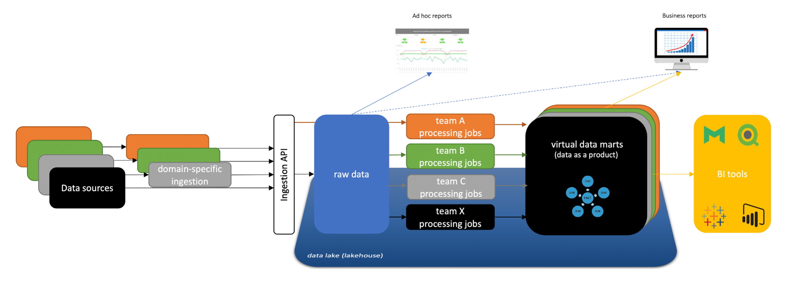

# BI Journey

A common pattern these days (ELT) where raw data is loaded into staging or lake tables and then transformed using a series of transformations.
Those transformations can be written in SQL, Python, Spark, etc.
Then the data can be used by building business reports or send to be used by customer facing data applications.

**Ingest**

The process of pushing data from various sources to  Data Lake (or LakeHouse).
Some domain knowledge about the product is necessary so software engineer working on product is needed.
Data Ingestion Jobs can be used to easily pull data from disparate system and put them in configurable place.
Ingestion Data Jobs can be as complex as python allows.
Or (thorough its plugin framework) can be easily integrated with open source sink and source providers

**Process**

The process of building curated datasets, which are ready to be easily consumed by the business for specific use cases: cleansing, applying business logic or aggregations to the raw data from the lake.
In order to implement the needed 'data massaging', people need to understand the semantics of the raw data, advanced SQL knowledge and optionally, Python.
The data ends up Data Warehouse (this is purely logic different, Warehouse can be same database as in the Lake)
The task is usually done by a data engineer and lately data analysts with SQL knowledge
Data Processing Jobs enable both Data Engineers and Analysts to contribute by exposing Data engineering abstractions.
Job Deployment API can make it easy to integate in an IDE type of UI for analysts to edit SQL only jobs for example.

**Use**

This includes ad-hoc queries and analysis as well as creating interactive dashboards using standard Business Intelligence tools.
SQL skills are nice to have, but not mandatory if using data from the Data Warehouse and drag-and-drop BI tools. This task is usually done by a data analyst.
Publishing Data Jobs can be used to publish data directly to reports (in case of Tableau) or present views which can be directly queried. 
Or pubish to database cache e.g for use by user facing applications.