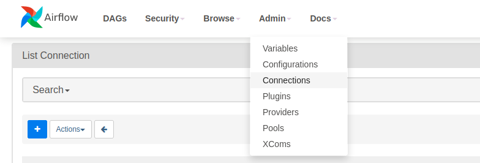
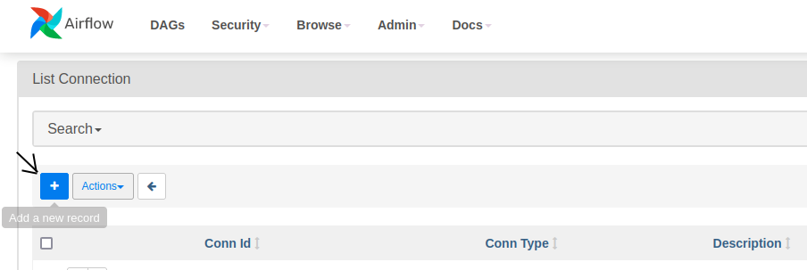
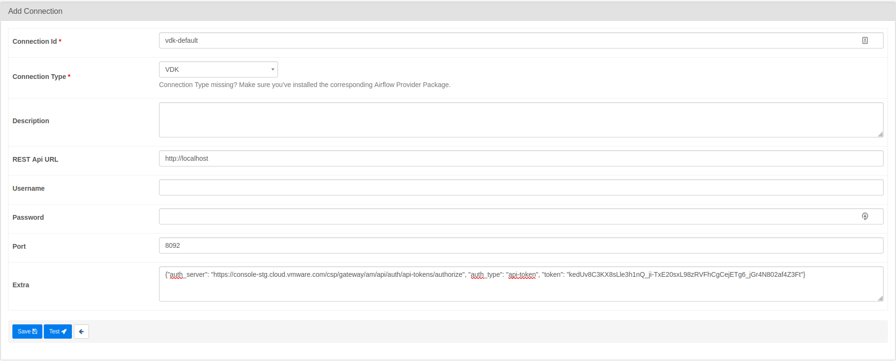
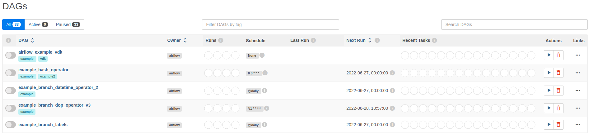
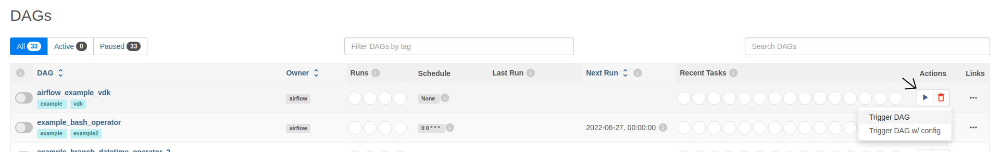

Overview
--------

In this example we will use the Versatile Data Kit to develop three Data jobs,
which will be managed through an Airflow DAG. Two of these jobs will read data
from separate json files, and will subsequently insert the data into trino tables.
The third job will read the data inserted by the previous two jobs, and will
print the data to the terminal.

Before you continue, make sure you are familiar with the
[Getting Started](https://github.com/vmware/versatile-data-kit/wiki/Getting-Started) section of the wiki.

Code
----

The relevant Data Job and Airflow DAG code is available
[here](https://github.com/vmware/versatile-data-kit/tree/main/examples).

You can follow along and run this example DAG on your machine;
alternatively, you can use the available code as a template and extend it to
make a DAG that fits your use case more closely.

Data
--------
We will use two json files which store some data about fictional people: their
names, city and country, where they live, and their phone numbers.

Requirements
------------

To run this example, you need

* Versatile Data Kit
* Trino DB
* Versatile Data Kit Plugin for Trino

Configuration
-------------
You must install Airflow and the VDK provider for Airflow. You can find the
Airflow Quick-Start guide [here](https://airflow.apache.org/docs/apache-airflow/stable/start/local.html).
You can install the airflow-provider-vdk package using the following command:
```console
pip install airflow-provider-vdk
```

If you have not done so already, you can install Versatile Data Kit and the
plugins required for this example by running the following commands from a terminal:
```console
pip install quickstart-vdk
```
Note that Versatile Data Kit requires Python 3.7+. See the
[Installation page](https://github.com/vmware/versatile-data-kit/wiki/Installation#install-sdk) for more details.
Also, make sure to install quickstart-vdk in a separate python virtual environment,
as there are version differences between the dependencies used by airflow and
those used by quickstart-vdk.

This example also requires Trino DB installed. See the Trino [Official Documentation](https://trino.io/) for more details about installation.


Please note that this example requires deploying Data jobs in a Kubernetes
environment, which means that you would also need to install
the **VDK Control Service.**

<ins>Prerequisites</ins>:

*   Install [helm](https://helm.sh/docs/intro/install)
*   Install [docker](https://docs.docker.com/get-docker)
*   Install [kind](https://kind.sigs.k8s.io/docs/user/quick-start/#installation) (version 0.11.1 or later)

<ins>Then run</ins>:
```console
vdk server --install
```

Data Jobs
--------

Our three Datajobs have the following structure:

```
airflow-trino-job1/
├── 01_drop_table.sql
├── 10_insert_data.py
├── config.ini
├── data.json
├── requirements.txt
```

<details>
    <summary>01_drop_table.sql</summary>

```sql
drop table if exists memory.default.test_airflow_one
```
</details>

<details>
  <summary>10_insert_data.py</summary>

```py
import json
import pathlib

from vdk.api.job_input import IJobInput


def run(job_input: IJobInput):
    data_job_dir = pathlib.Path(job_input.get_job_directory())
    data_file = data_job_dir / "data.json"

    if data_file.exists():
        with open(data_file) as f:
            data = json.load(f)

        rows = [tuple(i.values()) for i in data]
        insert_query = """
        INSERT INTO memory.default.test_airflow_one VALUES
        """ + ", ".join(str(i) for i in rows)

        job_input.execute_query(
            """
            CREATE TABLE IF NOT EXISTS memory.default.test_airflow_one
            (
                id varchar,
                first_name varchar,
                last_name varchar,
                city varchar,
                country varchar,
                phone varchar
            )
            """
        )

        job_input.execute_query(insert_query)

        print("Success! The data was send trino.")
    else:
        print("No data File Available! Exiting job execution!")
```
</details>
<details>
  <summary>config.ini</summary>

```ini
; Supported format: https://docs.python.org/3/library/configparser.html#supported-ini-file-structure

; This is the only file required to deploy a Data Job.
; Read more to understand what each option means:

; Information about the owner of the Data Job
[owner]

; Team is a way to group Data Jobs that belonged to the same team.
team = my-team

; Configuration related to running data jobs
[vdk]
db_default_type = TRINO
```
</details>
<details>
    <summary>data.json</summary>

```json
[{"id":"18","FirstName":"Michelle","LastName":"Brooks","City":"New York","Country":"USA","Phone":"+1 (212) 221-3546"},{"id":"19","FirstName":"Tim","LastName":"Goyer","City":"Cupertino","Country":"USA","Phone":"+1 (408) 996-1010"},{"id":"20","FirstName":"Dan","LastName":"Miller","City":"Mountain View","Country":"USA","Phone":"+ 1(650) 644 - 3358"},{"id":"21","FirstName":"Kathy","LastName":"Chase","City":"Reno","Country":"USA","Phone":"+1 (775) 223-7665"},{"id":"22","FirstName":"Heather","LastName":"Leacock","City":"Orlando","Country":"USA","Phone":"+1 (407) 999-7788"},{"id":"23","FirstName":"John","LastName":"Gordon","City":"Boston","Country":"USA","Phone":"+1 (617) 522-1333"},{"id":"24","FirstName":"Frank","LastName":"Ralston","City":"Chicago","Country":"USA","Phone":"+1 (312) 332-3232"},{"id":"25","FirstName":"Victor","LastName":"Stevens","City":"Madison","Country":"USA","Phone":"+1 (608) 257-0597"},{"id":"26","FirstName":"Richard","LastName":"Cunningham","City":"Fort Worth","Country":"USA","Phone":"+1 (817) 924-7272"},{"id":"27","FirstName":"Patrick","LastName":"Gray","City":"Tucson","Country":"USA","Phone":"+1 (520) 622-4200"},{"id":"28","FirstName":"Julia","LastName":"Barnett","City":"Salt Lake City","Country":"USA","Phone":"+1 (801) 531-7272"},{"id":"29","FirstName":"Robert","LastName":"Brown","City":"Toronto","Country":"Canada","Phone":"+1 (416) 363-8888"},{"id":"30","FirstName":"Edward","LastName":"Francis","City":"Ottawa","Country":"Canada","Phone":"+1 (613) 234-3322"}]
```
</details>

<details>
    <summary>requirements.txt</summary>

```text
vdk-trino
```
</details>

```
airflow-trino-job2/
├── 01_drop_table.sql
├── 10_insert_data.py
├── config.ini
├── data.json
├── requirements.txt
```

<details>
    <summary>01_drop_table.sql</summary>

```sql
drop table if exists memory.default.test_airflow_two
```
</details>

<details>
  <summary>10_insert_data.py</summary>

```py
import json
import pathlib

from vdk.api.job_input import IJobInput


def run(job_input: IJobInput):
    data_job_dir = pathlib.Path(job_input.get_job_directory())
    data_file = data_job_dir / "data.json"

    if data_file.exists():
        with open(data_file) as f:
            data = json.load(f)

        rows = [tuple(i.values()) for i in data]
        insert_query = """
        INSERT INTO memory.default.test_airflow_two VALUES
        """ + ", ".join(str(i) for i in rows)

        job_input.execute_query(
            """
            CREATE TABLE IF NOT EXISTS memory.default.test_airflow_two
            (
                id integer,
                first_name varchar,
                last_name varchar,
                city varchar,
                country varchar,
                phone varchar
            )
            """
        )

        job_input.execute_query(insert_query)

        print("Success! The data was send trino.")
    else:
        print("No data File Available! Exiting job execution!")
```
</details>
<details>
  <summary>config.ini</summary>

```ini
; Supported format: https://docs.python.org/3/library/configparser.html#supported-ini-file-structure

; This is the only file required to deploy a Data Job.
; Read more to understand what each option means:

; Information about the owner of the Data Job
[owner]

; Team is a way to group Data Jobs that belonged to the same team.
team = my-team

; Configuration related to running data jobs
[vdk]
db_default_type = TRINO
```
</details>
<details>
    <summary>data.json</summary>

```json
[{"id": 31, "FirstName": "Martha", "LastName": "Silk", "City": "Halifax", "Country": "Canada", "Phone": "+1 (902) 450-0450"}, {"id": 32, "FirstName": "Aaron", "LastName": "Mitchell", "City": "Winnipeg", "Country": "Canada", "Phone": "+1 (204) 452-6452"}, {"id": 33, "FirstName": "Ellie", "LastName": "Sullivan", "City": "Yellowknife", "Country": "Canada", "Phone": "+1 (867) 920-2233"}, {"id": 34, "FirstName": "Jo\u00e3o", "LastName": "Fernandes", "City": "Lisbon", "Country": "Portugal", "Phone": "+351 (213) 466-111"}, {"id": 35, "FirstName": "Madalena", "LastName": "Sampaio", "City": "Porto", "Country": "Portugal", "Phone": "+351 (225) 022-448"}, {"id": 36, "FirstName": "Hannah", "LastName": "Schneider", "City": "Berlin", "Country": "Germany", "Phone": "+49 030 26550280"}, {"id": 37, "FirstName": "Fynn", "LastName": "Zimmermann", "City": "Frankfurt", "Country": "Germany", "Phone": "+49 069 40598889"}, {"id": 38, "FirstName": "Niklas", "LastName": "Schr\u00f6der", "City": "Berlin", "Country": "Germany", "Phone": "+49 030 2141444"}, {"id": 39, "FirstName": "Camille", "LastName": "Bernard", "City": "Paris", "Country": "France", "Phone": "+33 01 49 70 65 65"}, {"id": 40, "FirstName": "Dominique", "LastName": "Lefebvre", "City": "Paris", "Country": "France", "Phone": "+33 01 47 42 71 71"}, {"id": 41, "FirstName": "Marc", "LastName": "Dubois", "City": "Lyon", "Country": "France", "Phone": "+33 04 78 30 30 30"}, {"id": 42, "FirstName": "Wyatt", "LastName": "Girard", "City": "Bordeaux", "Country": "France", "Phone": "+33 05 56 96 96 96"}, {"id": 43, "FirstName": "Isabelle", "LastName": "Mercier", "City": "Dijon", "Country": "France", "Phone": "+33 03 80 73 66 99"}, {"id": 44, "FirstName": "Terhi", "LastName": "H\u00e4m\u00e4l\u00e4inen", "City": "Helsinki", "Country": "Finland", "Phone": "+358 09 870 2000"}, {"id": 45, "FirstName": "Ladislav", "LastName": "Kov\u00e1cs", "City": "Budapest", "Country": "Hungary", "Phone": "+123 123 456"}, {"id": 46, "FirstName": "Hugh", "LastName": "OReilly", "City": "Dublin", "Country": "Ireland", "Phone": "+353 01 6792424"}]
```
</details>

<details>
    <summary>requirements.txt</summary>

```text
vdk-trino
```
</details>

```
airflow-transform-job/
├── 10_transform.py
├── 20_drop_table_one.sql
├── 30_drop_table_two.sql
├── config.ini
├── requirements.txt
```

<details>
  <summary>10_transform.py</summary>

```py
from vdk.api.job_input import IJobInput


def run(job_input: IJobInput):
    job1_data = job_input.execute_query(
        "SELECT * FROM memory.default.test_airflow_one"
    )
    job2_data = job_input.execute_query(
        "SELECT * FROM memory.default.test_airflow_two"
    )

    print(
        f"Job 1 Data ===> {job1_data} \n\n\n Job 2 Data ===> {job2_data}"
    )
```
</details>

<details>
    <summary>20_drop_table_one.sql</summary>

```sql
drop table if exists memory.default.test_airflow_one
```
</details>

<details>
    <summary>30_drop_table_two.sql</summary>

```sql
drop table if exists memory.default.test_airflow_two
```
</details>

<details>
  <summary>config.ini</summary>

```ini
; Supported format: https://docs.python.org/3/library/configparser.html#supported-ini-file-structure

; This is the only file required to deploy a Data Job.
; Read more to understand what each option means:

; Information about the owner of the Data Job
[owner]

; Team is a way to group Data Jobs that belonged to the same team.
team = my-team

; Configuration related to running data jobs
[vdk]
db_default_type = TRINO
```
</details>

<details>
    <summary>requirements.txt</summary>

```text
vdk-trino
```
</details>

```
dags/
├── airflow_example_dag.py
```

<details>
    <summary>airflow_example_dag.py</summary>

```python
from datetime import datetime

from airflow import DAG
from vdk_provider.operators.vdk import VDKOperator

with DAG(
    "airflow_example_vdk",
    schedule_interval=None,
    start_date=datetime(2022, 1, 1),
    catchup=False,
    tags=["example", "vdk"],
) as dag:
    trino_job1 = VDKOperator(
        conn_id="vdk-default",
        job_name="airflow-trino-job1",
        team_name="taurus",
        task_id="trino-job1",
    )

    trino_job2 = VDKOperator(
        conn_id="vdk-default",
        job_name="airflow-trino-job2",
        team_name="taurus",
        task_id="trino-job2",
    )

    transform_job = VDKOperator(
        conn_id="vdk-default",
        job_name="airflow-transform-job",
        team_name="taurus",
        task_id="transform-job",
    )

    [trino_job1, trino_job2] >> transform_job
```
</details>

Execution
---------
After starting vdk-server, you now have a local kubernetes cluster and Versatile
Data Kit Control Service installation. This means that you can now deploy the data
jobs created in the previous step.

To do so, open a terminal, navigate to the parent directory of the data job
folders that you have created, and type the following commands one by one:

```console
vdk create -n airflow-trino-job1 -t my-team --no-template -u http://localhost:8092 && \
vdk deploy -n airflow-trino-job1 -t my-team -p airflow-trino-job1 -r "airflow" -u http://localhost:8092
```

```console
vdk create -n airflow-trino-job2 -t my-team --no-template -u http://localhost:8092 && \
vdk deploy -n airflow-trino-job2 -t my-team -p airflow-trino-job2 -r "airflow" -u http://localhost:8092
```

```console
vdk create -n airflow-transform-job -t my-team --no-template -u http://localhost:8092 && \
vdk deploy -n airflow-transform-job -t my-team -p airflow-transform-job -r "airflow" -u http://localhost:8092
```

After successfully deploying the data jobs, you need to start an airflow instance.
To do that, open a new terminal tab/window, activate/source the python virtual
environment, where you installed the airflow vdk provider, and type
```console
airflow standalone
```
This will create a new airflow instance and all necessary configurations. After
starting airflow, copy the `dags`, containing the `airflow_example_dag.py` file
from this example, and paste it into the airflow folder which is automatically
created by airflow in your home directory.

Then, open a browser, and type `localhost:8080` in the url bar. You should see
the airflow _sign-in_ page. In the terminal running airflow, there is a log with
contents similar to the following
```console
standalone | Airflow is ready
standalone | Login with username: admin  password: cwQ32XVh2qWATHtR
standalone | Airflow Standalone is for development purposes only. Do not use this in production!
```
Find these logs, copy the username and password, and paste them in the airflow UI
mentioned above.


After you have reached the main airflow ui page, there is one important thing to
do, and that is, to create a new vdk connection. The steps to take to do this,
are as follows:
1) Go to `Admin -> Connections` 
2) Click on the `Add a new record` button 
3) When the connection form is open, fill the relevant fields similarly to what
is shown on the image. NOTE: Make sure to specify `vdk-default` as **Connection Id**
and `VDK` as **Connection Type**. Also, if you have your own authorization server
and token, you can use them instead of the ones shown on the image

4) Click on the **Save** button to finalize the creation of the new connection.


When your vdk connection is created, you can execute the DAG of this example by
going to the `DAGs` view 

and triger a new execution of the `airflow_example_vdk` DAG. 


Airflow will connect to your local Control Service, and will trigger executions
of the data jobs deployed at the beginning of this example.

What's next
-----------

You can find a list of all Versatile Data Kit examples [here](https://github.com/vmware/versatile-data-kit/wiki/Examples).
