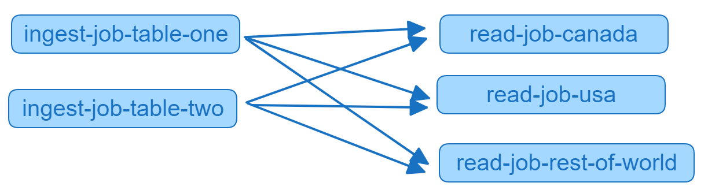

# Overview

DAGs allow VDK users to schedule jobs in a directed acyclic graph.
This means that jobs can be configured to run only when a set of previous jobs have finished successfully.

In this example you will use the Versatile Data Kit to develop six Data Jobs - two of these jobs will read data
from separate JSON files, and will subsequently insert the data into Trino tables. The next three jobs will read the
data inserted by the previous two jobs, and will print the data to the terminal. The sixth Data Job will be a DAG job
which will manage the other five and ensure that the third, fourth and fifth jobs run only when the previous two finish
successfully. All the DB-related (Trino is chosen but could be any other) details (tables, schema) will be passed
individually to each job as job arguments in JSON format.

The DAG Job uses a separate job input object separate from the one usually used for job
operations in VDK Data Jobs and must be imported.

The graph for the DAG will look like this:



Before you continue, make sure you are familiar with the
[Getting Started](https://github.com/vmware/versatile-data-kit/wiki/Getting-Started) section of the wiki.

## Estimated time commitment

This tutorial will take you between 15 and 20 minutes.

## Code

The relevant Data Job code is available
[here](https://github.com/vmware/versatile-data-kit/tree/main/examples/dag-with-args-example).

You can follow along and run this DAG Job on your machine;
alternatively, you can use the available code as a template and extend it to
make a DAG Job that fits your use case more closely.

## Data

There are two JSON files which store some data about fictional people: their
names, city and country, where they live, and their phone numbers.

## Requirements

To run this example, you need:

* Versatile Data Kit
* Trino DB
* `vdk-trino` - VDK plugin for a connection to a Trino database
* [VDK DAGs README](https://github.com/vmware/versatile-data-kit/tree/main/projects/vdk-plugins/vdk-dag)
* [VDK DAGs Specification](https://github.com/vmware/versatile-data-kit/tree/main/specs/vep-1243-vdk-dag)

## Configuration

If you have not done so already, you can install Versatile Data Kit and the
plugins required for this example by running the following commands from a terminal:
```console
pip install quickstart-vdk
pip install vdk-dag
```
Note that Versatile Data Kit requires Python 3.7+. See the
[Installation page](https://github.com/vmware/versatile-data-kit/wiki/Installation#install-sdk) for more details.
Also, make sure to [install quickstart-vdk](https://github.com/vmware/versatile-data-kit/wiki/Installation#install-quickstart-vdk) in a separate Python virtual environment.

This example also requires Trino DB installed.
See the Trino [Official Documentation](https://trino.io/) for more details about installation.

Please note that this example requires deploying Data Jobs in a Kubernetes
environment, which means that you would also need to install
the **VDK Control Service.**

### Prerequisites

*   Install [helm](https://helm.sh/docs/intro/install)
*   Install [docker](https://docs.docker.com/get-docker)
*   Install [kind](https://kind.sigs.k8s.io/docs/user/quick-start/#installation) (version 0.11.1 or later)

#### Then run
```console
vdk server --install
```

#### The last part is to export the local Control Service REST API URL:
```console
export VDK_CONTROL_SERVICE_REST_API_URL=locahost:8092
```

After starting vdk-server, you now have a local kubernetes cluster and Versatile
Data Kit Control Service installation. This means that you can now deploy Data
Jobs but first you have to create them which is the next step.

## Data Jobs

### Data Jobs code structure

The Data Jobs have the following structure:

```
ingest-job-table-one/
├── 01_drop_table.sql
├── 10_insert_data.py
├── config.ini
├── data.json
├── requirements.txt
```

<details>
    <summary>01_drop_table.sql</summary>

```sql
drop table if exists memory.default.test_dag_one
```
</details>

<details>
  <summary>10_insert_data.py</summary>

```py
import json
import pathlib

from vdk.api.job_input import IJobInput


def run(job_input: IJobInput):
    data_job_dir = pathlib.Path(job_input.get_job_directory())
    data_file = data_job_dir / "data.json"

    db_schema = job_input.get_arguments().get("db_schema")
    db_table = job_input.get_arguments().get("db_table")

    if data_file.exists():
        with open(data_file) as f:
            data = json.load(f)

        rows = [tuple(i.values()) for i in data]
        insert_query = f"""
        INSERT INTO {db_schema}.{db_table} VALUES
        """ + ", ".join(
            str(i) for i in rows
        )

        create_query = f"""
        CREATE TABLE IF NOT EXISTS {db_catalog}.{db_schema}.{db_table}
        (
            id varchar,
            first_name varchar,
            last_name varchar,
            city varchar,
            country varchar,
            phone varchar
        )
        """

        job_input.execute_query(create_query)
        job_input.execute_query(insert_query)

        print("Success! The data was send trino.")
    else:
        print("No data File Available! Exiting job execution!")
```
</details>
<details>
  <summary>config.ini</summary>

```ini
; Supported format: https://docs.python.org/3/library/configparser.html#supported-ini-file-structure

; This is the only file required to deploy a Data Job.
; Read more to understand what each option means:

; Information about the owner of the Data Job
[owner]

; Team is a way to group Data Jobs that belonged to the same team.
team = my-team

; Configuration related to running data jobs
[vdk]
db_default_type = TRINO
```
</details>
<details>
    <summary>data.json</summary>

```json
[{"id":"18","FirstName":"Michelle","LastName":"Brooks","City":"New York","Country":"USA","Phone":"+1 (212) 221-3546"},{"id":"19","FirstName":"Tim","LastName":"Goyer","City":"Cupertino","Country":"USA","Phone":"+1 (408) 996-1010"},{"id":"20","FirstName":"Dan","LastName":"Miller","City":"Mountain View","Country":"USA","Phone":"+ 1(650) 644 - 3358"},{"id":"21","FirstName":"Kathy","LastName":"Chase","City":"Reno","Country":"USA","Phone":"+1 (775) 223-7665"},{"id":"22","FirstName":"Heather","LastName":"Leacock","City":"Orlando","Country":"USA","Phone":"+1 (407) 999-7788"},{"id":"23","FirstName":"John","LastName":"Gordon","City":"Boston","Country":"USA","Phone":"+1 (617) 522-1333"},{"id":"24","FirstName":"Frank","LastName":"Ralston","City":"Chicago","Country":"USA","Phone":"+1 (312) 332-3232"},{"id":"25","FirstName":"Victor","LastName":"Stevens","City":"Madison","Country":"USA","Phone":"+1 (608) 257-0597"},{"id":"26","FirstName":"Richard","LastName":"Cunningham","City":"Fort Worth","Country":"USA","Phone":"+1 (817) 924-7272"},{"id":"27","FirstName":"Patrick","LastName":"Gray","City":"Tucson","Country":"USA","Phone":"+1 (520) 622-4200"},{"id":"28","FirstName":"Julia","LastName":"Barnett","City":"Salt Lake City","Country":"USA","Phone":"+1 (801) 531-7272"},{"id":"29","FirstName":"Robert","LastName":"Brown","City":"Toronto","Country":"Canada","Phone":"+1 (416) 363-8888"},{"id":"30","FirstName":"Edward","LastName":"Francis","City":"Ottawa","Country":"Canada","Phone":"+1 (613) 234-3322"}]
```
</details>

<details>
    <summary>requirements.txt</summary>

```text
vdk-trino
```
</details>

```
ingest-job-table-two/
├── 01_drop_table.sql
├── 10_insert_data.py
├── config.ini
├── data.json
├── requirements.txt
```

<details>
    <summary>01_drop_table.sql</summary>

```sql
drop table if exists memory.default.test_dag_two
```
</details>

<details>
  <summary>10_insert_data.py</summary>

```py
import json
import pathlib

from vdk.api.job_input import IJobInput


def run(job_input: IJobInput):
    data_job_dir = pathlib.Path(job_input.get_job_directory())
    data_file = data_job_dir / "data.json"

    db_schema = job_input.get_arguments().get("db_schema")
    db_table = job_input.get_arguments().get("db_table")

    if data_file.exists():
        with open(data_file) as f:
            data = json.load(f)

        rows = [tuple(i.values()) for i in data]
        insert_query = f"""
        INSERT INTO {db_schema}.{db_table} VALUES
        """ + ", ".join(
            str(i) for i in rows
        )

        create_query = f"""
        CREATE TABLE IF NOT EXISTS {db_schema}.{db_table}
        (
            id varchar,
            first_name varchar,
            last_name varchar,
            city varchar,
            country varchar,
            phone varchar
        )
        """

        job_input.execute_query(create_query)
        job_input.execute_query(insert_query)

        print("Success! The data was send trino.")
    else:
        print("No data File Available! Exiting job execution!")
```
</details>
<details>
  <summary>config.ini</summary>

```ini
; Supported format: https://docs.python.org/3/library/configparser.html#supported-ini-file-structure

; This is the only file required to deploy a Data Job.
; Read more to understand what each option means:

; Information about the owner of the Data Job
[owner]

; Team is a way to group Data Jobs that belonged to the same team.
team = my-team

; Configuration related to running data jobs
[vdk]
db_default_type = TRINO
```
</details>
<details>
    <summary>data.json</summary>

```json
[{"id": 31, "FirstName": "Martha", "LastName": "Silk", "City": "Halifax", "Country": "Canada", "Phone": "+1 (902) 450-0450"}, {"id": 32, "FirstName": "Aaron", "LastName": "Mitchell", "City": "Winnipeg", "Country": "Canada", "Phone": "+1 (204) 452-6452"}, {"id": 33, "FirstName": "Ellie", "LastName": "Sullivan", "City": "Yellowknife", "Country": "Canada", "Phone": "+1 (867) 920-2233"}, {"id": 34, "FirstName": "Jo\u00e3o", "LastName": "Fernandes", "City": "Lisbon", "Country": "Portugal", "Phone": "+351 (213) 466-111"}, {"id": 35, "FirstName": "Madalena", "LastName": "Sampaio", "City": "Porto", "Country": "Portugal", "Phone": "+351 (225) 022-448"}, {"id": 36, "FirstName": "Hannah", "LastName": "Schneider", "City": "Berlin", "Country": "Germany", "Phone": "+49 030 26550280"}, {"id": 37, "FirstName": "Fynn", "LastName": "Zimmermann", "City": "Frankfurt", "Country": "Germany", "Phone": "+49 069 40598889"}, {"id": 38, "FirstName": "Niklas", "LastName": "Schr\u00f6der", "City": "Berlin", "Country": "Germany", "Phone": "+49 030 2141444"}, {"id": 39, "FirstName": "Camille", "LastName": "Bernard", "City": "Paris", "Country": "France", "Phone": "+33 01 49 70 65 65"}, {"id": 40, "FirstName": "Dominique", "LastName": "Lefebvre", "City": "Paris", "Country": "France", "Phone": "+33 01 47 42 71 71"}, {"id": 41, "FirstName": "Marc", "LastName": "Dubois", "City": "Lyon", "Country": "France", "Phone": "+33 04 78 30 30 30"}, {"id": 42, "FirstName": "Wyatt", "LastName": "Girard", "City": "Bordeaux", "Country": "France", "Phone": "+33 05 56 96 96 96"}, {"id": 43, "FirstName": "Isabelle", "LastName": "Mercier", "City": "Dijon", "Country": "France", "Phone": "+33 03 80 73 66 99"}, {"id": 44, "FirstName": "Terhi", "LastName": "H\u00e4m\u00e4l\u00e4inen", "City": "Helsinki", "Country": "Finland", "Phone": "+358 09 870 2000"}, {"id": 45, "FirstName": "Ladislav", "LastName": "Kov\u00e1cs", "City": "Budapest", "Country": "Hungary", "Phone": "+123 123 456"}, {"id": 46, "FirstName": "Hugh", "LastName": "OReilly", "City": "Dublin", "Country": "Ireland", "Phone": "+353 01 6792424"}]
```
</details>

<details>
    <summary>requirements.txt</summary>

```text
vdk-trino
```
</details>

```
read-job-usa/
├── 10_read.py
├── config.ini
├── requirements.txt
```

<details>
  <summary>10_read.py</summary>

```py
from vdk.api.job_input import IJobInput


def run(job_input: IJobInput):
    db_schema = job_input.get_arguments().get("db_schema")
    db_tables = job_input.get_arguments().get("db_tables")

    job1_data = job_input.execute_query(
        f"SELECT * FROM {db_schema}.{db_tables[0]} "
        f"WHERE Country = 'USA'"
    )
    job2_data = job_input.execute_query(
        f"SELECT * FROM {db_schema}.{db_tables[1]} "
        f"WHERE Country = 'USA'"
    )

    print(f"Job 1 Data ===> {job1_data} \n\n\n Job 2 Data ===> {job2_data}")
```
</details>

<details>
  <summary>config.ini</summary>

```ini
; Supported format: https://docs.python.org/3/library/configparser.html#supported-ini-file-structure

; This is the only file required to deploy a Data Job.
; Read more to understand what each option means:

; Information about the owner of the Data Job
[owner]

; Team is a way to group Data Jobs that belonged to the same team.
team = my-team

; Configuration related to running data jobs
[vdk]
db_default_type = TRINO
```
</details>

<details>
    <summary>requirements.txt</summary>

```text
vdk-trino
```
</details>

```
read-job-canada/
├── 10_read.py
├── config.ini
├── requirements.txt
```

<details>
  <summary>10_read.py</summary>

```py
from vdk.api.job_input import IJobInput


def run(job_input: IJobInput):
    db_schema = job_input.get_arguments().get("db_schema")
    db_tables = job_input.get_arguments().get("db_tables")

    job1_data = job_input.execute_query(
        f"SELECT * FROM {db_schema}.{db_tables[0]} "
        f"WHERE Country = 'Canada'"
    )
    job2_data = job_input.execute_query(
        f"SELECT * FROM {db_schema}.{db_tables[1]} "
        f"WHERE Country = 'Canada'"
    )

    print(f"Job 1 Data ===> {job1_data} \n\n\n Job 2 Data ===> {job2_data}")
```
</details>

<details>
  <summary>config.ini</summary>

```ini
; Supported format: https://docs.python.org/3/library/configparser.html#supported-ini-file-structure

; This is the only file required to deploy a Data Job.
; Read more to understand what each option means:

; Information about the owner of the Data Job
[owner]

; Team is a way to group Data Jobs that belonged to the same team.
team = my-team

; Configuration related to running data jobs
[vdk]
db_default_type = TRINO
```
</details>

<details>
    <summary>requirements.txt</summary>

```text
vdk-trino
```
</details>

```
read-job-rest-of-world/
├── 10_read.py
├── 20_drop_table_one.sql
├── 30_drop_table_two.sql
├── config.ini
├── requirements.txt
```

<details>
  <summary>10_read.py</summary>

```py
from vdk.api.job_input import IJobInput


def run(job_input: IJobInput):
    db_schema = job_input.get_arguments().get("db_schema")
    db_tables = job_input.get_arguments().get("db_tables")

    job1_data = job_input.execute_query(
        f"SELECT * FROM {db_schema}.{db_tables[0]} "
        f"WHERE Country NOT IN ('USA', 'Canada')"
    )
    job2_data = job_input.execute_query(
        f"SELECT * FROM {db_schema}.{db_tables[1]} "
        f"WHERE Country NOT IN ('USA', 'Canada')"
    )

    print(f"Job 1 Data ===> {job1_data} \n\n\n Job 2 Data ===> {job2_data}")
```
</details>

<details>
    <summary>20_drop_table_one.sql</summary>

```sql
drop table if exists memory.default.test_dag_one
```
</details>

<details>
    <summary>30_drop_table_two.sql</summary>

```sql
drop table if exists memory.default.test_dag_two
```
</details>

<details>
  <summary>config.ini</summary>

```ini
; Supported format: https://docs.python.org/3/library/configparser.html#supported-ini-file-structure

; This is the only file required to deploy a Data Job.
; Read more to understand what each option means:

; Information about the owner of the Data Job
[owner]

; Team is a way to group Data Jobs that belonged to the same team.
team = my-team

; Configuration related to running data jobs
[vdk]
db_default_type = TRINO
```
</details>

<details>
    <summary>requirements.txt</summary>

```text
vdk-trino
```
</details>


```
dag-job/
├── dag_job.py
├── config.ini
├── requirements.txt
```

<details>
    <summary>dag_job.py</summary>

```python
from vdk.plugin.dag.dag_runner import DagInput


JOBS_RUN_ORDER = [
    {
        "job_name": "ingest-job-table-one",
        "team_name": "my-team",
        "fail_dag_on_error": True,
        "arguments": {
            "db_table": "test_dag_one",
            "db_schema": "default",
        },
        "depends_on": [],
    },
    {
        "job_name": "ingest-job-table-two",
        "team_name": "my-team",
        "fail_dag_on_error": True,
        "arguments": {
            "db_table": "test_dag_two",
            "db_schema": "default",
        },
        "depends_on": [],
    },
    {
        "job_name": "read-job-usa",
        "team_name": "my-team",
        "fail_dag_on_error": True,
        "arguments": {
            "db_tables": ["test_dag_one", "test_dag_two"],
            "db_schema": "default",
        },
        "depends_on": ["ingest-job-table-one", "ingest-job-table-two"],
    },
    {
        "job_name": "read-job-canada",
        "team_name": "my-team",
        "fail_dag_on_error": True,
        "arguments": {
            "db_tables": ["test_dag_one", "test_dag_two"],
            "db_schema": "default",
        },
        "depends_on": ["ingest-job-table-one", "ingest-job-table-two"],
    },
    {
        "job_name": "read-job-rest-of-world",
        "team_name": "my-team",
        "fail_dag_on_error": True,
        "arguments": {
            "db_tables": ["test_dag_one", "test_dag_two"],
            "db_schema": "default",
        },
        "depends_on": ["ingest-job-table-one", "ingest-job-table-two"],
    },
]


def run(job_input) -> None:
    DagInput().run_dag(JOBS_RUN_ORDER)

```
</details>

Note that the `run_dag` method belongs to the `DagInput` object which must be imported
and instantiated separately from the default `IJobInput` object which is passed to the `run` function by default.

<details>
  <summary>config.ini</summary>

```ini
; Supported format: https://docs.python.org/3/library/configparser.html#supported-ini-file-structure

; This is the only file required to deploy a Data Job.
; Read more to understand what each option means:

; Information about the owner of the Data Job
[owner]

; Team is a way to group Data Jobs that belonged to the same team.
team = my-team

[vdk]
dags_max_concurrent_running_jobs = 2
dags_delayed_jobs_randomized_added_delay_seconds = 1
dags_delayed_jobs_min_delay_seconds = 1
```
</details>

<details>
    <summary>requirements.txt</summary>

```text
vdk-dag
```
</details>

Note that the VDK DAG Job does not require the `vdk-trino` dependency.
Component jobs are responsible for their own dependencies, and the DAG Job only handles their triggering.

### Configuration details

Setting [dags_max_concurrent_running_jobs](https://github.com/vmware/versatile-data-kit/blob/main/projects/vdk-plugins/vdk-dag/src/vdk/plugin/dag/dag_plugin_configuration.py#L87)
to 2 in the DAG Job config.ini file would mean that the jobs in the DAG will be executed in the following order:
 * ingest-job-table-one, ingest-job-table-two
 * read-job-usa, read-job-canada
 * read-job-rest-of-world

When the ingest jobs are both finished, all the read jobs are ready to start but when the aforementioned limit is
hit (after read-job-usa and read-job-canada are started), the following message is logged:


Then the delayed read-job-rest-of-world is started after any of the currently running Data Jobs finishes.

The other two configurations are set in order to have a short fixed delay for delayed jobs such as the last read job.
Check the [configuration](https://github.com/vmware/versatile-data-kit/blob/main/projects/vdk-plugins/vdk-dag/src/vdk/plugin/dag/dag_plugin_configuration.py)
for more details.

<details>
    <summary>requirements.txt</summary>

```text
vdk-dag
```
</details>

Note that the VDK DAG Job does not require the `vdk-trino` dependency.
Component jobs are responsible for their own dependencies, and the DAG Job only handles their triggering.


## Execution

[Here](https://github.com/vmware/versatile-data-kit/tree/main/specs/vep-1243-vdk-dag#high-level-design) you can read
more about the DAG execution.

### Create and deploy Data Jobs

To do so, open a terminal, navigate to the parent directory of the data job
folders that you have created, and type the following commands one by one:

```console
vdk create -n ingest-job-table-one -t my-team --no-template && \
vdk deploy -n ingest-job-table-one -t my-team -p ingest-job-table-one -r "dag-with-args-example"
```

```console
vdk create -n ingest-job-table-two -t my-team --no-template && \
vdk deploy -n ingest-job-table-two -t my-team -p ingest-job-table-two -r "dag-with-args-example"
```

```console
vdk create -n read-job-usa -t my-team --no-template && \
vdk deploy -n read-job-usa -t my-team -p read-job-usa -r "dag-with-args-example"
```

```console
vdk create -n read-job-canada -t my-team --no-template && \
vdk deploy -n read-job-canada -t my-team -p read-job-canada -r "dag-with-args-example"
```

```console
vdk create -n read-job-rest-of-world -t my-team --no-template && \
vdk deploy -n read-job-rest-of-world -t my-team -p read-job-rest-of-world -r "dag-with-args-example"
```

```console
vdk create -n dag-job -t my-team --no-template && \
vdk deploy -n dag-job -t my-team -p dag-job -r "dag-with-args-example"
```

Note: The team name has to be consistent everywhere (in the config.ini, in each job of the DAG dict of jobs and
while creating&deploying the jobs). Instead of passing the team name each time, you can set a default value:
```console
vdk set-default -t my-team
```
This would then be used in all commands that require a team. However, you would still have to provide the same value
for team name in the config.ini file and the DAG dict of jobs.

### Run DAG Job

You can now run your DAG Job through the Execution API by using one of the following commands*:
```console
vdk execute --start -n dag-job -t my-team
vdk run dag-job
```

The log message after a successful execution should look similar to this:


Alternatively, if you would like your DAG Job to run on a set schedule, you can configure
its cron schedule in its config.ini file as you would with any other Data Job.

*You could also execute DAG Jobs in Jupyter Notebook.

## Summary

###

Congratulations! You finished the VDK DAGs tutorial successfully!
You are now equipped with the necessary skills to handle job interdependencies according to your needs.

### What's next

You can find a list of all Versatile Data Kit examples [here](https://github.com/vmware/versatile-data-kit/wiki/Examples).
