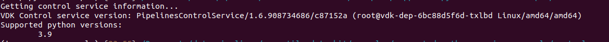
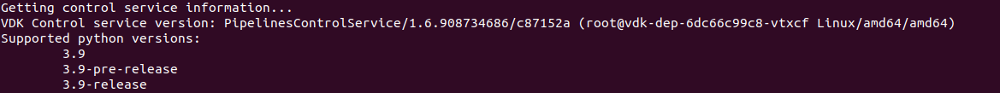

# Supported Python Versions Example - Control Service Setup

Overview
--------

In this part of the Supported Python Versions example, you will set up a Control Service instance to support the
use of two different python versions for data job deployments.

Having support for multiple python versions allows data
engineers/scientists to test different vdk sdk versions with specific features, or configurations of data job
dependencies, which may require specific python versions.

For the setup, you would need to have a vdk sdk installed in a python
virtual environment, and access to a running Control Service instance.

In this example, quickstart-vdk will be used (installation instructions can be found in the example's [main page](https://github.com/vmware/versatile-data-kit/tree/main/examples/supported-python-versions-example)) alongside vdk-server ([installation instructions](https://github.com/vmware/versatile-data-kit/wiki/Installation#install-versatile-data-kit-control-service)).

If you have access to a custom Control Service instance and vdk sdk, you can use those, instead.

### Estimated Time Commitment

---
This part of the example should take you between 10 and 15 minutes to complete.

Supported Python Versions
-------------------------

For the purpose of this example, you will set up the Control Service to support two different python versions, **3.9-pre-release** and **3.9-release**. The difference between the two will be the quickstart-vdk image used by deployed data jobs. The `pre-release` image of quickstart-vdk is updated regularly and has all the latest functionalities and bug fixes, while the `release` image has been, at the time of writing, last updated around 6 months ago, so it is much older than the pre-release image and lacks some functionalities. For both, you will use python3.9-latest as data job base image.

To set up the python versions supported by the Control Service, you will create a _values.yaml_ file with the relevant configuration.

> Tip: The use of _values.yaml_ instead of helm --set helps avoid parsing errors
> with the terminal shell, where different shells may treat special characters
> in specific ways.


Control Service Upgrade
-----------------------

As mentioned at the beginning, a running instance of the Control Service is
needed for this example. Here, we assume that an instance of vdk server is running
in a local kubernetes.

### Check currently supported python versions

To check what python versions are currently supported by the Service, run

```shell
vdk info -t my-team
```

The output should be something like the following.



You may see a different output, if you execute the command against a custom instance
of the Control Service.

### Upgrade the Control Service

Now, to add support for other python versions, an upgrade to the Control Service is
needed. To do that, create a _values.yaml_ file as mentioned in the **Supported
Python Versions** section above, and add the following snipped of code:

```yaml
deploymentSupportedPythonVersions:
  3.9-release:
    baseImage: "registry.hub.docker.com/versatiledatakit/data-job-base-python-3.9:latest"
    vdkImage: "registry.hub.docker.com/versatiledatakit/quickstart-vdk:release"
  3.9-pre-release:
    baseImage: "registry.hub.docker.com/versatiledatakit/data-job-base-python-3.9:latest"
    vdkImage: "registry.hub.docker.com/versatiledatakit/quickstart-vdk:pre-release"

deploymentDefaultPythonVersion: "pre-release"
```

> NOTE: The full content of the values.yaml file would depend on the configuration
> of the Control Service. If you use a custom Control Service instance, you can
> add the above code directly to the values.yaml file used to deploy the Service.

For this example, the full content of the values.yaml file is available [here](https://github.com/vmware/versatile-data-kit/tree/main/examples/supported-python-versions-example/control-service-setup).

Having the values file ready, the only thing left to upgrade the service is to
execute:
```shell
helm upgrade <name-of-the-release> vdk-gitlab/pipelines-control-service -f values.yaml
```

For this example, the command is
```shell
helm upgrade vdk vdk-gitlab/pipelines-control-service -f values.yaml
```
The reason for this is, because vdk-server initially sets the name to `vdk`. If you
use a custom instance, however, the name would possibly be different.


### Verify Service Upgrade

After the execution of the above command, wait for a few minutes for the service
to be updated. To check if the new configuration has been applied, you can execute:
```shell
vdk info -t my-team
```
again, and the output should contain the tags of the newly set python versions
like so



Wrap-Up
-------

Congratulations! You have reached the end of this example, and you now know how
to set up a VDK Control Service instance to support multiple python versions for
data job deployments.


What's next?
-----------

To see how data jobs can be set up to use different python versions, head over
to [multiple-python-version-usage](https://github.com/vmware/versatile-data-kit/tree/main/examples/supported-python-versions-example/multiple-python-version-usage)
