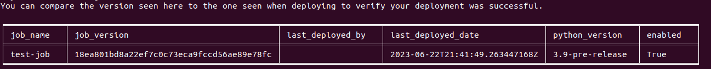
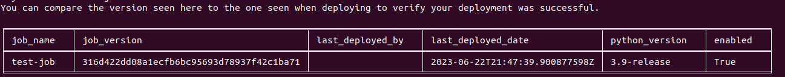

# Supported Python Versions Example - Multiple Python Version Usage

Overview
--------

In this part of the Supported Python Versions example, you will deploy a test
data job, check what python version it is deployed with, and change the
python version for its deployment.

This part is a continuation of the [Control Service Setup](https://github.com/vmware/versatile-data-kit/tree/main/examples/supported-python-versions-example/control-service-setup), and assumes that the Control Service instance supports
`3.9-pre-release` and `3.9-release`. If the Service instance that you're using does
not support the aforementioned python versions, follow the above link to update
the Control Service.

### Estimated Time Commitment

---
This part of the example should take you between 5 and 10 minutes to complete.

Data Job Code
-------------

The source code of the data job used in this example can be found [here](https://github.com/vmware/versatile-data-kit/tree/main/examples/supported-python-versions-example/multiple-python-version-usage).

It is a simple job with only one step that prints a log message:
<details>
    <summary>20_python_step.py</summary>

```python
# Copyright 2021-2023 VMware, Inc.
# SPDX-License-Identifier: Apache-2.0
import logging

from vdk.api.job_input import IJobInput

log = logging.getLogger(__name__)


def run(job_input: IJobInput):
    log.info(f"Starting job step {__name__}")
```
</details>

<details>
    <summary>config.ini</summary>

```ini
; Information about the owner of the Data Job
[owner]

; Team is a way to group Data Jobs that belonged to the same team.
team = my-team

; Configuration related to running data jobs
[job]
schedule_cron = 11 23 5 8 1

; Who will be contacted and on what occasion
[contacts]
notified_on_job_failure_user_error=
notified_on_job_failure_platform_error=
notified_on_job_success=
notified_on_job_deploy=
```
</details>

Usage
-----

### Check Deployment Status

---

First, check the deployment status of a data job. If you do not have one, you can
create a test data job following https://github.com/vmware/versatile-data-kit/wiki/getting-started. In this example, we will use
a job called `test-job`.

To view the deployment status, execute the following command

```shell
vdk deploy --show -t 'my-team' -n 'test-job'
```

The result should be something like the following


The `python_version` column indicates the python version that the data job
was deployed to use. Version `3.9-pre-release` is the default version as set
in [Control Service Setup](https://github.com/vmware/versatile-data-kit/tree/main/examples/supported-python-versions-example/control-service-setup) part of the example.

### Change Python Version

---------------------

To change the python version used by the deployed data job, update
the __config.ini__ file and add the python_version property to the `[job]`
section.

First, check the python versions supported by the Control Service instance by
using `vdk info`:
```shell
vdk info -t my-team
```

Then, after verifying that *3.9-release* is present in the output, update the
job's config file similarly to the one shown below.

<details>
    <summary>config.ini</summary>

```ini
; Information about the owner of the Data Job
[owner]

; Team is a way to group Data Jobs that belonged to the same team.
team = my-team

; Configuration related to running data jobs
[job]
schedule_cron = 11 23 5 8 1
python_version = 3.9-release

; Who will be contacted and on what occasion
[contacts]
notified_on_job_failure_user_error=
notified_on_job_failure_platform_error=
notified_on_job_success=
notified_on_job_deploy=

```
</details>

Once the config file is updated, run
```shell
vdk deploy -n test-job -t my-team -p test-job -r "update python version"
```
and wait for a few minutes.

The result should be similar to the one shown below:


As can be seen, the version is now `3.9-release`.


Wrap-Up
-------

Congratulations! You have reached the end of this example, and you now know how
to choose which python version you want to deploy a data job with.

What's next?
------------

You can find a list of all Versatile Data Kit examples [here](https://github.com/vmware/versatile-data-kit/wiki/Examples).
