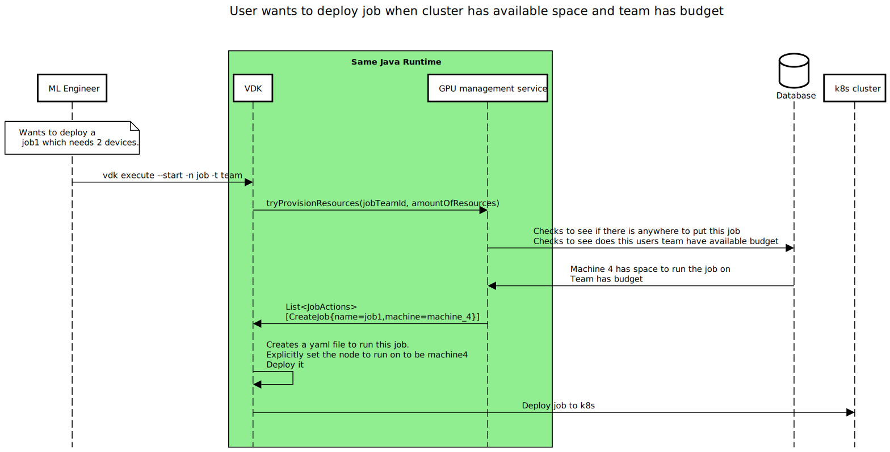
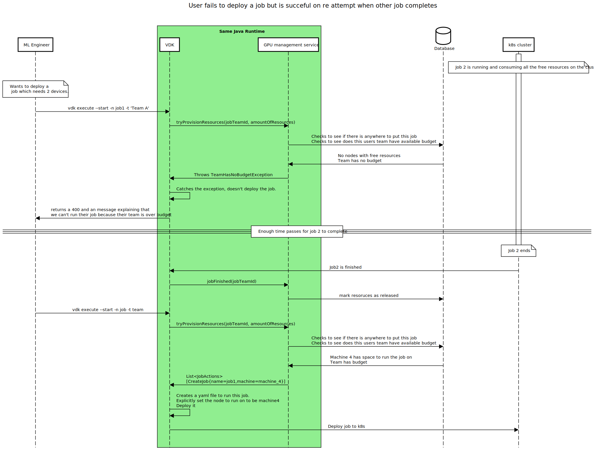

# VDK GPU Management integration

## Prerequisite knowledge

In VDK a job can be started two ways
1. Using the cron functionality of k8s
2. Manually using `vdk execute --start -j myJob -t myTeam`

For a first iteration of VDK and GPU management service we will assumes all GPU consuming tasks are being started the manually.
The reasons for this are
1. Its easier. We need to start somewhere
2. I don't think ML tasks would be run on such regular cadence. I think it is acceptable for a first iteration to think training and fine tuning tasks will be kicked off manually 


# API definition

GPU resource manager has been written as a platform-agnostic resource scheduler.
It doesn't assume that it is working with kubernetes.

In the following section we will go through how VDK and GPU Manager interact with each other. 
But to follow the sequence diagrams it is important to first read the inline kotlin below.

```kotlin
/**
 * Responsible for managing GPU resources most efficiently.
 */
interface GpuResourceManager {
    /**
     * Checks if a job can be deployed.
     * @throws NoAvailableBudgetException if the team trying to deploy a job doesn't have resources to deploy the job and there is no where on the cluster to run it
     * @return a list of actions that need to be complete to run the requested job
     *          This might involve deleting some jobs which belong to over budget teams and moving jobs to other machines to more effectively pack
     */
    @Throws(NoAvailableBudgetException::class)
    fun tryProvisionResources(jobUniqueIdentifier: JobUniqueIdentifier, amount: Float): List<JobAction>
    /**
     * Marks the completion of a job, releasing its resources.
     */
    fun jobEnded(jobUniqueIdentifier: JobUniqueIdentifier)
    /**
     * Marks a job's priority status. High priority jobs will never be killed in order to accommodate other jobs.
     */
    fun markJobPriority(jobUniqueIdentifier: JobUniqueIdentifier, priority: Boolean)
}
```


## Scenario 1: User Wants To Deploy Job When Free Space And Team Has Budget

This is the most basic happy path. A user wants to deploy a job and they have the available resources to deploy. 



# Scenario 2: User Wants To Deploy Job Even Though Team Is Over Budget

This is  the most basic error path. A user wants to deploy a job but they don't have the resources in their budget and their is none free on the cluster


# Scenario 3: User fails to deploy but is succesful on reattempt when other job completes

This example is almost an accumulation of the last 2 scenarios. 
This example shows how jobs completing are handled. 
In it a user can't deploy their job successfully until another jobs completes.



