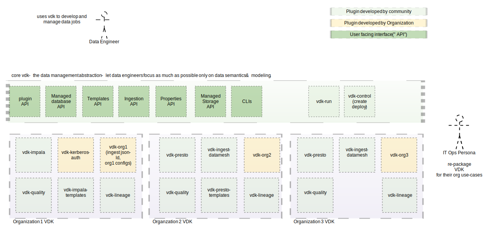
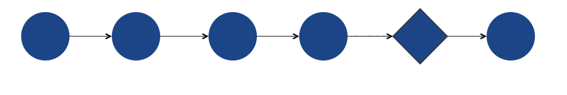
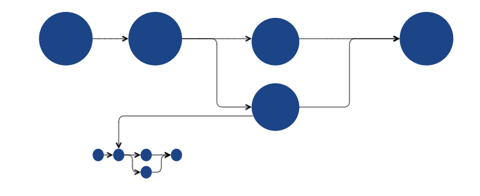

# Plugins

Plugins make Versatile Data Kit adaptable to any organization's use-cases.
Example use-cases for plugins are different database connections, file systems, different transformation templates, or organization-specific best practices and patterns.




## List of plugins

You can find a list of plugins that we have already developed in [plugins directory]().

## Installing and Using plugins

Installing a third-party plugin can be quickly done with pip:

```bash
pip install vdk-PLUGIN-NAME
```
Once the plugin is installed, vdk automatically finds it and activates it.

## Write your own plugin

A plugin is a python module that enhances or changes the behavior of Versatile Data Kit. <br>
A plugin is simply an implementation of one or more plugin hooks.

See all supported hook function specifications in [specs.py](../vdk-core/src/vdk/api/plugin/core_hook_spec.py).
The spec documentation contains details and examples for how a hook can be used.

To create a new plugin, there are only two steps necessary:<br>

* Create your implementation of the plugin's hook(s):
  You will need to mark it with the `hookimpl` decorator.
  Check out its [documentation here](../vdk-core/src/vdk/api/plugin/hook_markers.py) to see how you can configure the hook execution order
```python
# this is module myproject.pluginmodule, which will be our plugin
# define hookimpl as follows

# you need to have vdk-core as dependency
from vdk.api.plugin.hook_markers import hookimpl

# name of function must match name of hookspec function

@hookimpl(tryfirst=True)
def vdk_configure(config_builder: ConfigurationBuilder) -> None:
    """
    Here we define what configuration settings are needed with reasonable defaults.
    Other plugins will populate them. For example, there could be a plugin that reads env variables or parses config files.
    """
    config_builder.add(
        key="my_config",
        default_value="default-value-to-use-if-not-set-later",
        description="Description of my config.",
    )

# And here we can create another hook implementation
# let's use our configuration to print bar if it is set to foo everytime a job runs
@hookimpl
def run_job(self, context: JobContext):
    value = context.configuration.get_required_option('my_config')
    if value == "foo":
        print("bar")
```

* Register it as a plugin by listing the plugin modules in the vdk.plugin.run entry_point in your setup.py:
```python
entry_points={ 'vdk.plugin.run': ['name_of_plugin = myproject.pluginmodule'] }
```

<br>The plugin system is based on [pluggy.](https://pluggy.readthedocs.io/en/latest/index.html#implementations)

### Hook method names

As hook implementations can be functions (without class) it is recommended all hooks of the same family to share prefix. For example: db_connection_start, job_initialize.

## Types of plugins

### Generic Command-Line Lifecycle



Versatile Data Kit is used for executing different commands, some of them provided as plugins.
Using the above hooks, one can extend the functionality of any command by adding monitoring, customizing logging, or adding new options.

Check out the [CoreHookSpec class](../vdk-core/src/vdk/api/plugin/core_hook_spec.py) documentation for more details.

### Data Job Run (Execution) Cycle



The above image shows the normal run cycle of a data job. The hooks shown are only invoked when the "vdk run" command is invoked to execute a data job.


Check out the [JobRunSpecs class](../vdk-core/src/vdk/api/plugin/core_hook_spec.py) documentation for more details.

## Public interfaces

Any backwards compatibility guarantees apply only to public interfaces.
Public interfaces are modules and packages defined or imported in vdk.api.*.
unless the documentation explicitly declares them to be provisional or internal interfaces.
Anything else is considered internal.
All public interfaces (classes or methods) must have documentation.
