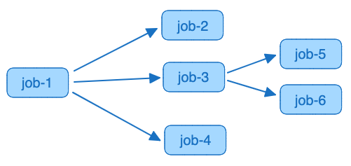

# VDK DAGs

Express dependencies between data jobs.

A plugin for Versatile Data Kit extends its Job API with an additional feature that allows users to trigger so-called VDK DAGs.

A VDK DAG is a regular Data Job that invokes other Data Jobs using Control Service Execution API.
In this way, there's nothing different from other data jobs except for its purpose. See [Data Job types](https://github.com/vmware/versatile-data-kit/wiki/User-Guide#data-job-types) for more info.

It's meant to be a much more lightweight alternative to complex and comprehensive workflows solution (like Airflow)
as it doesn't require to provision any new infrastructure or to need to learn new tool.
You install a new python library (this plugin itself) and you are ready to go.

Using this plugin, you can specify dependencies between data jobs as a direct acyclic graph (DAG).
See [Usage](#usage) for more information.

## Usage

```
pip install vdk-dag
```

Then one would create a single [step](https://github.com/vmware/versatile-data-kit/wiki/dictionary#data-job-step) and
define the jobs we want to orchestrate:

```python
def run(job_input):
    jobs = [
        {
        "job_name": "name-of-job",
        "team_name": "team-of-job",
        "fail_dag_on_error": True or False,
        "arguments": {"key1": value1, "key2": value2},
        "depends_on": [name-of-job1, name-of-job2]
        },
        ...
    ]
    DagInput().run_dag(jobs)
```

When defining a job to be run following attributes are supported:
* **job_name**: required, the name of the data job.
* **team_name:**: optional, the team of the data job. If omitted , it will use the DAG's team.
* **fail_dag_on_error**: optional, default is true. If true, the DAG will abort and fail if the orchestrated job fails, if false, DAG won't fail and continue.
* **arguments**: optional, the arguments that are passed to the underlying orchestrated data job.
* **depends_on**: required (can be empty), list of other jobs that the orchestrated job depends on. The job will not be started until depends_on job have finished.


### Example

The following example dependency graph can be implemented with below code.




In this example what happens is:
* Job 1 will execute.
* After Job 1 is completed, jobs 2,3,4 will start executing in parallel.
* Jobs 5 and 6 will start executing after job 3 completes, but will not wait for the completion of jobs 2 and 4.


```python

from vdk.api.job_input import IJobInput
from vdk.plugin.dag.dag_runner import DagInput

JOBS_RUN_ORDER = [
    {
        "job_name": "job1",
        "team_name": "team-awesome",
        "fail_dag_on_error": True,
        "arguments": {},
        "depends_on": []
    },

    {
        "job_name": "job2",
        "team_name": "team-awesome",
        "fail_dag_on_error": True,
        "arguments": {},
        "depends_on": ["job1"]
    },
    {
        "job_name": "job3",
        "team_name": "team-awesome",
        "fail_dag_on_error": True,
        "arguments": {},
        "depends_on": ["job1"]
    },
    {
        "job_name": "job4",
        "team_name": "team-awesome",
        "fail_dag_on_error": True,
        "arguments": {},
        "depends_on": ["job1"]
    },

    {
        "job_name": "job5",
        "team_name": "team-awesome",
        "fail_dag_on_error": True,
        "arguments": {},
        "depends_on": ["job3"]
    },
    {
        "job_name": "job6",
        "team_name": "team-awesome",
        "fail_dag_on_error": True,
        "arguments": {},
        "depends_on": ["job3"]
    },
]


def run(job_input: IJobInput) -> None:
    DagInput().run_dag(JOBS_RUN_ORDER)
```


### Runtime sequencing

The depends_on key stores the dependencies of each job - the jobs that have to finish before it starts.
The DAG execution starts from the jobs with empty dependency lists - they start together in parallel.  \
But what happens if they are too many? It could cause server overload.  \
In order to avoid such unfortunate situations, a limit in the number of concurrent running jobs is set.  \
This limit is a [configuration variable](https://github.com/vmware/versatile-data-kit/blob/main/projects/vdk-plugins/vdk-dag/src/vdk/plugin/dag/dag_plugin_configuration.py#L87)
that you are able to set according to your needs. When the limit is exceeded, the execution of the rest of the jobs
is not cancelled but delayed until a spot is freed by one of the running jobs. What's important here is that
although there are delayed jobs due to the limitation, the overall sequence is not broken.


### Data Job start comparison

There are 3 types of jobs right now in terms of how are they started.

* Started by Schedule
   * When the time comes for a scheduled execution of a Data Job, if the one is currently running, it will be waited
     to finish by retrying a few times. If it is still running then, this scheduled execution will be skipped.
* Started by the user using UI or CLI
   * If a user tries to start a job that is already running, one would get an appropriate error immediately and a
     recommendation to try again later.
* **Started by a DAG Job**
   * If a DAG job tries to start a job and there is already running such job, the approach of the DAG job would be
     similar to the schedule - retry later but more times.

### Configuration

The configuration variables of the VDK DAGs can be checked by running the command:
```console
vdk config-help
```

You will see all the VDK configuration variables. Search for _DAG_ in order to see the DAGs-related ones.

### FAQ


**Q: Will the DAG retry on Platform Error?**  \
A: Yes, as any other job, up to N (configurable by the Control Service) attempts for each job it is orchestrating.
See Control Service documentation for more information.

**Q: If an orchestrated job fails, will the DAG fail?**  \
A: Only if fail_dag_on_error flag is set to True (which is the default setting if omitted).

The DAG then will fail with USER error (regardless of how the orchestrated job failed)


**Q: Am I able to run the DAG locally?**  \
A: Yes, but the jobs orchestrated must be deployed to the cloud (by the Control Service).

**Q: Is there memory limit of the DAG?**  \
A: The normal per job limits apply for any jobs orchestrated/started by the DAG.

**Q: Is there execution time limit of the DAG?**  \
A: Yes, the DAG must finish within the same limit as any normal data job.
The total time of all data jobs started by the DAG must be less than the limit specified.
The overall limit is controlled by Control Service administrators.

**Q: Is the DAG going to fail and not trigger the remaining jobs if any of the jobs it is orchestrating fails?**  \
A: This is configurable by the end user in the parameter fail_dag_on_error.

**Q: Can I schedule one job to run every hour and use it in the DAG at the same time?**  \
A: Yes, if the job is already running, the DAG will wait for the concurrent run to finish and then trigger the job again from the DAG,
If the job is already running as part of the DAG, the concurrent scheduled run will be skipped.


### Build and testing

```
pip install -r requirements.txt
pip install -e .
pytest
```

In VDK repo [../build-plugin.sh](https://github.com/vmware/versatile-data-kit/tree/main/projects/vdk-plugins/build-plugin.sh) script can be used also.


#### Note about the CICD:

.plugin-ci.yaml is needed only for plugins part of [Versatile Data Kit Plugin repo](https://github.com/vmware/versatile-data-kit/tree/main/projects/vdk-plugins).

The CI/CD is separated in two stages, a build stage and a release stage.
The build stage is made up of a few jobs, all which inherit from the same
job configuration and only differ in the Python version they use.
They run according to rules, which are ordered in a way such that changes to a
plugin's directory trigger the plugin CI, but changes to a different plugin does not.
