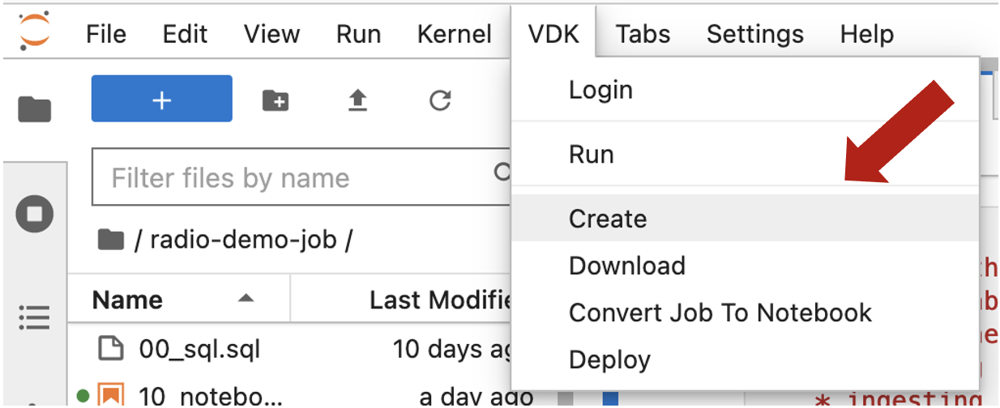
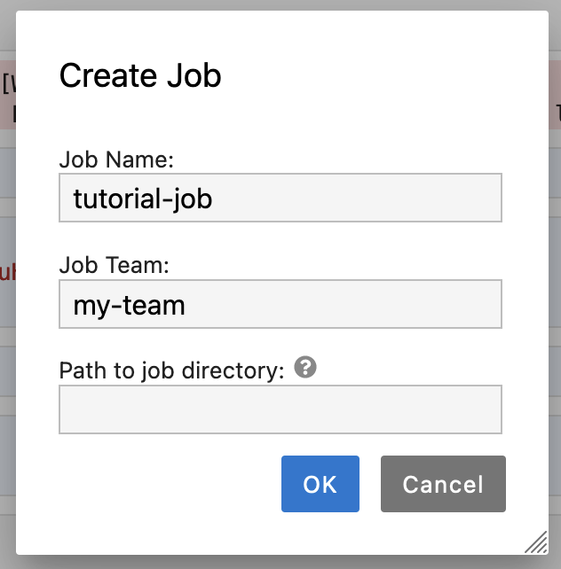
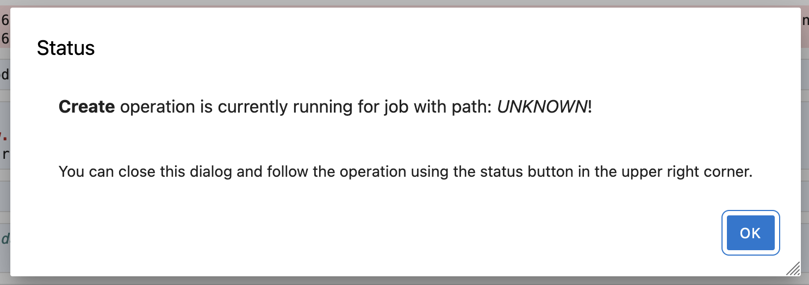
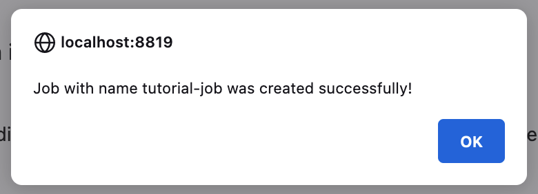

# Learn How to Create  a Data Job through the Jupyter UI
Time Commitment: About 5-10 minutes.

## Prerequisites

If you are not using an already configured environment,
before you start with the creation, please ensure you have the following:

  
<b>Installed Software and Services</b>

- **(Optional) [Control Service](https://github.com/vmware/versatile-data-kit/wiki/Interfaces#control-service:~:text=Parameterized%20SQL-,Control%20Service,-Job%20Lifecycle%20API):** Essential for orchestrating the execution of Data Jobs.
- **[vdk-jupyterlab-extension](https://github.com/vmware/versatile-data-kit/blob/main/projects/vdk-plugins/vdk-jupyter/vdk-jupyterlab-extension/README.md):** This extension integrates VDK with JupyterLab.
- **[vdk-notebook](https://github.com/vmware/versatile-data-kit/blob/main/projects/vdk-plugins/vdk-notebook/README.md):** Allows the execution of VDK jobs with notebooks.
- **[vdk-ipython](https://github.com/vmware/versatile-data-kit/blob/main/projects/vdk-plugins/vdk-ipython/README.md):** Loads VDK functionalities into IPython environments, allowing enhanced interaction.

## Data Job Creation Guide

### 0. Locate the 'Create' Option

- Select 'Create' option from the `VDK` section in the menu at the top.

### 1. Specify Job Properties

- Click 'Create' to open a dialog box.
- Fill in the job name and job team as appropriate.
- Specify Job Path by inputting the relative Jupyter path to the job directory, using the `parent/child/job` pattern. If no path is specified, the job will be created in the root directory.
- Once all details are filled in, click 'OK' to continue. The job will be created both locally and in the cloud (if available).

### 2. Await Operation Status Update

- Wait for a status update on the job creation operation.

### 3. Successful Creation

- Once the creation operation is complete, a dialog box will inform you of the operation's result.

- Navigate to the data job directory to view your newly created job.

## Wrap-up:
Well done!
You've successfully navigated through the process and created your first Data Job using Jupyter!
This is a significant step in your journey with the Versatile Data Kit, and we hope it was insightful.

## What's Next?

If you're just starting out, don’t stop here!
Proceed to [Develop a Job from Jupyter Guide](tutorial.md) to continue developing your newly created job!

Explore further with the [VDK Examples list](https://github.com/vmware/versatile-data-kit/wiki/Examples).
