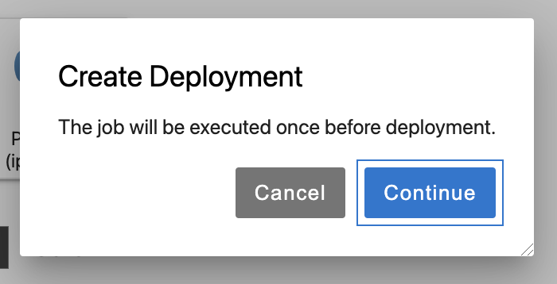

## Introduction

This guide will describe the step-by-step process of deploying a Data Job
through the Jupyter UI when using VDK on Jupyter.

## Deploying a job

This page will assume you have already created a job both locally and in the cloud,
and have developed the job.

1. Navigate to the data job directory.

2. From the menu bar at the top, open the VDK section and select the 'Deploy' option.

3. Enter your job name, team, and describe the latest change to the job in the
'Deployment reason' section. The path should be configured automatically if
   you have navigated to the job directory.
   

4. The following dialog informs you of the proceeding execution of the job
required before deploying the job to the cloud.
   

5. The following dialog will appear when the job deployment request has been
successful. Note that the job will require a few minutes to be fully deployed.