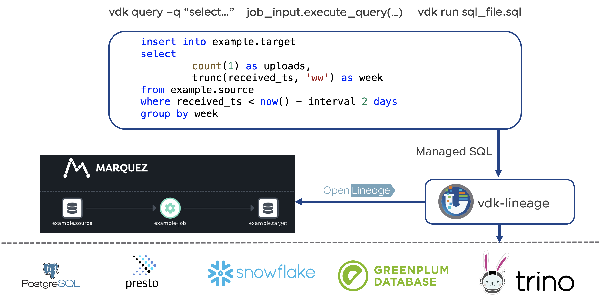

# VDK Lineage

VDK Lineage plugin provides lineage data (input data -> job -> output data) information and send it to a pre-configured
destination. The lineage data is send using [OpenLineage standard](https://openlineage.io)



At POC level currently.

Currently, lineage data is collected
 - For each data job run/execution both start and end events including the status of the job (failed/succeeded)
 - For each execute query we collect input and output tables.

TODOs:
 - Collect status of the SQL query (failed, succeeded)
 - Create parent /child relationship between sql event and job run event to track them better (single job can have multiple queries)
 - Non-SQL lineage (ingest, load data,etc)
 - Extend support for all queries
 - provide more information using facets – op id, job version,
 - figure out how to visualize parent/child relationships in Marquez
 - Explore openlineage.sqlparser instead of sqllineage library as alternative


## Usage

```
pip install vdk-lineage
```

And it will start collecting lineage from job and sql queries.

To send data using openlineage specify VDK_OPENLINEAGE_URL. For example:
```
export VDK_OPENLINEAGE_URL=http://localhost:5002
vdk marquez-server --start
vdk run some-job
# check UI for lineage
# stopping the server will delete any lineage data.
vdk marquez-server --stop
```

## Build and testing

In order to build and test a plugin go to the plugin directory and use `../build-plugin.sh` script to build it
