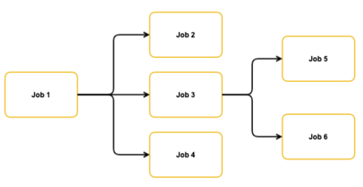

# Meta Jobs

Express dependencies between data jobs.

A plugin for Versatile Data Kit extends its Job API with an additional feature that allows users to trigger so-called Meta Jobs.

A meta job is a regular Data Job that invokes other Data Jobs using Control Service Execution API.
In this way, there's nothing different from other data jobs except for its purpose. See [Data Job types](https://github.com/vmware/versatile-data-kit/wiki/User-Guide#data-job-types) for more info.

It's meant to be a much more lightweight alternative to complex and comprehensive workflows solution (like Airflow)
as it doesn't require to provision any new infrastructure or to need to learn new tool.
You install a new python library (this plugin itself) and you are ready to go.

Using this plugin you can specify dependencies between data jobs as a direct acyclic graph (DAG). See usage for more information.

## Usage

```
pip install vdk-meta-jobs
```

Then one would create a single step and define the jobs we want to orchestrate

```python
def run(job_input):
    jobs = [
        {
        "job_name": "name-of-job",
        "team_name": "team-of-job",
        "fail_meta_job_on_error": True or False,
        "depends_on": [name-of-job1, name-of-job2]
        },
        ...
    ]
    MetaJobInput().run_meta_job(jobs)
```

When defining a job to be run following attributes are supported:
* **job_name**: required, the name of the data job
* **team_name:**: optional, the team of the data job. If omitted , it will use the meta job's team
* **fail_meta_job_on_error**: optional, default is true. if true, the meta job will abort and fail if the orchestrated job fails, if false, meta job won't fail and continue.
* **depends_on**: required (can be empty), list of other jobs that the orchestrated job depends on. The job will not be started until depends_on job have finished.


### Example

The following example dependency graph can be implemented with below code.




In this example what happens is
* Job 1 will execute.
* After Job 1 is completed, jobs 2,3,4 will start executing in parallel.
* Jobs 5 and 6 will start executing after job 3 completes, but will not wait for the completion of jobs 2 and 4.


```python

from vdk.api.job_input import IJobInput
from vdk.plugin.meta_jobs.meta_job_runner import MetaJobInput

JOBS_RUN_ORDER = [
    {
        "job_name": "job1",
        "team_name": "team-awesome",
        "fail_meta_job_on_error": True,
        "depends_on": []
    },

    {
        "job_name": "job2",
        "team_name": "team-awesome",
        "fail_meta_job_on_error": True,
        "depends_on": ["job1"]
    },
    {
        "job_name": "job3",
        "team_name": "team-awesome",
        "fail_meta_job_on_error": True,
        "depends_on": ["job1"]
    },
    {
        "job_name": "job4",
        "team_name": "team-awesome",
        "fail_meta_job_on_error": True,
        "depends_on": ["job1"]
    },

    {
        "job_name": "job5",
        "team_name": "team-awesome",
        "fail_meta_job_on_error": True,
        "depends_on": ["job3"]
    },
    {
        "job_name": "job6",
        "team_name": "team-awesome",
        "fail_meta_job_on_error": True,
        "depends_on": ["job3"]
    },
]


def run(job_input: IJobInput) - > None:
    MetaJobInput().run_meta_job(JOBS_RUN_ORDER)
```

### FAQ


**Q: Will the metajob retry on Platform Error?**<br>
A: Yes, as any other job, up to N (configurable by the Control Service) attempts for each job it is orchestrating.
   See Control Service documentation for more information

**Q: If an orchestrated job fails, will the meta job fail?**<br>
Only if fail_meta_job_on_error flag is set to True (which is teh default setting if omited)

The meta job then will fail with USER error (regardless of how the orchestrated job failed)


**Q: Am I able to run the metajob locally?**<br>
A: Yes, but the jobs orchestrated must be deployed to the cloud (by the Control Service).

**Q: Is there memory limit of the meta job?**<br>
A: The normal per job limits apply for any jobs orchestrated/started by the meta job.

**Q: Is there execution time limit of the meta job?**<br>
A: Yes, the meta job must finish within the same limit as any normal data job.
The total time of all data jobs started by the meta job must be less than the limit specified.
The overall limit is controlled by Control Service administrators

**Q: Is the metajob going to fail and not trigger the remaining jobs if any of the jobs it is orchestrating fails?**<br>
A: This is configurable by the end user in the parameter fail_meta_job_on_error

**Q: Can I schedule one job to run every hour and use it in the meta job at the same time?**<br>
A: Yes, if the job is already running, the metajob will wait for the concurrent run to finish and then trigger the job again from the meta job,
If the job is already running as part of the meta job, the concurrent scheduled run will be skipped


### Build and testing

```
pip install -r requirements.txt
pip install -e .
pytest
```

In VDK repo [../build-plugin.sh](https://github.com/vmware/versatile-data-kit/tree/main/projects/vdk-plugins/build-plugin.sh) script can be used also.


#### Note about the CICD:

.plugin-ci.yaml is needed only for plugins part of [Versatile Data Kit Plugin repo](https://github.com/vmware/versatile-data-kit/tree/main/projects/vdk-plugins).

The CI/CD is separated in two stages, a build stage and a release stage.
The build stage is made up of a few jobs, all which inherit from the same
job configuration and only differ in the Python version they use.
They run according to rules, which are ordered in a way such that changes to a
plugin's directory trigger the plugin CI, but changes to a different plugin does not.
