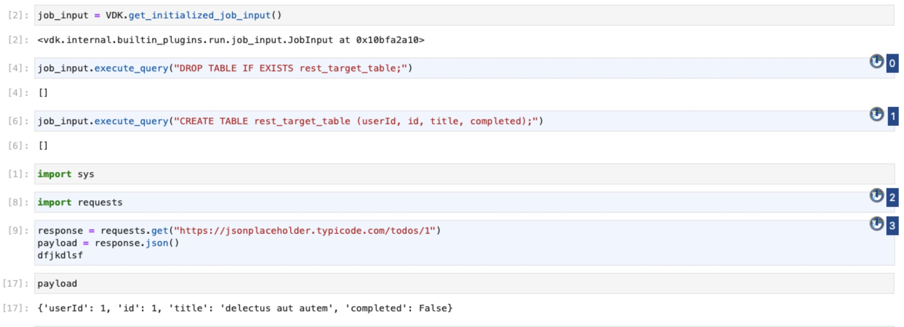

# Versatile Data Kit Notebook


## Purpose

The VDK Jupyter Notebook Integration provides a way for users to develop and manage data jobs directly within Jupyter notebooks.
This allows for a more interactive development experience and makes it easy to prototype, test, and iterate on data job code.
It supports separation of code into VDK and non-VDK cells to distinguish between development and production code.


## Installation

First, install the VDK Jupyter Notebook Integration package via pip:

```bash
pip install vdk-notebook
```

## Configuration

No specific configuration is required after installation.
The VDK Jupyter Notebook Integration automatically detects your existing VDK configuration.

## Usage

After installation:
- users will have access to the job_input interface, which can be used to execute templates, ingest data, and perform other VDK operations.
- users will be able to run vdk run on data job with notebook files along side python and SQL files as well.
- To separate your notebook into VDK and non-VDK cells, use the cell metadata feature in Jupyter. You can set the "vdk" key to true for cells that are part of the data job, and false for cells that are not.


### Example



Here is a directory structure which consist of one parent directory "parent-dir" and two subdirectories.
One of the subdirectories is a data job("example-job"). This is how the structure looks like:
```
parent-dir
└── example-job
    ├── notebook.ipynb
    ├── requirements.txt
    └── config.ini
└── some-other-dir
```
To run the data job from the parent-dir we need to use:

```
vdk run example-job
```


## Architecture
See the architecture of the plugin in the "Detailed design" section of [the VEP](https://github.com/vmware/versatile-data-kit/blob/main/specs/vep-994-jupyter-notebook-integration/README.md).
