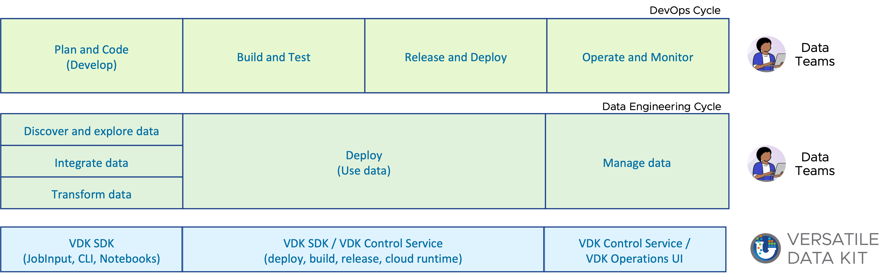

# Goals

The main goal of the Versatile Data Kit (VDK) is to enable efficient data engineering.

* Simplify and speed up data development & data engineering.
* Adopt and adapt good software development and DevOps practices in data engineering.
* Encourage existing best practices in data engineering by making them easy to follow.
* Use only what you need - modular. And build quickly what you miss - extensible.

<!-- source of this picture is from https://github.com/vmware/versatile-data-kit/files/12063655/data-eng-and-devops-and-vdk.pptx -->

# Architecture

## [System Context Diagrams](https://c4model.com/#SystemContextDiagram)

Versatile Data Kit is conceptually composed of two independently usable components:
- **VDK SDK** - ETL/ELT Python Framework. Highly extensible. Use anywhere there is python installed.
- **Control Service** - Kubernetes based runtime and service for data job deployment and monitoring and operations.

The VDK SDK includes essential user tools for creating data jobs focusing on ingestion and transformation.
It can be installed locally on the user's machine for local development.
It follows a plugin-oriented architecture in which all functionality is built through plugins.
This way VDK SDK can be rebuilt in any flavor based on the requirements of the organization and users. 
To get started, a default distribution is provided: `pip install quickstart-vdk`

The SDK is built with Python, a language renowned for its powerful libraries for data manipulation.
With the plugin-based architecture, developers can easily add functionality to the VDK SDK.
For example, they could add a plugin that allows the SDK to interact with a new type of database
or a plugin that adds a new data transformation functionality.

> Note: all diagrams in the document are based on https://c4model.com

 

The Control Service provides all the horizontal components required to configure and run [data jobs](https://github.com/vmware/versatile-data-kit/wiki/dictionary#data-job) on any cloud:
the UI, and REST APIs for deployment, execution, properties and secrets.
Also job scheduling, logging, alerting, monitoring etc.
It is tightly coupled with Kubernetes and relies on Kubernetes ecosystem for many of its functionalities.

---

## VDK SDK Component Diagram

Diving deeper into the VDK SDK, the entry point from the data practitioner's perspective is
* VDK Data Job Framework which provides tools and interfaces to perform ETL operations on data through SQL or Python.

Operators and data practitioners can use VDK Plugin Framework to customize and extend VDK.

#### vdk-core

The core component of VDK encompasses the Data Job Framework and the Plugin Framework.

vdk-core is built using a plugin-oriented design.
It provides the core interfaces for building data jobs, including ingestion, processing, templates, properties interfaces.
It implements the core lifecycle of ingestion, Data Job execution, CLI commands.

The actual implementation of these interfaces is performed in different plugins.
Most of these interfaces have a default implementation using built-in plugins within vdk-core, which provide basic functionality.
For instance, the properties interface has in-memory or file-based properties backends builtin.

The vdk-core component is intentionally designed to have minimal external dependencies (libraries).
This is done because vdk-core is intended to be used in various types of installations.

##### Data Job Framework
Data Job Framework gives the users the ability to access different data development interfaces described below.

###### VDK Data Job

Users create [data jobs](https://github.com/vmware/versatile-data-kit/wiki/dictionary#data-job).
Each data job can contain multiple [steps](https://github.com/vmware/versatile-data-kit/wiki/dictionary#data-job-step)
executed in some order (alphanumeric order by default).
`vdk run` is used to run a full data job both locally and when deployed in the cloud as well. 
Users can install plugins like vdk-notebook to add new types of steps. 
Users can install plugins like vdk-jupyter that provide IDE for creating and developing data jobs as well.

###### VDK Job Input

[Job Input](https://github.com/vmware/versatile-data-kit/blob/main/projects/vdk-core/src/vdk/api/job_input.py)
encapsulates a variety of functionalities and interfaces that provide a comprehensive toolkit for complex data operations.

- Ingester interface (IIngester) provide ways to ingest (or load) data into different destinations and remote stores (based on plugins).
  - Data Engineers can use `send_tabular_data_for_ingestion` and `send_object_for_ingestion` to send data to remote stores
- Database Query and Connection interface (IManagedConnection) provides access to managed database connections and query execution.
  It's managed by VDK - so it can be configured and provides error recovery mechanisms, parameters substitution.
  Through plugins, it is possible to collect lineage, provide query quality analysis, etc.
  - There is dedicated method `job_input.execute_query`
  - or one can use `job_input.get_managed_connection()` to get the managed connection and use it like `pd.read_sql("*", con=job_input.get_managed_connection())`
  - SQL steps are automatically executed using the configured managed connection
- Template interface (ITemplate) enables to package a whole data job and execute it as single operation for reusability.
  - Templates are added by plugins.
  - For example there are templates implemented for (Kimball) dimensional modeling (creating fact and dimension tables).
- Properties and Secrets can connect to different properties and secrets backends for data job users.
  - Properties API is used to store state data (e.g last updated timestamp) or configuration data
  - Secrets API is optional and can be enabled to store more securely data in a HashiCorp Vault instance.
- Job Arguments can be passed when starting a new job execution or run.

##### Plugin Framework

The Versatile Data Kit (VDK) provides a highly extensible plugin framework,
which offers a seamless way to enhance the data processing capabilities.
Users can easily install third-party plugins using pip, with the command:
`pip install vdk-PLUGIN-NAME`.
Once installed, the plugin is automatically located and activated by vdk, streamlining the user's experience.

A plugin in the VDK framework is a Python module that can modify or enhance the behavior of the SDK.
The creation process involves implementing one or more plugin hooks, marking them with the `hookimpl` decorator, and then registering the plugin.

By utilizing hooks, these plugins can extend command functionalities such as monitoring, lineage, logging customization, or the addition of new features.

There are 4 groups of hooks that can be created:
- **Generic Command-Line Lifecycle**: these allow the extension of any CLI command's functionality or adding new CLI commands
- **Data Job Run (Execution) Lifecycle**: these are specifically invoked when executing a data job.
- **Managed Database Connection Lifecycle**: these plugins hook on cursor events, providing a sequence of validation, decoration, execution, and recovery operations.
- **Ingestion Lifecycle**: these handle the entire data ingestion workflow, ranging from preprocessing the payload, sending it for ingestion, to post-processing.

**Backend Registry Interfaces**: these classes are responsible for registering different backends for managed databases connections, ingestion methods and targets, properties/ secrets implementations, adding new templates.

See more details [about how to use, install, and develop plugins here](https://github.com/vmware/versatile-data-kit/tree/main/projects/vdk-plugins#plugins).

Check out some more interesting and useful plugins:
[vdk-dag](https://github.com/vmware/versatile-data-kit/tree/main/projects/vdk-plugins/vdk-dag),
[vdk-lineage](https://github.com/vmware/versatile-data-kit/tree/main/projects/vdk-plugins/vdk-lineage),
[vdk-server](https://github.com/vmware/versatile-data-kit/tree/main/projects/vdk-plugins/vdk-server)

[quickstart-vdk](https://github.com/vmware/versatile-data-kit/tree/main/projects/vdk-plugins/quickstart-vdk) is a distribution packaged with most useful plugins to get started with VDK.
Users and organization are encourage to create their own distribution for their own specific purposes.

## VDK Control Service Container Diagram

Diving deeper into the VDK Control Service, the entry point from data practitioner's perspective is
* VDK Operations UI which is used for operating and monitoring of data jobs.
* [VDK Rest API](https://iaclqhm5xk.execute-api.us-west-1.amazonaws.com/data-jobs/swagger-ui/index.html#/) (through VDK Control CLI or Notebook UI) which is used to deploy and configure data jobs.

From operator's perspective:
* Operators use provided [helm chart](https://github.com/vmware/versatile-data-kit/wiki/Installation#install-versatile-data-kit-control-service) to install, and configure the Control Service deployment and the needed data infrastructure.
* Anyone can try local demo version by installing `quickstart-vdk` and running `vdk server --install`

#### Control Service Rest APIs

[Control Service Rest API](https://iaclqhm5xk.execute-api.us-west-1.amazonaws.com/data-jobs/swagger-ui/index.html) streamlines and manages key stages of the development lifecycle:
- Deploy the data job (with "single click") to the Control Service and it would take care of build, release, deploy of DevOps Cycle.
- Manage (operate and monitor) the jobs through Control Service monitoring and alerting and VDK Operations UI.

###### APIs

- Jobs API to register new jobs and stores job configuration.
- Source API to upload job source and provide version of the data job's source ("release")
- Deployment API make sure code is built and deployed with correct configuration
- Execution API tracks all executions exposing needed metrics and data and can start new executions
- Properties And Secrets API are additional services to help data jobs users keep state and credentials

###### Implementation
The Rest API is implemented in Java with Spring Boot framework.

Operators can also configure VDK Control Service to use existing Logging and Monitoring system in organization ecosystem
using environment variables or system properties.

In production, the REST API is running as a Kubernetes Deployment in a kubernetes cluster.

###### Security
The REST API implements authentication and authorization through OAuth2.
Complex authorization logic can be achieved using an authorization webhook.
All communication between the Control Service, the VDK SDK, and the managed components (like databases) can be encrypted.

###### Integration with the Kubernetes Ecosystem

The Control Service relies a lot on Kubernetes ecosystem for scheduling, orchestration,
logging services (for example fluentd can be configured to export logs to a log aggregator),
monitoring (metrics can easily be exported to prometheus)

###### Reliability
The Control Service leverages the resilience and fault-tolerance capabilities of Kubernetes
for scheduling and orchestration (automatic restarts, load balancing).

Errors encountered during data job execution, such as connectivity issues with external systems or
unanticipated exceptions in the data job code, are tracked by the Execution API.

Upon deployment there's provided tool [vdk-heartbeat](https://github.com/vmware/versatile-data-kit/tree/main/projects/vdk-heartbeat)
that can be used to verify deployment is working correctly.

#### VDK Operations UI
VDK Operations UI is an Angular-based web application. It relies on VDK Rest API and especially for almost all read operations on the [Rest GraphQL Query API](https://iaclqhm5xk.execute-api.us-west-1.amazonaws.com/data-jobs/swagger-ui/index.html#/Data%20Jobs/jobsQuery) .

#### Builder Job
Builder Jobs are used to build and release users' data jobs.
Those are system jobs used during deployment to install all dependencies and package the data job.
Builder Jobs interacts with Git to read the source code and with Container Registry (e.g. Docker) in order to store the data job image.

When a user deploys a data job, a data job container image is created for it and deployed as a cron job in kubernetes.

Operators can provide custom a builder image with further capabilities
(for example running system tests to verify data jobs , security hardening like checking for malicious code, etc.)

#### Data Job

The deployment of a data job happens as a CronJob deployment in Kubernetes. CronJob pulls the data job image from the Container Registry upon each execution. The data jobs are run in Kubernetes and monitored in cloud runtime environment via Prometheus, which uses the Kubernetes APIs to read metrics.

#### Database

CockroachDB is used to store the data job metadata. This includes information about data job definitions, and data job executions.
