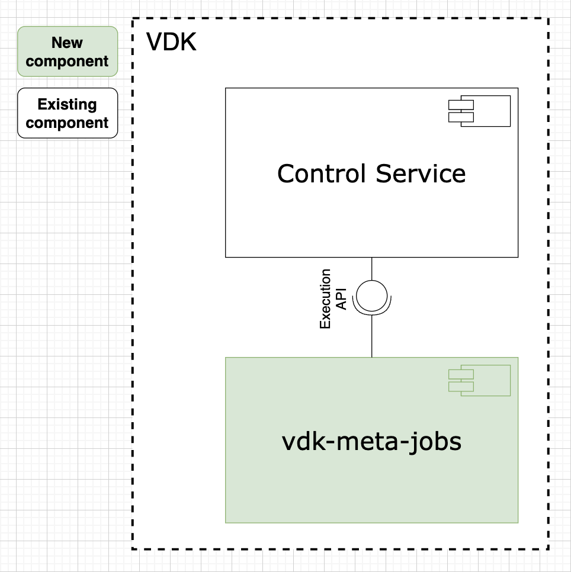
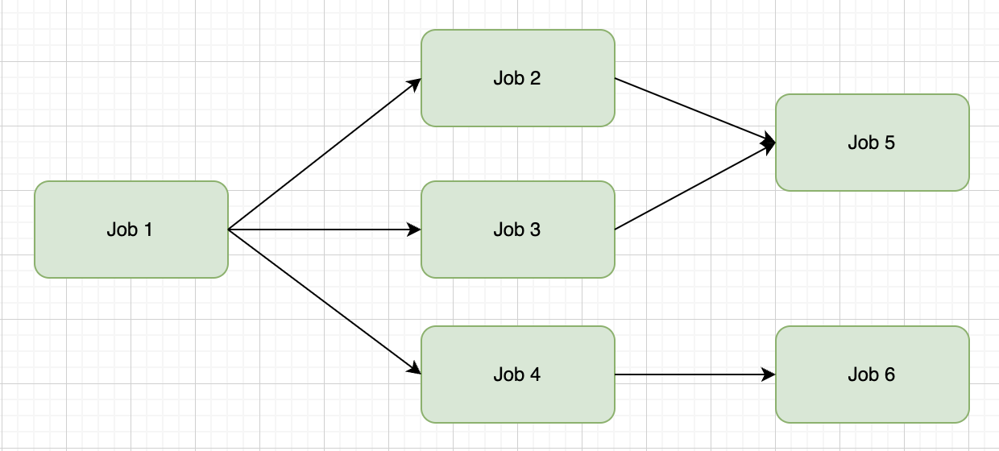

# VEP-1243: VDK Meta jobs

* **Author(s):** Yoan Salambashev (ysalambashev@vmware.com)
* **Status:** draft

- [Summary](#summary)
- [Glossary](#glossary)
- [Motivation](#motivation)
- [Requirements and goals](#requirements-and-goals)
- [High-level design](#high-level-design)
- [API Design](#api-design)
- [Detailed design](#detailed-design)
- [Implementation stories](#implementation-stories)
- [Alternatives](#alternatives)

## Summary

<!--
Short summary of the proposal. It will be used as user-focused
documentation such as release notes or a (customer facing) development roadmap.
The tone and content of the `Summary` section should be
useful for a wide audience.
-->

The Meta Job is a new feature in VDK that enables users to manage job dependencies in their data processing workflows.
It allows a Data Job to manage other Data Jobs by triggering them on certain job completion conditions (i.e. job1
and job2 complete before job3 starts) resulting in more accurate and consistent data output. An integration with
Apache Airflow is available, but it requires users to manage their own instance or pay for an externally managed
service. Meta Jobs provide a more lightweight alternative that simplifies the process and reduces cost.

## Glossary
<!--
Optional section which defines terms and abbreviations used in the rest of the document.
-->

* **VDK**: https://github.com/vmware/versatile-data-kit/wiki/dictionary#vdk
* **Control Service**: https://github.com/vmware/versatile-data-kit/wiki/dictionary#control-service
* **Data Job**: https://github.com/vmware/versatile-data-kit/wiki/dictionary#data-job
* **Data Job Step**: https://github.com/vmware/versatile-data-kit/wiki/dictionary#data-job-step
* **Data Job Execution**: https://github.com/vmware/versatile-data-kit/wiki/dictionary#data-job-execution
* **Apache Airflow (Airflow)**: https://airflow.apache.org/
* **DAG**: Directed Acyclic Graph
* **reqs/min**: requests per minute

## Motivation
<!--
It tells **why** do we need X?
Describe why the change is important and the benefits to users.
Explain the user problem that need to be solved.
-->

Data teams are constantly looking for ways to optimize and streamline their data processing workflows.
One critical aspect of these workflows is managing job dependencies, which ensures that Data Jobs are executed
in the appropriate order. Until now, we addressed this problem
by integrating with the external tool Apache Airflow. However, this approach comes with its downsides: teams would
have to manage their instance of Airflow or pay for an externally managed service.

To address this problem, VDK is introducing the Meta Jobs plugin. Meta Jobs are providing users with the ability
to manage job dependencies natively within the framework. They ensure that one or more Data Jobs will be triggered
upon successful completion (or other specified criteria) of one or more other Data Jobs. Similarly to other
orchestrating services, Meta Jobs express the dependencies as a DAG. As Data Jobs themselves, they go with
all the powerful features as every other Data Job, such as scheduling and monitoring.
This new feature gives users the ability to easily orchestrate the workflow the way they want it.

Meta Jobs allow for greater job segmentation, which can prove beneficial when working with complex
pipelines. Breaking down the pipelines into more manageable Data Jobs can help users with maintaining and debugging.
Thus, this feature will save time, resources, and worries about external dependencies.
Our data engineering framework empowers data teams to manage job dependencies with control, leading to more
reliable and efficient data processing workflows.

## Requirements and goals
<!--
It tells **what** is it trying to achieve?
List the specific goals (functional and nonfunctional requirements)? How will we
know that this has succeeded?

Specify non-goals. Clearly, the list of non-goals can't be exhaustive.
Non-goals are only features, which a contributor can reasonably assume were a goal.
One example is features that were cut during scoping.
-->

### Goals

* **Introduce a vdk-meta-jobs plugin**

* **Provide a way to manage job dependencies**
    - Execute jobs in a strict order. For example, one wants to ingest data from two different sources
      into the same database table and read all the data only when both ingests are successful.
    - Execute a job from another job with some specified arguments

### Non-Goals

## High-level design

<!--
All the rest sections tell **how** are we solving it?

This is where we get down to the specifics of what the proposal actually is.
This should have enough detail that reviewers can understand exactly what
you're proposing, but should not include things like API designs or
implementation. What is the desired outcome and how do we measure success?

Provide a valid UML Component diagram that focuses on the architecture changes
implementing the feature. For more details on how to write UML Component Spec -
see https://en.wikipedia.org/wiki/Component_diagram#External_links.

For every new component on the diagram, explain which goals does it solve.
In this context, a component is any separate software process.

-->

The vdk-meta-jobs plugin is a VDK component that enables the orchestration of Data Jobs.
Simply put, the Meta Job is a regular Data Job that invokes other Data Jobs using the Control Service Execution API.
The plugin allows users to define job dependencies and orchestrates the execution of multiple Data Jobs in a specific
order. The Data Jobs themselves perform specific ETL tasks. The plugin is designed in a way that is native to VDK’s
ecosystem.

#### Folder structure

* [vdk-meta-jobs](/projects/vdk-plugins/vdk-meta-jobs): the root folder for all the code
* [src](/projects/vdk-plugins/vdk-meta-jobs/src): the root folder for all the core python code
* [tests](/projects/vdk-plugins/vdk-meta-jobs/tests): the root folder for the e2e tests
* [config](/projects/vdk-plugins/vdk-meta-jobs/src/vdk/plugin/meta_jobs/meta_configuration.py): contains configuration variables

## API design

<!--

Describe the changes and additions to the public API (if there are any).

For all API changes:

Include Swagger URL for HTTP APIs, no matter if the API is RESTful or RPC-like.
PyDoc/Javadoc (or similar) for Python/Java changes.
Explain how does the system handle API violations.
-->

No changes to the public API.

## Detailed design
<!--
Dig deeper into each component. The section can be as long or as short as necessary.
Consider at least the below topics but you do not need to cover those that are not applicable.

### Capacity Estimation and Constraints
    * Cost of data path: CPU cost per-IO, memory footprint, network footprint.
    * Cost of control plane including cost of APIs, expected timeliness from layers above.
### Availability.
    * For example - is it tolerant to failures, What happens when the service stops working
### Performance.
    * Consider performance of data operations for different types of workloads.
       Consider performance of control operations
    * Consider performance under steady state as well under various pathological scenarios,
       e.g., different failure cases, partitioning, recovery.
    * Performance scalability along different dimensions,
       e.g. #objects, network properties (latency, bandwidth), number of data jobs, processed/ingested data, etc.
### Database data model changes
### Telemetry and monitoring changes (new metrics).
### Configuration changes.
### Upgrade / Downgrade Strategy (especially if it might be breaking change).
  * Data migration plan (it needs to be automated or avoided - we should not require user manual actions.)
### Troubleshooting
  * What are possible failure modes.
    * Detection: How can it be detected via metrics?
    * Mitigations: What can be done to stop the bleeding, especially for already
      running user workloads?
    * Diagnostics: What are the useful log messages and their required logging
      levels that could help debug the issue?
    * Testing: Are there any tests for failure mode? If not, describe why._
### Operability
  * What are the SLIs (Service Level Indicators) an operator can use to determine the health of the system.
  * What are the expected SLOs (Service Level Objectives).
### Test Plan
  * Unit tests are expected. But are end to end test necessary. Do we need to extend vdk-heartbeat ?
  * Are there changes in CICD necessary
### Dependencies
  * On what services the feature depends on ? Are there new (external) dependencies added?
### Security and Permissions
  How is access control handled?
  * Is encryption in transport supported and how is it implemented?
  * What data is sensitive within these components? How is this data secured?
      * In-transit?
      * At rest?
      * Is it logged?
  * What secrets are needed by the components? How are these secrets secured and attained?
-->

### Workflow

The structure of the Meta Job is a DAG. Here is an example of the DAG of jobs workflow:
1. The Meta Job(DAG) is initialized, following the preset configuration.
2. The DAG is being validated that there are no conflicts regarding the existence of the team/jobs in the
Control Service it addresses as well as any other technical errors.
3. If there are no errors during step 2., the DAG is built.
4. The DAG of jobs is executed, taking into account all the order information.
5. A summary of the DAG is logged.

### Configuration details

You are allowed to specify whether the Meta Job itself should fail if any of its orchestrated jobs encounter errors.
This is achieved by adding the Data Job attribute **fail_meta_job_on_error**. Set to true, as by default, would mean
that in the event of a failing orchestrated job, the Meta Job would also fail - with USER error.
This can help to prevent cascading failures and ensure that issues are isolated and addressed as soon as possible.

There are more settings that are configurable by the user, that can be explored in the
[config](/projects/vdk-plugins/vdk-meta-jobs/src/vdk/plugin/meta_jobs/meta_configuration.py).

### Capacity Estimation and Constraints

The load to the Control Service APIs from the Meta Jobs plugin mostly depends on three factors:

* Number of Data Jobs in the DAG (there is a reasonable default limit, but the value is
  [configurable](https://github.com/vmware/versatile-data-kit/blob/main/projects/vdk-plugins/vdk-meta-jobs/src/vdk/plugin/meta_jobs/meta_configuration.py#L87);
* Data Job Executions duration;
* Configuration value of [META_JOBS_TIME_BETWEEN_STATUS_CHECK_SECONDS](https://github.com/vmware/versatile-data-kit/blob/main/projects/vdk-plugins/vdk-meta-jobs/src/vdk/plugin/meta_jobs/meta_configuration.py#L76).

The main resource Meta Jobs consume is API requests. Here are the different cases in which an API request is sent:

* To start a job
* To check the status of a job (based on META_JOBS_TIME_BETWEEN_STATUS_CHECK_SECONDS)
* To get details after a job is completed
* On retries (if a job start failed)

Let's create a formula for calculating the number of API requests in a DAG run. We'll use the following variables:

J: Number of Data Jobs in the DAG
E: Average Data Job Execution duration
S: The value of META_JOBS_TIME_BETWEEN_STATUS_CHECK_SECONDS

Generally, job1 is independent of job2 in terms of requests - job1 would not impact the number of requests job2 would
send throughout its duration.

Thus, 1 job would send (1 + E/S + 1) API request for its run.
Hence, the DAG would make J * (1 + E/S + 1) total requests.

For example, the following workflow consists of 6 Data Jobs:

* `Job 2`, `Job 3` and `Job 4` depend on `Job 1`;
* `Job 5` depends on `Job 2` and `Job 3`;
* `Job 6` depends on `Job 4`;
* The execution time of each of the following jobs is about 10 min: `Job 1` and `Job 2`;
* The execution time of each of the following jobs is about 15 min: `Job 3`, `Job 4` and `Job 6`;
* The execution time of each of the following jobs is about 20 min: `Job 5`;
* The concurrent running jobs limit is configured to 2.
* The value of META_JOBS_TIME_BETWEEN_STATUS_CHECK_SECONDS is configured to the default 40 (seconds).

In this scenario, the vdk-meta-jobs plugin will perform a total of 147 requests for the whole workflow execution.
See Appendix A for more details about this example.

### Troubleshooting

* What are the possible failure modes.

  * There are a few ways in which the plugin may fail:

    * If an orchestrated job is being finalized and its status is not the expected "succeeded" one and the configuration
    value of "fail_meta_job_on_error" is set to TRUE, then a USER ERROR is raised for the Meta Job and its execution
    is interrupted.
    * If any kind of platform error occurs, a Meta Job would retry up to N (configurable by the Control Service) times
      for each job it is orchestrating.
    * If a non-registered job is attempted to be accessed, the plugin would raise Index Error with some suggestions.
    * If a job is starting but a conflict is detected with another running job (409) or an internal server error (>=500)
      has occurred, the execution of the job would be delayed.
    * In the event of circular dependency (e.g. job1 depends on job2 and job2 depends on job1), violating the
      requirements, the plugin would raise User Error.

  * Diagnostics: All the main operations from the creation of the Meta Jobs DAG to the very end of the execution are
    logged.

  * Testing: There are [tests](/projects/vdk-plugins/vdk-meta-jobs/tests/test_meta_job.py) for all the aforementioned
    failure scenarios.

### Test Plan

Unit and functional tests are introduced as part of the VDK Meta Jobs plugin.

### Availability

The plugin will be part of the vdk installation, so the same availability constraints apply.

### Dependencies

There are no external dependencies that the plugin relies on.

### Cons

Although having all these pros, the user should have in mind the cons of the Meta Jobs as well. The limitation that
have to be considered is that there is a limit on the number of concurrent running jobs in a single DAG. If this
limit is exceeded, the upcoming jobs would be delayed for a while until there is an empty spot for them.

## Implementation stories
<!--
Optionally, describe what are the implementation stories (eventually we'd create github issues out of them).
-->

## Alternatives
<!--
Optionally, describe what alternatives has been considered.
Keep it short - if needed link to more detailed research document.
-->

Apache Airflow was the alternative workflow management platform that was taken into consideration.
However, a VDK integration with Airflow proved to be costly mainly due to the management of external infrastructure.

## Appendix A: Calculating the load to the Control Service APIs

Let's estimate the number of API requests needed to be sent by the Meta Jobs plugin for the entire the workflow
execution.
We know that one Data Job is going to perform 1 request per 40 seconds to the Control Service APIs.
Also, the concurrent running job limit is set to 2.
For our convenience, let's make the following assumptions:
1. Finalizing one job and starting another takes no time (~0 sec).
2. Each job starts successfully from the first try - no retries are needed.

Here is the formula we defined earlier for a total amount of requests a DAG would need to send:

TR (total requests) = J * (2 + E/S)

In our DAG: J = 6, E = (2*600 + 2*900 + 2*1200)/6 = 900, S = 40.
Hence, TR = 6 * (2 + 900/40) = 6 * 24.5 = 147

Additionally, the following time intervals "X - Y" show which jobs would be running
from moment X until moment Y (measured in minutes), where X = 0 is the start:

* 0 - 10: `Job 1`;
* 10 - 20: `Job 2` and `Job 3`;
* 20 - 25: `Job 3` and `Job 4`;
* 25 - 35: `Job 4` and `Job 5`;
* 35 - 40: `Job 5` and `Job 6`;
* 40 - 50: `Job 6`.
