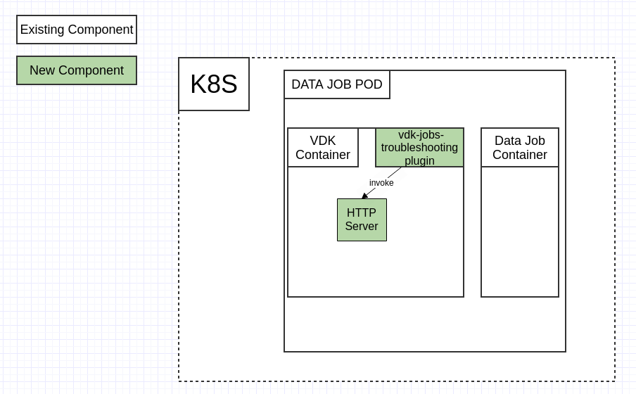

# VEP-1416: VDK Troubleshooting Tools

* **Author(s):** Andon Andonov (andonova@vmware.com)
* **Status:** draft

  - [Summary](#summary)
  - [Glossary](#glossary)
  - [Motivation](#motivation)
  - [Requirements and goals](#requirements-and-goals)
  - [High-level design](#high-level-design)
  - [API design](#api-design)
  - [Detailed design](#detailed-design)

## Summary
This VEP outlines the changes that would need to be introduced to provide users and Versatile Data Kit administrators with tools to troubleshoot data jobs, which are deployed in a kubernetes cluster. These tools will be provided through a dedicated plugin, which will be configurable and extendable, so more functionality could be added in the future.

The initial troubleshooting capability that will be introduced, will be the ability to do a thread dump of the python process and send it to a specific endpoint.

## Glossary
- VDK: https://github.com/vmware/versatile-data-kit/wiki/dictionary#vdk
- Plugins: https://github.com/vmware/versatile-data-kit/wiki/dictionary#vdk-plugins
- Data Job: https://github.com/vmware/versatile-data-kit/wiki/dictionary#data-job
- Data Job Execution: https://github.com/vmware/versatile-data-kit/wiki/dictionary#data-job-execution
- Data Job Deployment: https://github.com/vmware/versatile-data-kit/wiki/dictionary#data-job-deployment
- Kubernetes: https://kubernetes.io/
- Prometheus: https://prometheus.io/docs/introduction/overview/

## Motivation
When a data job, which is deployed in a kubernetes cluster, fails with an error, the VDK Deployment administrator can troubleshoot it either through the exposed Prometheus metrics or by looking at the job's logs. This works in most cases, but fails when there are issues with the logging service, some dependency does not propagate its logs, or when the configuration of the environment has been changed.

In such cases, there are a couple of approaches that can be taken:

1. An execution of the job can be triggered manually, and the administrator can connect to the cluster directly and either examine the logs as they are produced, or attach to the pod of the data job and troubleshoot it remotely. This has the limitation that the person doing the troubleshooting needs to have access to the kubernetes cluster, and even then the container in which the data job is running may not have all the utilities (editor, program for monitoring of running processes, etc.) to allow for proper troubleshooting. Additionally, it may not be possible for the data job to be run off its schedule due to business concerns, in which case the users/admins would need to wait for the job's next scheduled execution.
2. The data job can be executed locally, so that the user/admin can have complete control over the environment. This again has the drawback that off-schedule execution of the data job may not be possible. Also, in case the issue is with some environment configuration or system dependency, the error may not be reproducible locally, which can make troubleshooting even more difficult.

To allow for easier troubleshooting of errors with data jobs, a special plugin will be introduced, which will provide capabilities to do a thread dump and send the data to a predefined endpoint where it can be examined by the owner of the data job or by the team responsible for the VDK deployment. The plugin could also be extended in the future with other debugging capabilities.

## Requirements and goals
### Goals

* **Introduce a vdk-jobs-troubleshooting plugin**

* **Provide capability to do a thread dump**
  - A user/admin wants to get a thread dump of the data job process for troubleshooting purposes. For example, a user deploys a data job and after some time the job starts failing without any apparent reason. The user needs to be able to get a thread dump, so they are able to properly investigate the root cause for the issue.

### Non-Goals

* **Additional troubleshooting tools are not planned as part of this proposal.**

## High-level design

<!--
All the rest sections tell **how** are we solving it?

This is where we get down to the specifics of what the proposal actually is.
This should have enough detail that reviewers can understand exactly what
you're proposing, but should not include things like API designs or
implementation. What is the desired outcome and how do we measure success?

Provide a valid UML Component diagram that focuses on the architecture changes
implementing the feature. For more details on how to write UML Component Spec -
see https://en.wikipedia.org/wiki/Component_diagram#External_links.

For every new component on the diagram, explain which goals does it solve.
In this context, a component is any separate software process.

-->

For the proposed design, a vdk-jobs-troubleshooting plugin will be introduced. The plugin will start a http server instance, which will monitor the python process of the execution, and in case of an error with the job, will do a thread dump and send it to a predefined endpoint.

## API design

No changes to the public API.

## Detailed design
<!--
Dig deeper into each component. The section can be as long or as short as necessary.
Consider at least the below topics but you do not need to cover those that are not applicable.

### Capacity Estimation and Constraints
    * Cost of data path: CPU cost per-IO, memory footprint, network footprint.
    * Cost of control plane including cost of APIs, expected timeliness from layers above.
### Availability.
    * For example - is it tolerant to failures, What happens when the service stops working
### Performance.
    * Consider performance of data operations for different types of workloads.
       Consider performance of control operations
    * Consider performance under steady state as well under various pathological scenarios,
       e.g., different failure cases, partitioning, recovery.
    * Performance scalability along different dimensions,
       e.g. #objects, network properties (latency, bandwidth), number of data jobs, processed/ingested data, etc.
### Database data model changes
### Telemetry and monitoring changes (new metrics).
### Configuration changes.
### Upgrade / Downgrade Strategy (especially if it might be breaking change).
  * Data migration plan (it needs to be automated or avoided - we should not require user manual actions.)
### Troubleshooting
  * What are possible failure modes.
    * Detection: How can it be detected via metrics?
    * Mitigations: What can be done to stop the bleeding, especially for already
      running user workloads?
    * Diagnostics: What are the useful log messages and their required logging
      levels that could help debug the issue?
    * Testing: Are there any tests for failure mode? If not, describe why._
### Operability
  * What are the SLIs (Service Level Indicators) an operator can use to determine the health of the system.
  * What are the expected SLOs (Service Level Objectives).
### Test Plan
  * Unit tests are expected. But are end to end test necessary. Do we need to extend vdk-heartbeat ?
  * Are there changes in CICD necessary
### Dependencies
  * On what services the feature depends on ? Are there new (external) dependencies added?
### Security and Permissions
  How is access control handled?
  * Is encryption in transport supported and how is it implemented?
  * What data is sensitive within these components? How is this data secured?
      * In-transit?
      * At rest?
      * Is it logged?
  * What secrets are needed by the components? How are these secrets secured and attained?
-->
