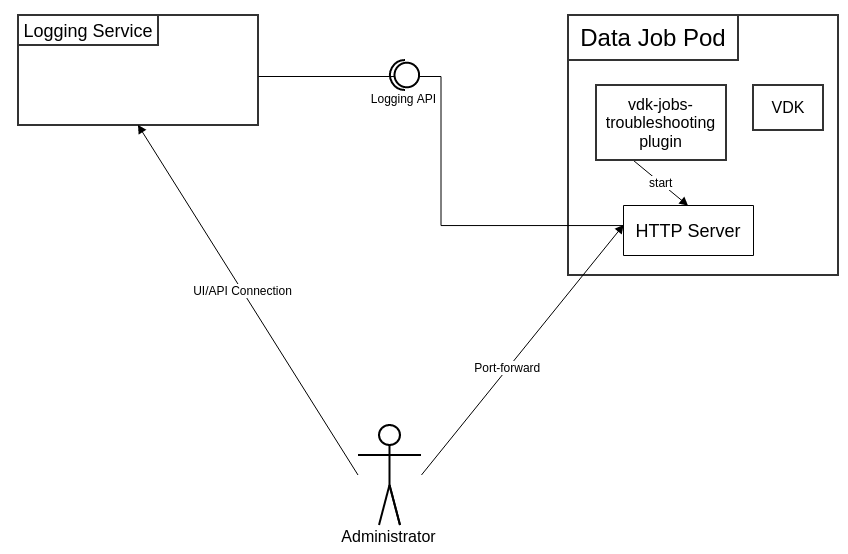

# VEP-1416: VDK Troubleshooting Tools

* **Author(s):** Andon Andonov (andonova@vmware.com)
* **Status:** draft

  - [Summary](#summary)
  - [Glossary](#glossary)
  - [Motivation](#motivation)
  - [Requirements and goals](#requirements-and-goals)
  - [High-level design](#high-level-design)
  - [API design](#api-design)
  - [Detailed design](#detailed-design)

## Summary

-----
This VEP outlines the changes that would need to be introduced to provide users and Versatile Data Kit administrators with tools to troubleshoot data jobs, which are deployed in a kubernetes cluster. These tools will be provided through a dedicated plugin, which will be configurable and extendable, so more functionality could be added in the future.

The initial troubleshooting capability introduced, is the ability to do a thread dump of the python process and send it to a specific endpoint.

## Glossary

-----
- VDK: https://github.com/vmware/versatile-data-kit/wiki/dictionary#vdk
- Plugins: https://github.com/vmware/versatile-data-kit/wiki/dictionary#vdk-plugins
- Data Job: https://github.com/vmware/versatile-data-kit/wiki/dictionary#data-job
- Data Job Execution: https://github.com/vmware/versatile-data-kit/wiki/dictionary#data-job-execution
- Data Job Deployment: https://github.com/vmware/versatile-data-kit/wiki/dictionary#data-job-deployment
- Kubernetes: https://kubernetes.io/
- Prometheus: https://prometheus.io/docs/introduction/overview/

## Motivation

-----
When a data job, which is deployed in a kubernetes cluster, fails with an error, the VDK Deployment administrator can troubleshoot it either through the exposed Prometheus metrics or by looking at the job's logs. This works in most cases, but fails when there are issues with the logging service, some dependency does not propagate its logs, or when the configuration of the environment has been changed.

In such cases, there are a couple of approaches that can be taken:

1. An execution of the job can be triggered manually, and the administrator can connect to the cluster directly and either examine the logs as they are produced, or attach to the pod of the data job and troubleshoot it remotely. This has the limitation that the person doing the troubleshooting needs to have access to the kubernetes cluster, and even then the container in which the data job is running may not have all the utilities (editor, program for monitoring of running processes, etc.) to allow for proper troubleshooting. Additionally, it may not be possible for the data job to be run off its schedule due to business concerns, in which case the users/admins would need to wait for the job's next scheduled execution.
2. The data job can be executed locally, so that the user/admin can have complete control over the environment. This again has the drawback that off-schedule execution of the data job may not be possible. Also, in case the issue is with some environment configuration or system dependency, the error may not be reproducible locally, which can make troubleshooting even more difficult.

To allow for easier troubleshooting of errors with data jobs, a special plugin will be introduced, which will provide capabilities to do a thread dump and either log the contents or stored locally, where it can be examined by the owner of the data job or by the team responsible for the VDK deployment. The plugin could also be extended in the future with other debugging capabilities.

## Requirements and goals

-----
### Goals

* **Introduce a vdk-jobs-troubleshooting plugin**

* **Provide capability to do a thread dump**
  - An administrator wants to get a thread dump of the data job process for troubleshooting purposes. For example, a user deploys a data job and after some time the job starts failing without any apparent reason. The administrator needs to be able to get a thread dump, so they are able to properly investigate the root cause for the issue.

### Non-Goals

* **Additional troubleshooting tools are not planned as part of this proposal.**
* **The thread-dump feature would not be exposed to users/data job owners.**

## High-level design

-----

For the proposed design, a vdk-jobs-troubleshooting plugin will be introduced. The plugin will start a http server instance, which will allow users to obtain a thread dump (which will also be printed in the logs) for further troubleshooting.

## API design

-----

There would be no changes to the API used by Data Job developers. The jobs troubleshooting plugin would have its own API, which would be used by developers that want to create data job troubleshooting utilities and which would be independent of the APIs of other major Versatile Data Kit components like vdk-core. For more details, check the [Detailed design](#detailed-design) section below.

## Detailed design

-----

### vdk-jobs-troubleshooting Plugin
The plugin will act as a toolbox, where data job troubleshooting tools will be implemented. As part of this proposal, only a thread-dump utility will be implemented. It will start a local web server, which will attach itself to a free port and, depending on configuration, will allow administrators to do port-forwarding to the data job pod and trigger a thread dump. The contents of the dump would be logged and would be available for examination.

In this context, the term "utility" refers to python classes that inherit from a base `ITroubleshootUtility` class and contain logic which is to be used for troubleshooting of deployed data jobs. All troubleshoot utility classes would need to implement two methods from the parent class, `start()` and `stop()`.

The `start()` method of the utility should start the execution of the said utility, and would be called when the data job is initialized, while the `stop()` method would be called at the end of the data job execution and would need to implement everything that's needed for the clean termination of the utility.

The main configuration variable for this plugin would be:
* __VDK_TROUBLESHOOT_UTILITIES_TO_USE__ - which will accept a comma-separated list of string literals with the troubleshooting utilities that will be used, e.g., `"utility1,utility2,..."`.

Another configuration variable that would be used the thread dump utility would be:
* __VDK_TROUBLESHOOT_PORT_TO_USE__ - which would specify the internal port to be used by the local http server. This port can then be accessed by administrators through port-forwarding.

### HTTP Server
The HTTP server would be started by the vdk-jobs-troubleshooting plugin as a stand-alone process. As for the purpose of the thread dump utility, the server would accept only simple GET requests, the [HTTPServer](https://docs.python.org/3/library/http.server.html#http.server.HTTPServer) from the python standard library would be used.

When the server is started, it would search for a free port on the localhost, and bind itself to it, sending a log message which port is to be accessed by the administrator.

As mentioned in the [Security and Permissions](#security-and-permissions) section below, the server would NOT be accessible outside the kubernetes pod, and only administrators with access to the kubernetes cluster would be able to use it.

In case future troubleshooting utilities are to use the server, the developers of the utilities could do that by implementing a custom request handler. This can be done by inheriting from python's built-in [BaseHTTPRequestHandler](https://docs.python.org/3/library/http.server.html#http.server.BaseHTTPRequestHandler) and passing the handler to the server object.

### Availability
The plugin will be part of the vdk installation, so the same availability constraints apply. The http server will be running in a separate process, but it will still be available as long as the data job pod is running. In case of issues with the logging service, the http server would still be able to log the thread-dump locally in the data job pod.

### Test Plan
Unit and functional tests would be introduced as part the jobs troubleshooting plugin.

### Security and Permissions
As the http server will run locally within the data job pod, no ports would be exposed externally. This means that only users who have the necessary permissions to connect to the kubernetes cluster would be able to connect to the server itself.

In cases, where the thread dump is logged through the logging service, the security considerations for the general execution logs will apply.
