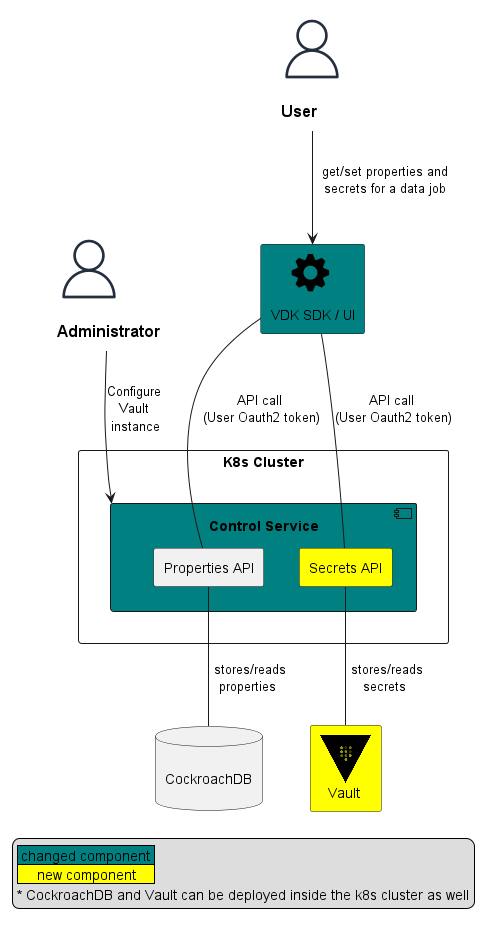

# VEP-1493: Vault Integration For Secrets Storage

* **Author(s):** Dako Dakov (ddakov@gmail.com), ...
* **Status:** draft


To get started with this template:
- 
- [ ] **Fill out this file as best you can.**
  There are instructions as HTML comments.
  At minimum, you should fill in the "Summary" and "Motivation" sections.
- [ ] **Create a PR for this VEP.**
- [ ] **Merge early and iterate.**
  Avoid getting hung up on specific details and instead aim to get the goals of
  the VEP clarified and merged quickly. The best way to do this is to just
  start with the high-level sections and fill out details incrementally in
  subsequent PRs.

<!-- Provide table of content as it's helpful. -->

- [Summary](#summary)
- [Glossary](#glossary)
- [Motivation](#motivation)
- [Requirements and goals](#requirements-and-goals)
- [High-level design](#high-level-design)
- [API Design](#api-design)
- [Detailed design](#detailed-design)
- [Implementation stories](#implementation-stories)
- [Alternatives](#alternatives)

## Summary

Provide integration with Hashicorp Vault for secure storage of secrets. Control Service operators will be able to 
optionally configure a vault instance to be used for storing data job properties which are marked as secret. 

## Glossary

CS or VDK-CS - The Versatile Data Kit [Control Service](https://github.com/vmware/versatile-data-kit/tree/main/projects/control-service)  
[Hashicorp Vault](https://github.com/hashicorp/vault) or Vault - A tool for secrets management, encryption as a service,
and privileged access management  
Secret/Secrets - sensitive data which needs to be available to data jobs - including but no limited to: secrets/
passwords/credentials/tokens/data

## Motivation

Some data jobs need to use secrets in order to connect to third party systems by providing user credentials or tokens - currently these
secrets are stored in data jobs properties, which in turn are stored in plain text in the configured Control 
Service Data Base. This enhancement will allow users to securely store secrets/passwords/credentials/tokens/data into 
a vault. 


## Requirements and goals

Goals:
- provide the ability to optionally configure a Vault instance in the Control Service for storing secrets
- change the APIs and SDK so that users can set and retrieve secrets and data jobs can use them during runtime

Non-Goals:
- automatic provisioning of a Vault instance as part of the VDK-CS installation
- automatic migration of existing secrets to Vault

## High-level design

In order to implement the proposed change, we should make the following changes - highlighted in the diagram below:
- provide the ability to optionally configure a Vault instance in the Control Service for storing secrets
- change the CS to store properties marked as secret into the configured Vault
- enhance vdk-sdk to allow for users to store secrets for their data jobs
- during runtime, data jobs can retrieve the secrets 



## API design

Currently, data job properties are stored and read in bulk. We are going to introduce similar APIs for storing and
reading secrets. 

#### Storing/retrieving secrets Control Service API

Introduce new API methods for storing and retrieving secrets under:
[/data-jobs/for-team/{team_name}/jobs/{job_name}/deployments/{deployment_id}/properties]()

```yaml
  '/data-jobs/for-team/{team_name}/jobs/{job_name}/deployments/{deployment_id}/secrets':
    summary: |
      Data Job Secrets API.
    get:
      tags:
        - Data Jobs Secrets
      responses:
        '200':
          $ref: '#/components/responses/Secrets'
      operationId: dataJobSecretsRead
      summary: Get Data Job secrets.
      description: <i>(Introduced in v1.0)</i>
    put:
      requestBody:
        content:
          application/json:
            schema:
              $ref: '#/components/schemas/DataJobSecrets'
        required: true
      tags:
        - Data Jobs Secrets
      responses:
        '201':
          description: Created successfully.
        '204':
          description: Updated successfully.
      operationId: dataJobSecretsUpdate
      summary: Update Data Job secrets.
      description: <i>(Introduced in v1.0)</i>
    parameters:
      -  name: team_name
         description: Team Name
         schema:
           type: string
         in: path
         required: true
      - name: job_name
        description: Data Job Name.
        schema:
          type: string
        in: path
        required: true
      - name: deployment_id
        description: Data job deployment id.
        schema:
          $ref: '#/components/schemas/DataJobDeploymentId'
        in: path
        required: true
```

When storing secrets, the request body is expected to provide a JSON object, containing all secrets:

```json
{
  "secret1": {},
  "secret2": {},
  "secret3": {}
}
```

#### Storing/retrieving secrets via the SDK during data job runtime

We are going to introduce Secrets API similar to the existing Properties API in the 
[JobInput class](https://github.com/vmware/versatile-data-kit/blob/main/projects/vdk-core/src/vdk/api/job_input.py#L11)
which allow data jobs to get and set properties


Get a single secret:
```python

def run(job_input):
   my_secret_token = job_input.get_secret("my_secret_key")   

```

Get all secrets:
```python

def run(job_input):
   secrets = job_input.get_all_secrets()
   aws_token = secrets['MY_AWS_TOKEN']
   authenticate(aws_token)
```

Set a secrets:
```python

def run(job_input):
   secrets = job_input.get_all_secrets()
   secrets['MY_TOKEN'] = get_new_token()
   job_input.set_all_secrets()
```

## Detailed design
<!--
Dig deeper into each component. The section can be as long or as short as necessary.
Consider at least the below topics but you do not need to cover those that are not applicable.

### Capacity Estimation and Constraints
    * Cost of data path: CPU cost per-IO, memory footprint, network footprint.
    * Cost of control plane including cost of APIs, expected timeliness from layers above.
### Availability.
    * For example - is it tolerant to failures, What happens when the service stops working
### Performance.
    * Consider performance of data operations for different types of workloads.
       Consider performance of control operations
    * Consider performance under steady state as well under various pathological scenarios,
       e.g., different failure cases, partitioning, recovery.
    * Performance scalability along different dimensions,
       e.g. #objects, network properties (latency, bandwidth), number of data jobs, processed/ingested data, etc.
### Database data model changes
### Telemetry and monitoring changes (new metrics).
### Configuration changes.
### Upgrade / Downgrade Strategy (especially if it might be breaking change).
  * Data migration plan (it needs to be automated or avoided - we should not require user manual actions.)
### Troubleshooting
  * What are possible failure modes.
    * Detection: How can it be detected via metrics?
    * Mitigations: What can be done to stop the bleeding, especially for already
      running user workloads?
    * Diagnostics: What are the useful log messages and their required logging
      levels that could help debug the issue?
    * Testing: Are there any tests for failure mode? If not, describe why._
### Operability
  * What are the SLIs (Service Level Indicators) an operator can use to determine the health of the system.
  * What are the expected SLOs (Service Level Objectives).
### Test Plan
  * Unit tests are expected. But are end to end test necessary. Do we need to extend vdk-heartbeat ?
  * Are there changes in CICD necessary
### Dependencies
  * On what services the feature depends on ? Are there new (external) dependencies added?
### Security and Permissions
  How is access control handled?
  * Is encryption in transport supported and how is it implemented?
  * What data is sensitive within these components? How is this data secured?
      * In-transit?
      * At rest?
      * Is it logged?
  * What secrets are needed by the components? How are these secrets secured and attained?
-->