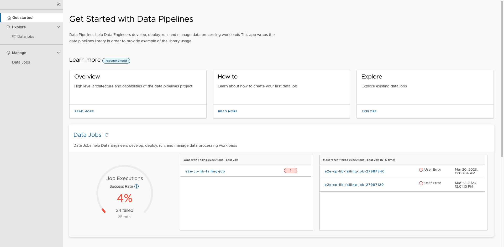
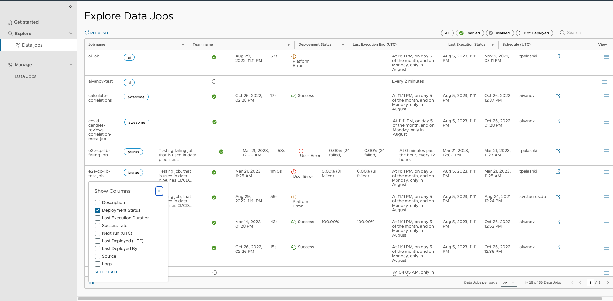
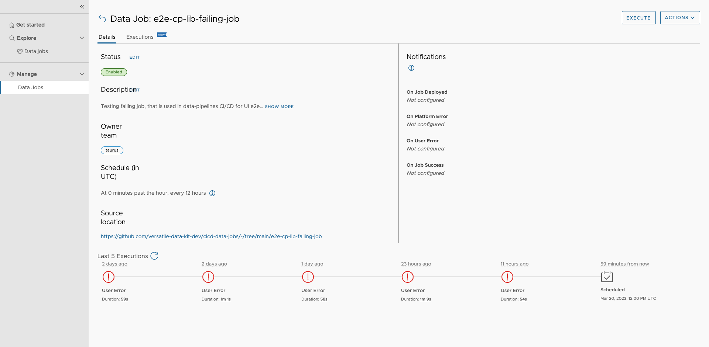
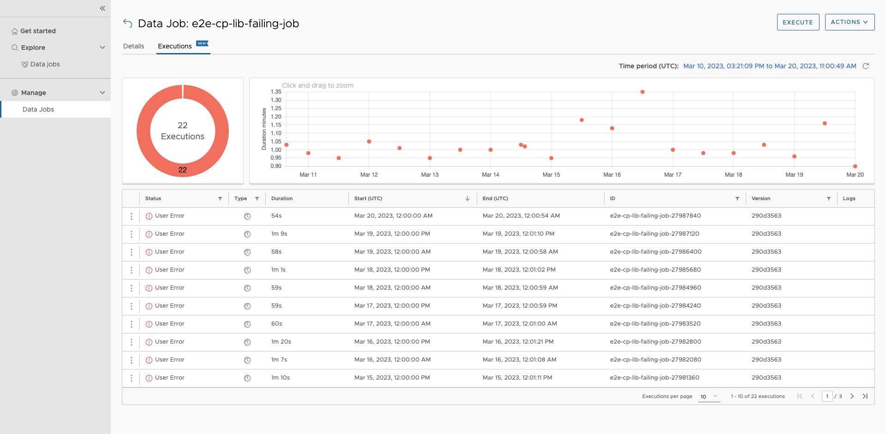
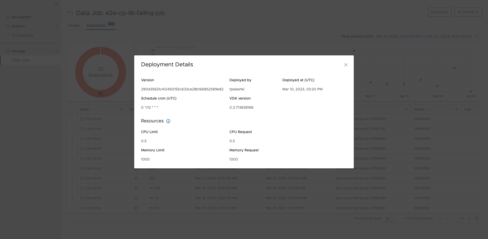

# VEP-1507: Versatile Data Kit Operations UI

* **Author(s):** Paul Murphy (murphp15@tcd.ie), Iva Koleva (ikoleva@vmware.com),
  Dilyan Marinov (mdilyan@vmware.com)
* **Status:** implemented

- [VEP-1507: Versatile Data Kit Operations UI](#vep-1507-versatile-data-kit-operations-ui)
  - [Summary](#summary)
  - [Glossary](#glossary)
  - [Motivation](#motivation)
  - [Requirements And Goals](#requirements-and-goals)
    - [Goals:](#goals)
    - [Out Of Scope:](#out-of-scope)
  - [High-Level Design](#high-level-design)
      - [Folder Structure](#folder-structure)
      - [Package Publishing](#package-publishing)
  - [Detailed Design](#detailed-design)
    - [Front-End Components](#front-end-components)
    - [User Journeys](#user-journeys)
    - [CI/CD](#cicd)
      - [Dependency Management](#dependency-management)
      - [Build and Test](#build-and-test)
        - [e2e test image](#e2e-test-image)
      - [Release](#release)
  - [Implementation Stories](#implementation-stories)

## Summary

<!--
Short summary of the proposal. It will be used as user-focused
documentation such as release notes or a (customer facing) development roadmap.
The tone and content of the `Summary` section should be
useful for a wide audience.
-->

At the moment customers can deploy and manage jobs through the VDK CLI tool or
the Control Service API. Adding a web UI to the VDK lets customers develop and
manage data jobs more comfortably. The Operations UI packages are built in
Angular and are designed to be extensible. This allows anyone to build their
project on top of the existing UI components.

## Glossary
<!--
Optional section which defines terms and abbreviations used in the rest of the document.
-->

data-pipelines, @versatiledatakit/data-pipelines: npm project for bootstrapping
of the codebase. It contains all the vdk-specific front-end code. For more
details please see [README.md](/projects/frontend/data-pipelines/README.md)

shared-components, @versatiledatakit/shared: a set of reusable Angular
components [README.md](/projects/frontend/data-pipelines/README.md)

## Motivation

The VDK aims to simplify the implementation, execution, monitoring, and
troubleshooting of data jobs and pipelines. When managing numerous data jobs, it
becomes challenging to upgrade them, monitor them, and resolve issues. Using the
VDK CLI or API directly for operating multiple jobs is not scalable. Visualizing
complex information with just the available tools is not convenient and requires
a high level of technical skill.

To address this challenge, an easy-to-use user interface is necessary. The UI
should provide the following functionalities:

- Developers should be able to manage data jobs easily. They should have the
  flexibility to update configurations, check the latest version, and more.
- Operators and support staff should be able to detect the status of data jobs
  quickly and have easy access to troubleshooting tools.
- Team leads should have an aggregated view of the status of all jobs, including
  how often they fail and why they fail.

## Requirements And Goals
<!--
It tells **why** do we need X?
Describe why the change is important and the benefits to users.
Explain the user problem that need to be solved.
-->

### Goals:

The VDK Operations UI should be:
1. Easy to set up and run, whether locally or in a k8s cluster.
1. Easy to extend with new features
  1. The process for adding a new UI section should be clearly documented, with
     step-by-step instructions provided
  1. First-time contributors should be able to build a new section in an
     isolated manner
  1. After creating a new section, contributors should be able to add it to a
     deployed instance of the UI without any friction

### Out Of Scope:
1. Screens for rendering data lineage graphs.

## High-Level Design

#### Folder Structure

* [frontend](/projects/frontend) root folder for all frontend code.
    * [shared-components](/projects/frontend/shared-components/README.md): the
      root folder for the shared components project, for more details please see
      the readme.
      * gui: contains the root package.json file for the project.
        * projects:
          * documentation-ui: functionality for testing and developing new
            components
          * shared: all the shared components live here
    * [data-pipelines](/projects/frontend/data-pipelines/README.md): the root
      folder for the data-pipelines project, for more details please see the
      readme.
    * [cicd](/projects/frontend/cicd/): contains docker images, scripts, etc.
      for cicd jobs

<!--
All the rest sections tell **how** are we solving it?

This is where we get down to the specifics of what the proposal actually is.
This should have enough detail that reviewers can understand exactly what
you're proposing, but should not include things like API designs or
implementation. What is the desired outcome and how do we measure success?

Provide a valid UML Component diagram that focuses on the architecture changes
implementing the feature. For more details on how to write UML Component Spec -
see https://en.wikipedia.org/wiki/Component_diagram#External_links.

For every new component on the diagram, explain which goals does it solve.
In this context, a component is any separate software process.

-->
#### Package Publishing
The shared components and data-pipelines packages are published to the [npm
registry](https://www.npmjs.com/) under the user
[@verstiledatakit](https://www.npmjs.com/settings/versatiledatakit/packages).
The npm registry was chosen as the package repository because it is the most
widely adopted javascript package manager. Publishing to the registry also
supports customers that want to:
1. Use the shared component libraries in their projects.
2. Build their own docker image for data-pipelines

## Detailed Design
<!--
Dig deeper into each component. The section can be as long or as short as necessary.
Consider at least the below topics but you do not need to cover those that are not applicable.

### Capacity Estimation and Constraints
    * Cost of data path: CPU cost per-IO, memory footprint, network footprint.
    * Cost of control plane including cost of APIs, expected timeliness from layers above.
### Availability.
    * For example - is it tolerant to failures, What happens when the service stops working
### Performance.
    * Consider performance of data operations for different types of workloads.
       Consider performance of control operations
    * Consider performance under steady state as well under various pathological scenarios,
       e.g., different failure cases, partitioning, recovery.
    * Performance scalability along different dimensions,
       e.g. #objects, network properties (latency, bandwidth), number of data jobs, processed/ingested data, etc.
### Database data model changes
### Telemetry and monitoring changes (new metrics).
### Configuration changes.
### Upgrade / Downgrade Strategy (especially if it might be breaking change).
  * Data migration plan (it needs to be automated or avoided - we should not require user manual actions.)
### Troubleshooting
  * What are possible failure modes.
    * Detection: How can it be detected via metrics?
    * Mitigations: What can be done to stop the bleeding, especially for already
      running user workloads?
    * Diagnostics: What are the useful log messages and their required logging
      levels that could help debug the issue?
    * Testing: Are there any tests for failure mode? If not, describe why._
### Operability
  * What are the SLIs (Service Level Indicators) an operator can use to determine the health of the system.
  * What are the expected SLOs (Service Level Objectives).
### Test Plan
  * Unit tests are expected. But are end to end test necessary. Do we need to extend vdk-heartbeat ?
  * Are there changes in CICD necessary
### Dependencies
  * On what services the feature depends on ? Are there new (external) dependencies added?
### Security and Permissions
  How is access control handled?
  * Is encryption in transport supported and how is it implemented?
  * What data is sensitive within these components? How is this data secured?
      * In-transit?
      * At rest?
      * Is it logged?
  * What secrets are needed by the components? How are these secrets secured and attained?
-->
### Front-End Components

**Home Page**

Contains three widgets:
- [data
  job](https://github.com/vmware/versatile-data-kit/wiki/dictionary#data-job)
  execution success rate - shows the success rate for all data job
  [executions](https://github.com/vmware/versatile-data-kit/wiki/dictionary#data-job-execution)
  in the last 14 days
- data jobs with failing exectuions(last 24h) - the list can also be used to
  navigate to individual job details
- most recent failed executions(last 24h) - the list can also be used to
  navigate to individual failed execution details

**Data Jobs Page**

Shows all existing data jobs and their properties
- Job name
- Description
- Deployment Status
- Last Execution End (UTC)
- Last Execution Duration
- Last Execution Status
- Success rate
- Schedule (in UTC)
- Next run (UTC)
- Last Deployed (UTC)
- Last Deployed By
- Notifications
- Source
- Logs
- Details

Jobs can be filtered by the following properites
- Job name
- Description
- Deployment Status
- Last Execution Status

Individual data jobs can be enabled, disabled and executed from the appropriate
buttons. Each job row in the table contains links to the source code, logs and
details of the corresponding data job. A search box is also available.

**Data Job Details Page**

Shows the status, description, owner team, schedule (in UTC) and source
location. Shows who gets notified on changing job status (deployment, success,
user error, platform error). Shows the last 5 job executions, their status,
execution time, duration, and links to logs. The job can be executed or deleted
from the appropriate buttons. The data job executions details page can be viewed
from the `Executions` tab.

**Data Job Executions Details Page**

Shows a success/failure pie chart for the total executions of the data job.
Shows a graph of job duration over time. Graph is zoomable and the time period
can be adjusted. Shows execution history for the job. Executions history table
has the following columns:
- Status
- Type
- Duration
- Start (UTC)
- End (UTC)
- ID
- Version
- Logs

The execution history table can be filtered by
- Status
- Type
- ID
- Version

Deployment details for an individual execution can be viewed using a button
attached to the row.

**Data Job Execution Deployment Details Pop-Up**

Shows the follwoing details about an individual execution
- Version
- Deployed by
- Deployed at (UTC)
- Schedule cron (UTC)
- VDK version

Shows the following resource information about an individual execution
- CPU Limit
- CPU Request
- Memory Limit
- Memory Request

More info about k8s resource requests, resource limits and resource units.

https://kubernetes.io/docs/concepts/configuration/manage-resources-containers/#requests-and-limits

https://kubernetes.io/docs/concepts/configuration/manage-resources-containers/#resource-units-in-kubernetes

**Related Issues**

https://github.com/vmware/versatile-data-kit/issues/1751

### User Journeys

**Data Job Development**

The VDK Operations UI empowers users to iterate quickly during the active
development phase of new data jobs. It provides the necessary tools for
developers to view the status and output of their jobs. It outputs performance
and resource data to help with optimisation.

*Example scenario 1 - User creates a new job and tests it on different types of input data*

Bob, a data engineer, is developing a new data job that works with different
data sources. He creates and deploy the job using the vdk cli. Bob then changes
the data source configuration. He uses the executions tab to view logs and check
how each data source impacts job duration.

*Example scenario 2 - User has data heavy ingestion and wants to optimize their data jobs*

Alice, a data engineer is developing a data job that uses a complex SQL query to
ingest a large amount of data. She has several ideas to optimise the query to
run on a large amount of data. Alice does incremental code changes and creates
data job deployments for each change. She compares how different approaches
scale by using the  job duration graph on the data jobs executions details page.
Alice chooses the best approach based on her findings.

*Example scenario 3 - User creates a new job, but it fails to start*

Charlie, a data engineer, is developing a new data job. He does a code change
and sees that his job has failed in the data job details page. He opens the logs
from the provided link and finds out what caused the error.

**Data Job Monitoring**

The VDK Operations UI empowers users to detect problems at a glance. It also
provides the necessary traceability to do deeper troubleshooting when necessary.

*Example Scenario 1 User finds that their job is failing intermittently*

Dan, a data engineer on an ingestion team has a production job that runs every
30 minutes. One morning, he finds a mix of data job success and failure
notifications in his inbox. Dan goes to the data jobs page, finds his job by
name, goes to the job's details page and navigates to the executions tab. He
finds that his job started failing the previous day after 00:01 AM.

Dan checks the logs for the first failure and finds that the job is getting
rate-limited by the data source. He checks the documentation and finds that the
data source has introduced new rate limits starting the previous day. Dan
adjusts their job's frequency to prevent future failures.

*Example Scenario 2 User finds that their job's duration has increased after May 24th*

Erica, a data engineer on an ingestion team, owns a production job that fetches
and curates data. The data is used to generate daily reports. She gets a
complaint from a data analytics team that the new report contains stale data
from the previous day. She finds the job in the data job page and goes to the
job's details page, where she navigates to the executions tab. Erica checks the
duration graph and sees that execution times have been rising since May 24th.

Erica uses the versioning info from the deployment details pop-up to trace
changes to the data job in the job's code repository. She finds that on and
after May 24th, Chuck, a member of her team, introduced a series of changes. The
changes have significantly worsened performance. Erica mitigates the issue by
reverting the changes. She calls a meeting with her team to discuss how to fix
the problem. The team has available resource information from the data job
execution deployment details pop-up. They discuss the trade-off of throwing more
resources at the problem vs. spending time optimising Chuck's changes.

*Example Scenario 3 - User finds that their job failed, but they didn't get notified*

Fred is a DevOps engineer who manages data pipelines for several ingestion and
analytics teams. He checks the general health of his data jobs using the home
page. Fred finds that it has fallen below 100%. He sees there have been recent
failures in a specific team's job, but he wasn't notified. This job is a core
dependency for several other jobs. He navigates from the home page to the job's
detail's page. Fred finds that his e-mail is not listed in the failure
notifications section. He contacts the job owner and asks that they add his
e-mail to avoid this scenario in the future.

*Example Scenario 4 - User finds that a job delivers low-quality data*

Georgia, a data analyst, has received complaints about data quality issues in a
recent report. She logs into the web UI to check the data jobs which produced
tables for that report. The jobs have failing or delayed executions in the last
24 hours. Georgia navigates to the Home Page and checks the data jobs with
failing executions widget. She navigates to the individual job details page and
analyses the logs and execution history. Georgie takes note of the failing data
job and the owner team responsible for it. She reaches out to the job owner.
Georgia shares her findings and collaborates with them to identify the cause of
the failure and resolve the issue.

### CI/CD

CI/CD for VDK Operations UI components leverages existing CI/CD for the VDK monorepo
using GitLab.

- [GitLab config for frontend
  components](/projects/frontend/cicd/.gitlab-ci.yml)
- [@versatiledatakit/shared install
  script](/projects/frontend/cicd/install_shared.sh)
- [@versatiledatakit/data-pipelines build
  script](/projects/frontend/cicd/build_data_pipelines.sh)
- [@versatiledatakit/data-pipelines install
  script](/projects/frontend/cicd/install_data_pipelines.sh)
- [release script for npm
  packages](/projects/frontend/cicd/publish_package_npm.sh)

The shell scripts linked above are designed for CI/CD and local development use.

#### Dependency Management

Our main goals when it comes to dependency management are as follows:

1. Keep peer dependencies up to date to avoid vulnerabilities
2. Detect problems related to peer dependencies early

Therefore, peer dependency versions are lower-bound, i.e. the version of a
specific peer dependency should be greater than or equal to a specific number.
Peer dependency versions should not be upper-bound unless absolutely necessary.

`package-lock.json` is not included in version control for either package.
Instead, for each pipeline run, `npm install` is run, and `package-lock.json` is
output as an artefact at the end. Artefact retention is 7 days. This setup
ensures that the latest dependencies are pulled for every build. It also ensures
compatibility issues are detected early and are traceable.

**Advantages Of Using Lower-Bound Peer Dependency Versions**

1. Reduces conflicts. Setting a lower-bound version for a peer dependency
ensures that the package uses a compatible version of that dependency and
reduces the chance of conflicts (if another version is pinned somewhere else).
It also provides more flexibility to users: they can pin the version themselves
if they have to.

2. Improves security. Ensures we use the latest versions and makes it easier to
keep up with updates.

**Disadvantages**

Compatibility issues. If a new version of a dependency
introduces a breaking change, this leads to increased maintenance, due to
failures in CI/CD.

**Alternatives Considered**

Pinned dependencies and Dependabot automatic updates. The dependencies are
pinned and dependabot automatically updates them. This keeps peer dependencies
up to date and allows the detection of problems early by opening PRs after a new
dependency release. The disadvantage here is that the process becomes too
granular, e.g. every peer dependency update opens a new PR, which triggers a new
release.

Range-based dependencies. Specify only the major version and allow any minor and
patch versions to be used. Dependabot opens PRs only for major version updates.
This is better in terms of granularity but reduces flexibility.

#### Build and Test

- Opening a pull request with changes to `@versatiledatakit/data-pipelines`
triggers a pipeline that builds the shared package and runs unit tests on it.
- Opening a pull request with changes to `@versatiledatakit/shared` triggers a
pipeline that builds and tests both the data-pipelines and shared packages to
ensure compatibility.
- Upon successful build and unit testing of any subcomponent, e2e testing is also
  performed to verify [end-to-end scenarios](../../projects/frontend/data-pipelines/gui/e2e).
  _Note: the e2e tests now run in headed mode, as a workaround to auth issues observed
  with running cypress in headless mode https://github.com/vmware/versatile-data-kit/issues/1766._
- Opening a pull request with changes to the [VDK Operations UI
CI/CD](/projects/frontend/cicd) triggers a pipeline that builds and tests both
packages. Merging changes into `main` requires that these pipelines pass
successfully.

##### e2e test image
End-to-end tests have lots dependencies (browsers, build systems, etc.). Cypress
(e2e framework) are aware of this and provide a base image. We extend the base
image with the extra functionality we need. This extended image is used for
testing in GitLab

It contains:

1. Angluar (build)
2. Chrome Browser (for UI testing)
3. Command cli utils (curl, git, zip, etc...) (auxiliary functions/packaging
   reports, etc..)
4. Sonar (Code Quality checking)
5. Npm and Nvm (build)

The actual dockerfile can be found at
[Dockerfile](/projects/frontend/cicd/Dockerfile)

New versions are released by changing the version in
[version.txt](/projects/frontend/cicd/version.txt)

New releases are published under the image name
[registry.hub.docker.com/versatiledatakit/vdk-cicd-base-gui](https://hub.docker.com/r/versatiledatakit/vdk-cicd-base-gui)

**Related Issues**

https://github.com/vmware/versatile-data-kit/issues/1728

#### Release

VDK Operations UI packages are published under the
[@verstiledatakit](https://www.npmjs.com/settings/versatiledatakit/packages)
namespace in npm registry. Merging changes to a package triggers the publishing
of that package to npm. VDK Operations UI packages are **not** included in VDK
nightly builds. This setup ensures that each atomic change to the Operations UI
corresponds to a release version.

Versioning for each package is based on its `version.txt` file and the GitLab
pipeline id. Major and minor versions are taken from `version.txt`. The GitLab
pipeline id, which is guaranteed to be unique, serves as the patch version. Note
that `package.json` files do not represent package versions and should not be
used as a source of truth for versioning.

- [version.txt for
  @versatiledatakit/data-pipelines](/projects/frontend/data-pipelines/gui/version.txt)
- [version.txt for
  @versatiledatakit/shared](/projects/frontend/shared-components/gui/version.txt)

As stated in [CONTRIBUTING.md](/CONTRIBUTING.md), versioning of all components
follows https://semver.org

## Implementation Stories
<!--
Optionally, describe what are the implementation stories (eventually we'd create github issues out of them).
-->
