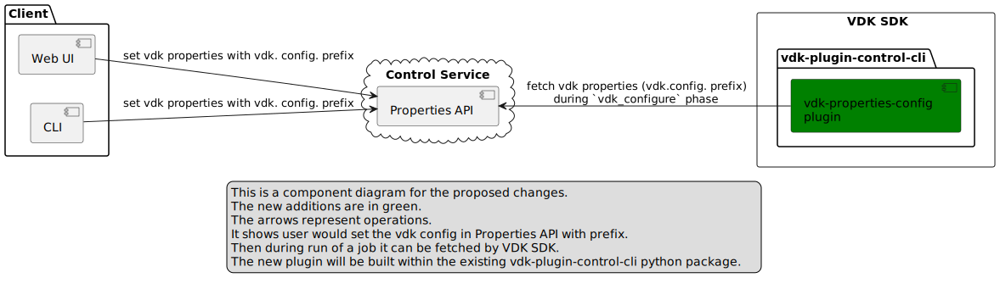
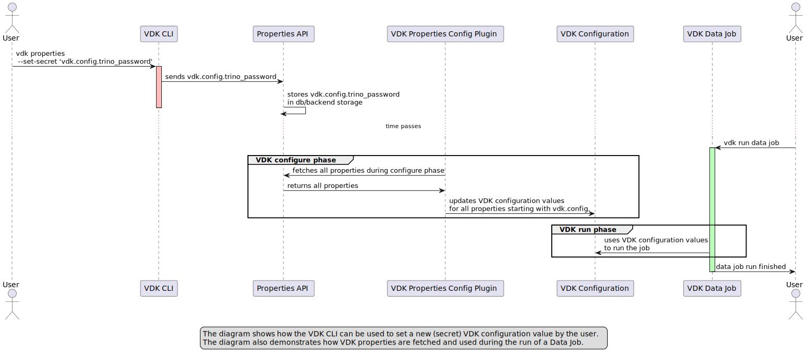

# VEP-1722: Properties based VDK Configuration Provider

* **Author(s):** Antoni Ivanov (aivanov@vmware.com),
* **Status:** draft

To get started with this template:

- [ ] **Create an issue in Github (if one does not exists already)**
- [ ] **Make a copy of this template directory.**
  Copy this template into the specs directory and name it
  `NNNN-short-descriptive-title`, where `NNNN` is the issue number (with no
  leading-zero padding) created above.
- [ ] **Fill out this file as best you can.**
  There are instructions as HTML comments.
  At minimum, you should fill in the "Summary" and "Motivation" sections.
- [ ] **Create a PR for this VEP.**
- [ ] **Merge early and iterate.**
  Avoid getting hung up on specific details and instead aim to get the goals of
  the VEP clarified and merged quickly. The best way to do this is to just
  start with the high-level sections and fill out details incrementally in
  subsequent PRs.

<!-- Provide table of content as it's helpful. -->

- [Summary](#summary)
- [Glossary](#glossary)
- [Motivation](#motivation)
- [Requirements and goals](#requirements-and-goals)
- [High-level design](#high-level-design)
- [API Design](#api-design)
- [Detailed design](#detailed-design)
- [Implementation stories](#implementation-stories)
- [Alternatives](#alternatives)

## Summary

This VEP proposes a new provider for VDK configuration that allows users to set job-specific configuration for data jobs.
Currently, users can only set configuration using environment variables or the config.ini file, both of which have limitations.
The new provider will take configuration from properties with the "vdk.config." prefix and have lesser priority than environment variables and the config.ini file.

## Glossary
<!--
Optional section which defines terms and abbreviations used in the rest of the document.
-->

## Motivation
VDK allows users to develop and execute data jobs.
Each data job can require its own specific configuration that needs to be set before execution.
Currently, the only way to set configuration is using environment variables or the config.ini file.
However, these approaches have limitations. Users cannot set environment variables for deployed jobs in the cloud, and the config.ini file is not secure for storing sensitive data.

To address these limitations, we propose a new provider for VDK configuration that allows users to set job-specific configuration using properties with the "vdk.config." prefix.
This approach provides more flexibility and security in setting configuration, especially for sensitive data.

The current limitations in setting job-specific configuration within VDK can also impact the system's usefulness for users.
One issue is the lack of flexibility, as users are unable to adopt a new database plugin unless it has been pre-configured by a system administrator.
This creates an additional step for users, requiring them to request the necessary configuration changes from administrators.
In addition, the current method of setting configuration values via the Control Service introduces security concerns,
as it requires the sharing of sensitive information such as passwords, and can lead to a poor user experience.

## Requirements and goals
<!--
It tells **what** is it trying to achieve?
List the specific goals (functional and nonfunctional requirements)? How will we
know that this has succeeded?

Specify non-goals. Clearly, the list of non-goals can't be exhaustive.
Non-goals are only features, which a contributor can reasonably assume were a goal.
One example is features that were cut during scoping.
-->
The new provider for VDK configuration should satisfy the following requirements and goals:

* Allow users to set job-specific configuration using properties with the "vdk.config." prefix.
* Have lesser priority than environment variables and the configuration values from  config.ini file.
* Be flexible and secure in setting configuration, especially for sensitive data.

### Non-goal

In the future, config.ini file can be auto-generated entirely from the properties and updated when config.ini is edited on deploy.

## High-level design

The new provider for VDK configuration will be added as a new option in the VDK configuration system.
It will take configuration from properties with the "vdk.config." prefix and have lesser priority than environment variables and the config.ini file.
The properties will be stored in a properties file.

## API design

The new provider for VDK configuration will not require any changes to existing API.

## Detailed design

[](https://www.plantuml.com/plantuml/uml/ZLCzZ-8m4EtzAqPGKC59b1Gd3X3IVHGqTnNIoOadYPTWM_OO_lvEecZZJKYqI4XuFjwRzsRO1vAUuhqMCYVhuMz0Bno7TAwTD0IBVwVVSFppS_4vUl7M8Rynm8yB9qSjIS7HcaANSAbZgSsujCj7BqdRL_cJ90c_RBP8PWGP86w5Q7-ll_TZmWuUwWQkfxyQMAy34dzpZmGhpc_obdD3NXlxtyaGdjQhLKEW7v8mmLkUpmV-Y3x2T4Fzp1hGg02Js6BKCW732d46X-Le0ohxbidynfHjWonHA1mFB-AMQGOkTWxvo31DxCrclUv1wV9mQEIBqjleeCdbtR8GN2K3YjbbJuaiaFAAdxAkqqsfo5BB4SLBv-PfT-2HeZT3Yg-CEpv9XekElSBGMP0auI7hYE5g2kk7Ujh_LgFegQbALohGgCHJ7qtgPc__z3XXTXQoBIPLs6wtOHiZystiFYwWhI-qqQ52DRobla_i6IlUwtS0)

To further elaborate on the detailed design of the new VDK plugin for configuration:

1. Adding the plugin to the VDK SDK:
   1. The new VDK plugin for configuration will be implemented as a new plugin within the VDK SDK.
   2. For efficiency the plugin will be developed inside [vdk-plugin-control-cli](https://github.com/vmware/versatile-data-kit/tree/main/projects/vdk-plugins/vdk-plugin-control-cli) as it already has setup for accessing Properties
2. Retrieving configuration values from properties:
   1. The plugin will retrieve configuration values from properties with the "vdk.config." prefix.
   2. During job configuration, the plugin will search for properties with the "vdk.config." prefix in the properties API.
   3. If a property with the prefix is found, the plugin will use the value of the property to configure the job.
   4. The value will be with lowest priority (plugin will be developed using tryFirst=True) (see call time order in https://pluggy.readthedocs.io/en/stable/#call-time-order)
3. Storing configuration:
   1. The configuration will be stored in a properties API.
   2. User would use VDK CLI or UI to set properties with prefix 'vdk.config.' for example 'vdk.config.trino_password'
   3. The property will be stored as normal property are stored. Nothing different here.
   4. Potential usability improvement to be considered: Both UI and CLI could hide "vdk.config." as implementation detail
      1. UI can provide Properties UI and Job Configuration UI (which would come with ony options from vdk `config-help`)
         Details on actual UI are out of scope for this VEP and can be decided by UI devs when needed.
      2. vdk cli could come with `vdk properties --set-vdk-config` vdk config or `vdk config --set`
      3. vdk cli should validate the config key (from the list of supported configs (provided by vdk config-help))

## Implementation stories
<!--
Optionally, describe what are the implementation stories (eventually we'd create github issues out of them).
-->

## Alternatives
<!--
Optionally, describe what alternatives has been considered.
Keep it short - if needed link to more detailed research document.
-->
Creating separate System Config API (as proposed here - https://github.com/vmware/versatile-data-kit/issues/832)
but that is a lot more complex both in terms of interfaces being added and implementation.
This approach is much lighter alternative and re-use existing functionality.

Other alternative is to continue use config.ini but encrpypt it using gitcrypt
* Cons:
  * Encrypting config.ini with gitcrypt provides some level of security, but it still has limitations. If the git repository is compromised, then the config.ini file can be accessed. In contrast, storing configuration values in a properties api provides an additional layer of security since the properties db can be encrypted and stored separately from the git repository in a much more restricted space .
  * The VDK plugin approach allows for more flexibility in setting configuration using UI, CLI and future improvements could allow through config.ini
  * Any future security updates in Properties (like integration with vault or something else would only be needed in one place.
* Pros:
  * The VDK plugin approach does not version the properties, which means that configuration changes will not be versioned either. In contrast, with gitcrypt, the encrypted config.ini file can be versioned along with the rest of the git repository
