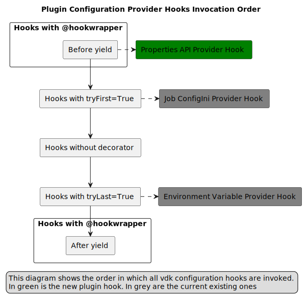

# VEP-1722: Properties based VDK Configuration Provider

* **Author(s):** Antoni Ivanov (aivanov@vmware.com),
* **Status:** draft
* **Issue:** https://github.com/vmware/versatile-data-kit/issues/1722

- [Summary](#summary)
- [Glossary](#glossary)
- [Motivation](#motivation)
- [Requirements and goals](#requirements-and-goals)
- [High-level design](#high-level-design)
- [API Design](#api-design)
- [Detailed design](#detailed-design)
- [Implementation stories](#implementation-stories)
- [Alternatives](#alternatives)

## Summary

This VEP proposes a new provider for VDK configuration that allows users to set job-specific configuration for data jobs.
Currently, users can only set configuration using environment variables or the config.ini file, both of which have limitations.
The new provider will take configuration from properties with the "vdk.config." prefix and have lesser priority than environment variables and the config.ini file.

## Glossary
<!--
Optional section which defines terms and abbreviations used in the rest of the document.
-->
* VDK runtime environment is the software environment where data jobs built using VDK are executed.
* User - a person who uses VDK to develop and execute data jobs. That person can be a data engineer, data scientist, or a developer.
* Administrator - a person who sets up and maintains the VDK Control Service and VDK runtime environment.
* Client - a component or system that accesses a service or functionality provided by another component or system.
* See also [VDK Dictionary](https://github.com/vmware/versatile-data-kit/wiki/dictionary)

## Motivation
VDK allows users to develop and execute data jobs.
Each data job can require its own specific configuration that needs to be set before execution.
Currently, the only way to set configuration is using environment variables or the config.ini file.
However, these approaches have limitations. Users cannot set environment variables for deployed jobs in the cloud, and the config.ini file is not secure for storing sensitive data.

To address these limitations, we propose a new provider for VDK configuration that allows users to set job-specific configuration using properties with the "vdk.config." prefix.
This approach provides more flexibility and security in setting configuration, especially for sensitive data.

The current limitations in setting job-specific configuration within VDK can also impact the system's usefulness for users.
One issue is the lack of flexibility, as users are unable to adopt a new database plugin unless it has been pre-configured by a system administrator.
This creates an additional step for users, requiring them to request the necessary configuration changes from administrators.
In addition, the current method of setting configuration values via the Control Service introduces security concerns,
as it requires the sharing of sensitive information such as passwords, and can lead to a poor user experience.

## Requirements and goals
<!--
It tells **what** is it trying to achieve?
List the specific goals (functional and nonfunctional requirements)? How will we
know that this has succeeded?

Specify non-goals. Clearly, the list of non-goals can't be exhaustive.
Non-goals are only features, which a contributor can reasonably assume were a goal.
One example is features that were cut during scoping.
-->
The new provider for VDK configuration should satisfy the following requirements and goals:

* Allow users to set job-specific configuration using properties with the "vdk.config." prefix.
* Have lesser priority than environment variables and the configuration values from  config.ini file.
* Be flexible and secure in setting configuration, especially for sensitive data.
* The configuration provider should validate user inputs for correct syntax, data type, and allowed values
* The provider should have robust error handling, providing clear and informative error messages to users.
* The provider should have minimal impact on the performance of the VDK execution.
* The provider should be user-friendly and straightforward to use, with clear documentation and examples.

### Non-goal

In the future, config.ini file can be auto-generated entirely from the properties and updated when config.ini is edited on deploy.

## High-level design

The new provider for VDK configuration will be added as a new option in the VDK configuration system.
It will take configuration from properties with the "vdk.config." prefix and have lesser priority than environment variables and the config.ini file.
The properties will be stored in a Properties API.

[](https://www.plantuml.com/plantuml/uml/hP9FRzGm4CNl_XHFuGA7x0VWW8fQ2QtAOQNovq0HTUn9OkeTHsEdsmhjToU3qzBI7f5oohpvlJSpFid5IfdtqKJg2qg2X64iy478bP3OB8M1s1lWqnWobi_2fVsKc5XrTX2xHvy4PIHCagQKoSEDbWVAcpzz1AO3hFT1aGj1284n215li4giI3fa24r2MTbf8h7Qe1Hi2_AeWZcJu93cw96fg2jk_3LSuZuCYjs9TfP06UztMnn26R4m-t1xxyNmimGU83CZzR3ucJg40cSP7Q6duaRowExmvUmS5sVdQsSTP8hp47W1nwZgRWwnG6q2QnpGRSXbmMkkjefRbxX8YgsB0TDT6HDZikxQ3hGnn7vTid4npHxDQLNZWkGcE6hmom1ujFVcwP2DEHgZ5xCyH4Apfgvzgm-Qb-CyXrVXWq5RLtl9jRU1pT3ghgxXrGSzem6E6kB1x3I6XNKF__QLEdpUVaVRldiM7c_rahej_7MjTrl-RL3zD-iHA-_qu_-17M4UpTBEqul8-YB-XRvMu5FUcqjUdzRLKlnHYxFG5QRHPZ8djDJtyJS0)
## API design

The new provider for VDK configuration will not require any changes to existing API.

## Detailed design

[](https://www.plantuml.com/plantuml/uml/ZLGzRzim4DtvAmxEa7Qm2cJqKAHE4A0VWuUsKu3Y99ubDZ8fy8us-kzxeer8jc8X7Wpfo7lltkEZxbamIjgrfgMQl3K_6mBhi8wu0sx2WK7_GBJw-_4xFFpu2XLwA0aIamK9m2I0uEa07vYgIF8nxwo2txewHHGNFEonJGJblmoadR60CoPiEO2bNV0isaAPDUDqCNGKnMa98y6Mf6gK6BqzJc1JTBxEk35v25j0U4H1-1PA9L599s46AmaHVYcvwL0HAzUX5rYST2tEgvk1zyj65oSjemqFMIjisbGxltW3VUp5TFrrtiLeHa26T6TCVbv-7iQ45UpjozYNPm_B9PCiZ_x3hQuNH_yBKNV2dmwP3o7Qsvx0xL5eX7VpzBJMdnagIdUfNrbPNMIuYcqcBLTWL27DuAWSvy6MdqgiNfGoDs1Dnj9qU5CK1OZR4VJj2gll9jqfzOMp9zVwYDY-zZUK5ruCMs_MwzuIKyUGkhCmAqs3J6O-05U47wFBW6qxFhrZW2SKRxevJxk2I9AYlwHupxZJc2fSwjGhucltcP_zDiHBFVc3qYiwE6d6nzpVnP6dCVd1pS7-kN5uTXO96LCQogVRiqsHDHkhrmJa_Lld7JTa9_aQRkMzOgLT-ny0)

To further elaborate on the detailed design of the new VDK plugin for configuration:

1. Adding the plugin to the VDK SDK:
   1. The new VDK plugin for configuration will be implemented as a new plugin within the VDK SDK.
   2. For efficiency the plugin will be developed inside [vdk-plugin-control-cli](https://github.com/vmware/versatile-data-kit/tree/main/projects/vdk-plugins/vdk-plugin-control-cli) as it already has set up for accessing Properties
2. Retrieving configuration values from properties:
   1. The plugin will retrieve configuration values from properties with the "vdk.config." prefix.
   2. During job configuration, the plugin will search for properties with the "vdk.config." prefix in the Properties API.
   3. If a property with the prefix is found, the plugin will use the value of the property to configure the job.
   4. The value will be with lowest priority compared to configuration provided by environment variables and config.ini file.
3. Storing configuration:
   1. The configuration will be stored in a Properties API.
   2. User would use VDK CLI or UI to set properties with prefix 'vdk.config.' for example 'vdk.config.trino_password'
   3. The property will be stored as normal property are stored. Nothing different here.
   4. Potential usability improvement to be considered: Both UI and CLI could hide "vdk.config." as implementation detail
      1. UI can provide Properties UI and Job Configuration UI (which would come with ony options from vdk `config-help`)
         Details on actual UI are out of scope for this VEP and can be decided by UI devs when needed.
      2. vdk cli could come with `vdk properties --set-vdk-config` vdk config or `vdk config --set`
      3. vdk cli should validate the config key (from the list of supported configs (provided by vdk config-help))
         1. If the key is not valid, vdk cli should print a warning and prompt for confirmation to continue.
                The confirmation should be required to prevent accidental typos. We do not directly prevent users from setting invalid properties
                because it is possible user is using local version without plugins installed in cloud version.

### Details on precedence of configuration values

By default, hooks are called in LIFO registered order, however,
a hookimpl can influence its call-time invocation position using special attributes.

Based on that hooks can be separated in 5 groups depending on decorator used:

1. First are executed hooks with `@hookwrapper` decorator - only the expression before `yield`
2. Hooks with the tryFirst=True decorator.
3. Hooks without any decorator.
4. Hooks with the tryLast=True decorator.
5. Hooks with the Hookwrapper decorator - the expression after the yield statement (if any).

Based on that the precedence of configuration values will be as defined in following diagram:

[](https://www.plantuml.com/plantuml/uml/bP91Qnin48Nl-XL3UeuXRNDiS5fQwbAe3w7NeAp6si7op3AQtQqf_U_rMX7Pf7OXfu7HUv_U4rfcyshzBZaZImZhr4TY-2IyeTYhDnA6jSf00HM-Ycmph7YGffpyq83gd4iOaOExQob381_Lxo2tCcQm5a5qCXF3s5BJWay9Xh25vjabxP7j5O4E_2s6XLinH4LaeC9X7A6R0XRr0efWFxcEWgPNHJR0NvIDE88mPeSS7lCvnSOynuHmKRgCP2qi9zgelkjGBy1dY2fzTmM_7S3CyH4teWXxmXHcilihz-SSsNJ_XJJRXpljySdpzenUUeE0ZQWtcILvzn_yT_yF_VthUbw_x7cxCTINDQzBpLePBeECV7bJ-vHHjpLs6NLRqvKntnRyFFLd7aY5TyW6FxsIVqZu_1yUeo4FzuDNU1FLx-V-R_Bm-8bNJ2UCn7JQU91sg4QOuNQzEk7i3e9gHMHNwooKOckBcvgfFadTrokVdh2UG4Mw9NBeT-al)

### Telemetry and monitoring changes (new metrics).

None required as the plugin will be using existing functionality.

### Test plan

Standard tests for any plugins unit tests and functional tests.

### Documentation changes

### Troubleshooting

Failure modes:

* If the plugin is not installed, the configuration will not be retrieved from properties.
  * provide clear message on which are the currently installed provides in the logs
* Invalid or incorrect configuration values
  * suggest validation above
  * user should be able to change the configuration value
* Conflicting configuration values from different sources (e.g., environment variables, config.ini file, properties with "vdk.config." prefix).
    * provide clear message in the logs which configuration value is used and from which source
    * Provide log configuration value conflicts and discrepancies at the INFO or WARN logging level,
      including the specific configuration key, conflicting values, and their sources.
* Issues with the Properties API.
  * Then the plugin will not be able to retrieve configuration values from properties.
    To prevent running jobs with incomplete configuration, the plugin will fail the job with an error message.
  * Configuration options can be provided to enable soft failure mode.
    In this mode, the plugin will log a warning message and continue running the job with incomplete configuration.
    This mode is useful for testing and debugging purposes.

### Security implications

The plugin will be using Properties API and any security implications will be handled by the Properties API.

## Implementation stories
<!--
Optionally, describe what are the implementation stories (eventually we'd create github issues out of them).
-->

## Alternatives
<!--
Optionally, describe what alternatives has been considered.
Keep it short - if needed link to more detailed research document.
-->
Creating separate System Config API (as proposed here - https://github.com/vmware/versatile-data-kit/issues/832)
but that is a lot more complex both in terms of interfaces being added and implementation.
This approach is much lighter alternative and re-use existing functionality.

Other alternative is to continue use config.ini but encrypt it using gitcrypt
* Cons:
  * Encrypting config.ini with gitcrypt provides some level of security, but it still has limitations. If the git repository is compromised, then the config.ini file can be accessed. In contrast, storing configuration values in a properties api provides an additional layer of security since the properties db can be encrypted and stored separately from the git repository in a much more restricted space .
  * The VDK plugin approach allows for more flexibility in setting configuration using UI, CLI and future improvements could allow through config.ini
  * Any future security updates in Properties (like integration with vault or something else) would only be needed in one place.
* Pros:
  * The VDK plugin approach does not version the properties, which means that configuration changes will not be versioned either. In contrast, with gitcrypt, the encrypted config.ini file can be versioned along with the rest of the git repository
