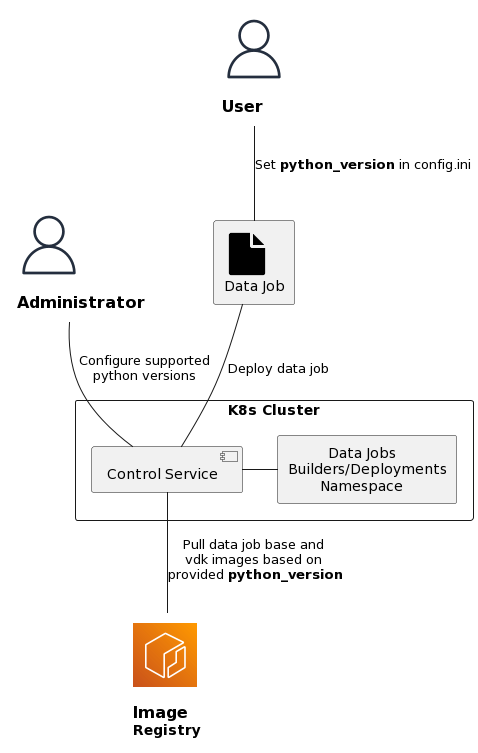
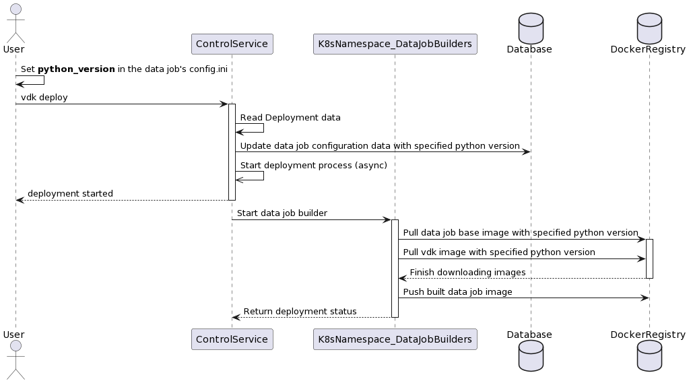

# VEP-1739: Multiple Python Versions

* **Author(s):** Andon Andonov (andonova@vmware.com)
* **Status:** draft

<!-- Provide table of content as it's helpful. -->

- [Summary](#summary)
- [Glossary](#glossary)
- [Motivation](#motivation)
- [Requirements and goals](#requirements-and-goals)
- [High-level design](#high-level-design)
- [API Design](#api-design)
- [Detailed design](#detailed-design)
- [Alternatives](#alternatives)

## Summary

---
Currently, if a user wants to use a different Python version for their job, they had to ask the Control Service administrator to change the configuration and redeploy the service. This process could be time-consuming and disruptive, as it would break other existing deployed jobs (that do not require the new version).

Now, we're introducing an optional python_version property to the Control Service API, which allows users to specify the Python version they want to use for their job deployment. This means users no longer have to rely on the service administrator to make changes to the configuration and can deploy their jobs with the version they need. Service administrator only need to define a range of supported python versions. 

If the python_version property is not specified, the Control Service will use a default version set by the service administrators. Users can easily see what Python version their job uses by running vdk deploy --show or making a GET request to /data-jobs/for-team/{team_name}/jobs/{job_name}/deployments or /data-jobs/for-team/{team_name}/jobs/{job_name}/deployments/{deployment_id}.

## Glossary

---
* VDK: https://github.com/vmware/versatile-data-kit/wiki/dictionary#vdk
* Control Service: https://github.com/vmware/versatile-data-kit/wiki/dictionary#control-service
* Data Job: https://github.com/vmware/versatile-data-kit/wiki/dictionary#data-job
* Data Job Deployment: https://github.com/vmware/versatile-data-kit/wiki/dictionary#data-job-deployment
* Kubernetes: https://kubernetes.io/
* User: a person who uses VDK to develop and execute data jobs. That person can be a data engineer, data scientist, or a developer.
* Administrator (Admin): a person who sets up and maintains the VDK Control Service and VDK runtime environments.

## Motivation

---
When a data job is deployed, the Control Service uses vdk and data job base images set once and applied to
all job deployments. This is not an issue in general, as it is assumed that the Versatile Data Kit administrators, responsible
for the Control Service deployment, have taken into account the users' tech stack.

There are, however, situations when this might not be the case. For example, if the administrators of a Versatile Data
Kit deployment decide to keep an older python version (say 3.8) for all data job deployments, but a user working
on a special use case needs to use a dependency that does not support anything below python 3.10, they would not be able
to deploy a data job, because the job would be build with python 3.8. To accommodate the special job, the administrators
would need to re-configure and re-deploy the Control Service. Although this may not be a big issue (not taking into
account the hassle of redeploying the whole Control Service for just one special job), it would break all jobs whose
dependencies rely on python versions older than 3.10, as once set to 3.10, the Control Service will deploy all data jobs
with it.

In such cases, there are two main approaches that could be taken:
1) Look for a different package -- this works in most cases, as there are often multiple packages that solve the same
problems and are build for different python versions. However, depending on how specialized the problem at hand is, there
might be no alternatives to a package, or there might be necessary to use an older version of the package which could
expose the data job to vulnerabilities patched in the newer package releases.
2) Deploy a separate Control Service instance -- with this solution, a new instance of the Control Service would need to be
deployed and configured to use the newer python version. In addition, the vdk SDK would also need to be reconfigured to
point to the new Control Service instance, which may cause more confusion among other users who may not be aware that
there are multiple Control Services and SDKs with different configurations. This may be acceptable if the specialized
data job is with high priority, but having a completely separate Control Service instance for a single job deployment is
unreasonable.

To avoid situations, where old or unsafe dependencies are used, or to avoid the necessity to deploy separate Control
Service deployments, changes will be made to the Control Service API and deployment logic to allow for different python
versions to be used per data job deployment. Additionally, minor changes will be made to the vdk-control-cli plugin to
facilitate the selection of python version at job deployment.

## Requirements and goals

---
### Goals
* **Change API to accommodate passing the python version to be used in data job deployments**
  * A user developing a data job wants to use specific python version for their job deployment. They need to be
  able to specify what python version they want to use in the config.ini file (the file containing the job's configuration like job owner, cron schedule, etc.) of the job, or as part of the body of the
  job deployment request in case they use the Control Service API directly, and not through the vdk SDK.
* **Backwards compatibility**
  * After implementing this proposal, backwards compatibility needs to be maintained, as to prevent issues with
  existing Control Service and data job deployments.
* **Introduce mechanism to configure what python versions are supported by the Control Service**
  * An administrator needs to be able to configure what python versions are supported by a Control Service deployment,
  and what vdk and job base images correspond to a certain python version.
* **Save python version configuration in the Control Service's database.**
  * The python version configuration related to a specific data job deployment needs to be stored in the database
  alongside the rest of the data job's deployment configuration
* **Add python version used for a job's deployment to the job's cronjob spec.**
  * The python version used for a data job's deployment needs to be added as annotation to the job's cronjob spec.
* **Update vdk-control-cli plugin to allow it to read the python version from config.ini**
  * When a user creates a data job and updates the job's config.ini file to set a specific python version to be
  used when the job is deployed, the python version needs to be read from the config file and passed to the Control
  Service.
### Non-Goals
* **Python version validation at SDK level.**
  * As there will be python version validation at the Control Service level, such validation will not be added at the
  vdk SDK level.

## High-level design

---
Thi diagram below shows a high-level design view of the changes that would be proposed
in this VEP. The user would create a data job and set a **python_version** property in the job's _config.ini_ file. When the job is deployed, the python_version would be passed to the Control Service, which on its end would verify that the version is supported and would pull the vdk and job base images corresponding to the python version from the registry. The supported python versions would be configured by the administrator. In the final step, the pulled image links would be passed to the data job builder.



The proposed design will introduce changes to the Control Service API and deployment logic, as well as to the database configuration and vdk SDK. Additionally, it will allow users to specify what python version their job needs to be deployed with, as part of the job's config.ini file.

Once set, the python version will be passed from the config.ini to the Control Service through the vdk SDK, or it could be passed directly as part of the deployment request body in case the Control Service API is called directly. If no python version is passed to the Control Service, a predefined default version will be used.

## API design

---
The public REST API of the Control Service would be changed to support a user-specified python version to be used for
the data job deployment. This would be facilitated through the addition of an optional **python_version** property to the
[DataJobDeployment](https://github.com/vmware/versatile-data-kit/blob/main/projects/control-service/projects/model/apidefs/datajob-api/api.yaml#L1068)
resource schema.
```yaml
python_version:
  description: Python version number to used for data job deployment
  type: string
  example: 3.11
```
The property would be optional to avoid enforcing python version selection. If the user decides to not set the property,
a default value would be used.


## Detailed design

---
As mentioned in the [High Level Design](#high-level-design) section above, changes to multiple components would be needed
to allow users to deploy data jobs with different python versions. In this section we explain the design decisions made in greater detail, and we provide more details on the user flow related to the proposed changes.
For the public API design changes that would be needed, see the [API design](#api-design) section above.

### Expected User Flow
In the below diagram, we present the user work flow, using the vdk SDK, after the changes are implemented. Once the user creates a data job, they could add a **python_version** property to the configuration file of the data job. After they deploy the job, the deployment data is read and updated in the database, and the deployment of the job is initiated. Based on the python_version, the corresponding job base and vdk images are pulled from the registry by the data job builder.



### Supported Python Versions Configuration
Currently, the only way to specify what job base image is to be used by data job builders is through the
[datajobs.deployment.dataJobBaseImage](the only way to specify what job base image is to be used by data job builders is through the datajobs.deployment.dataJobBaseImage application property) application property. The vdk image to be used in job deployments, on the other hand,
can be specified through a _DOCKER_VDK_BASE_IMAGE_ [environment variable](https://github.com/vmware/versatile-data-kit/blob/main/projects/control-service/projects/pipelines_control_service/src/main/resources/application-prod.properties#L40).
This is not optimal, as the only way to change the vdk and base images is to change the configuration and re-deploy the whole Control Service.
As mentioned in the previous sections, we want to make vdk and job base images configurable per data job deployment, not Control Service one.
To facilitate this, we need a configuration what python versions and respective vdk and job base images are supported by the Control Service.

To configure these, a few options were explored:

#### Option 1: Introduce three environment variables, SUPPORTED_PYTHON_VERSIONS, JOB_BASE_IMAGE_TEMPLATE, and JOB_VDK_IMAGE_TEMPLATE.
These can be set in the helm chart of the Control Service and in the application properties files.

The env vars would be of type string, and would be used to construct the job base images passed to the job builders and the vdk images that would be used by the deployed data jobs. The _SUPPORTED_PYTHON_VERSIONS_ var would be a string of comma-separated python version numbers like **"3.7,3.8,3.9"**, the _JOB_BASE_IMAGE_TEMPLATE_ would be a string of the format "**registry.hub.docker.com/versatiledatakit/data-job-base-python-**", and the _JOB_VDK_IMAGE_TEMPLATE_ would be set as "**registry.hub.docker.com/versatiledatakit/quickstart-vdk:release-**".

After the variables are loaded, the Control Service can build the base and vdk images name. When a **python_version** is passed to the body of the request for job deployment, the Control Service would check if the version is supported (validate if the value is present in the _SUPPORTED_PYTHON_VERSIONS_), and if it is, it would load the _JOB_BASE_IMAGE_TEMPLATE_ and _JOB_VDK_IMAGE_TEMPLATE_ value and append the python_version alongside some predefined suffix.

For example, given the following env var values
```shell
SUPPORTED_PYTHON_VERSIONS="3.7,3.8,3.9"
JOB_BASE_IMAGE_TEMPLATE="registry.hub.docker.com/versatiledatakit/data-job-base-python-"
JOB_VDK_IMAGE_TEMPLATE="registry.hub.docker.com/versatiledatakit/quickstart-vdk:release-"
```
and **python_version** passed as "3.8", the final base image name could be something like
```shell
registry.hub.docker.com/versatiledatakit/data-job-base-python-3.8
# or
registry.hub.docker.com/versatiledatakit/data-job-base-python-3.8-latest
```
and the final vdk image name could be something like
```shell
registry.hub.docker.com/versatiledatakit/quickstart-vdk:release-3.8
# or
registry.hub.docker.com/versatiledatakit/quickstart-vdk:release-3.8-supercollider
```
**NOTE:** In this case, it would be very important how the base and vdk images are named, as to avoid situations where the pre-built base and vdk images in the registry have different names from the ones composed by the Control Service based on user input. Also, in the second case, the "-latest" and "-supercollider" suffixes would need to be part of the Control Service code, as users should not need add them as part of the **python_version**.

In the helm chart, the configuration can easily be set in the values.yaml file as
```yaml
dataJobDeploymentSupportedPythonVersions: "3.7,3.8,3.9"
dataJobDeploymentBaseImageTemplate: "registry.hub.docker.com/versatiledatakit/data-job-base-python-"
dataJobDeploymentVdkImageTemplate: "registry.hub.docker.com/versatiledatakit/quickstart-vdk:release-"
```
and then in the _templates/deployment.yaml_ they can be injected as proper environment variables like so:
```yaml
- name: SUPPORTED_PYTHON_VERSIONS
  value: "{{ .Values.dataJobDeploymentSupportedPythonVersions }}"
- name: BASE_IMAGE_TEMPLATE
  value: "{{ .Values.dataJobDeploymentBaseImageTemplate }}"
- name: VDK_IMAGE_TEMPLATE
  value: "{{ .Values.dataJobDeploymentVdkImageTemplate }}"
```
In the _application.properties_ files, the above could be consumed as
```shell
datajobs.deployment.supportedPythonVersions=${SUPPORTED_PYTHON_VERSIONS:3.7}
datajobs.deployment.baseImageTemplate=${BASE_IMAGE_TEMPLATE:example.registry.com/somerepo/data-job-base-python-}
datajobs.deployment.vdkImageTemplate=${VDK_IMAGE_TEMPLATE:example.registry.com/somerepo/data-job-vdk-python-}
```

#### Option 2: Use dictionaries to map supported python versions to corresponding base and vdk images.
This option would utilize nested yaml dictionaries for configuration to map the supported version to a base and vdk images.

In the helm chart values file, this configuration would be set like:
```yaml
supportedPythonVersions:
   3.7:
      baseImage: "registry.hub.docker.com/versatiledatakit/data-job-base-python-3.7-latest"
      vdkImage: "registry.hub.docker.com/versatiledatakit/quickstart-vdk:release-3.7"
   3.8:
      baseImage: "registry.hub.docker.com/versatiledatakit/data-job-base-python-3.8-latest"
      vdkImage: "registry.hub.docker.com/versatiledatakit/quickstart-vdk:release-3.8"
   3.9:
      baseImage: "registry.hub.docker.com/versatiledatakit/data-job-base-python-3.9-latest"
      vdkImage: "registry.hub.docker.com/versatiledatakit/quickstart-vdk:release-3.9"
```
And in the application properties files, these could be set as a single property as:
```shell
datajobs.deployment.supportedPythonVersions={'3.7':{'baseImage': 'registry.hub.docker.com/versatiledatakit/data-job-base-python-3.7-latest', 'vdkImage': 'registry.hub.docker.com/versatiledatakit/quickstart-vdk:release-3.7'}, '3.8':{'baseImage': 'registry.hub.docker.com/versatiledatakit/data-job-base-python-3.8-latest', 'vdkImage': 'registry.hub.docker.com/versatiledatakit/quickstart-vdk:release-3.8'}, '3.9':{'baseImage': 'registry.hub.docker.com/versatiledatakit/data-job-base-python-3.9-latest', 'vdkImage': 'registry.hub.docker.com/versatiledatakit/quickstart-vdk:release-3.9'}}
```
**NOTE:** As the supported versions would be dynamically set, the application properties files would need to be manually updated accordingly.

#### Option 3: Configure the supported python versions in the vdk_options.ini file.
This file is already being loaded in the Control Service through the [helm chart](https://github.com/vmware/versatile-data-kit/blob/main/projects/control-service/projects/helm_charts/pipelines-control-service/templates/deployment.yaml#L171) and the [application properties](https://github.com/vmware/versatile-data-kit/blob/main/projects/control-service/projects/pipelines_control_service/src/main/resources/application-prod.properties#L62) files, and is used to store some general configurations like resource limits, etc. In the options file, the supported versions would be stored like:
```ini
[supported_python_versions_base_images]
PYTHON_3.7 = "registry.hub.docker.com/versatiledatakit/data-job-base-python-3.7-latest"
PYTHON_3.8 = "registry.hub.docker.com/versatiledatakit/data-job-base-python-3.8-latest"
PYTHON_3.9 = "registry.hub.docker.com/versatiledatakit/data-job-base-python-3.9-latest"

[supported_python_versions_vdk_images]
PYTHON_3.7 = "registry.hub.docker.com/versatiledatakit/quickstart-vdk:release-3.7"
PYTHON_3.8 = "registry.hub.docker.com/versatiledatakit/quickstart-vdk:release-3.8"
PYTHON_3.9 = "registry.hub.docker.com/versatiledatakit/quickstart-vdk:release-3.9"
```
These could then be read by the [VdkOptionsReader](https://github.com/vmware/versatile-data-kit/blob/main/projects/control-service/projects/pipelines_control_service/src/main/java/com/vmware/taurus/service/deploy/VdkOptionsReader.java#L29) and propagated the where necessary.
In options 2 and 3, custom logic would need to be implemented to remove the prefixes of the different python versions and keep only the version numbers (3.7, 3.8, 3.9) to compare them to the python_version passed by users.

#### Chosen solution
At the end, **Option 2** was selected, as it would be relatively straightforward to implement in the helm chart of the Control Service, which would make it easily configurable by administrators.
