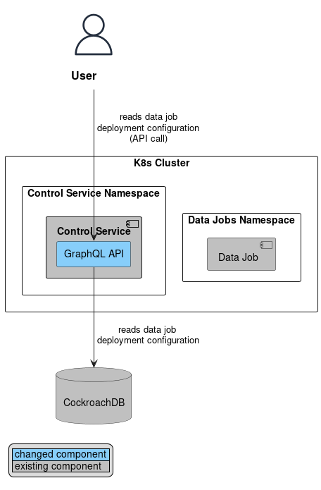
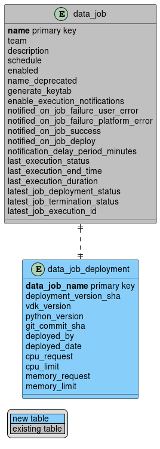

# VEP-2272: Complete Data Job Configuration Persistence

* **Author(s):** Miroslav Ivanov (miroslavi@vmware.com)
* **Status:** implementable

- [Summary](#summary)
- [Glossary](#glossary)
- [Motivation](#motivation)
- [Requirements and goals](#requirements-and-goals)
- [High-level design](#high-level-design)
- [API Design](#api-design)
- [Detailed design](#detailed-design)
- [Implementation stories](#implementation-stories)
- [Alternatives](#alternatives)

## Summary

Currently, the deployment configuration of data jobs is partially dependent on the Kubernetes cluster, leading to
unnecessary overhead when loading data job deployments. Additionally, the loss of Kubernetes namespace results in the
potential loss of data jobs, requiring a manual and complex restoration process. By switching the source of truth from
Kubernetes to a database, we can ensure a more reliable and easy restoration process while optimizing performance for
Control Service APIs.

## Glossary

* VDK: https://github.com/vmware/versatile-data-kit/wiki/dictionary#vdk
* Control Service: https://github.com/vmware/versatile-data-kit/wiki/dictionary#control-service
* Data Job: https://github.com/vmware/versatile-data-kit/wiki/dictionary#data-job
* Data Job Deployment: https://github.com/vmware/versatile-data-kit/wiki/dictionary#data-job-deployment
* Kubernetes: https://kubernetes.io/

## Motivation

Ensuring efficient and reliable management of data job deployments is crucial for the smooth functioning of our system.
Currently, when a data job is deployed, its deployment configuration is stored in both Kubernetes and the database.
However, there exists a disparity where certain essential properties are exclusively stored in Kubernetes, such as the
job's Python version and deployment information.

This discrepancy creates a significant challenge for the Control Service APIs that rely on retrieving data job
deployments. For instance, the GraphQL API's jobs query initially retrieves the data jobs from the database and
subsequently retrieves the deployment data from Kubernetes. This two-step process introduces performance degradation to
the Control Service, as it requires additional time and resources to fetch information from multiple sources.

Moreover, in the event of a Kubernetes namespace loss, there is a potential risk of losing critical data job deployment
configurations. In such scenarios, recovering the lost data jobs becomes a manual and complex restoration process.
This adds further complexity and potential downtime for users relying on the Control Service for their data job
management needs.

To address these issues, it is essential to optimize the storage and retrieval of data job deployments. By ensuring that
all relevant properties are stored consistently, in the database, so we can streamline the process and enhance the
overall efficiency of the Control Service APIs.

By improving the efficiency and reliability of data job deployments, we aim to optimize the overall system performance
and provide a seamless experience for our users.

## Requirements and goals

### Goals

1. Identify the specific data job configuration that is stored only within the Kubernetes cluster.
2. Transition the primary source of truth for all data jobs configurations from both Kubernetes and database to just the
   database, in order to centralize data storage, improve data integrity, and enable easier access and manipulation.
3. Enhance the performance of Control Service APIs by loading the data job configuration from only one data source
   (Control Service database).
4. Prepare Control Service for future enhancement of the migration process and ease of restoration by centralizing and
   storing all data job configurations within the database.

### Non-Goals

1. Implement automatic data jobs restore capability in case of the loss of Kubernetes namespace whereby the Control
   Service automatically retrieves the configuration from a database and seamlessly restores the data jobs.
2. Capability to maintain a record of past deployments for each data job.

## High-level design

The diagrams below show a high-level design view of the changes that would be proposed in this VEP.

|                  Deploy or Update Data Job                  |                           Read Data Job Deployment Configurations                           |
|:-----------------------------------------------------------:|:-------------------------------------------------------------------------------------------:|
|  |  |

The proposed design will introduce changes to the Control Service (deployment logic, GraphQL API, etc.), as well as to
the database model.

When the Control Service receives an API call to deploy a data job, it will store the complete deployment configuration
in the database while the Kubernetes Cron Jobs will be updated by a new asynchronous process which will be covered in
the [Detailed design](#detailed-design). In this way, data integrity and synchronization between these two sources will
be maintained.

When it receives an API call to retrieve the data job deployment configuration, it will only query the database. In this
way, we will reduce API calls to Kubernetes and the response time of the GraphQL API.

## API design

There would be no changes to the public APIs.

## Detailed design

### Kubernetes Cron Jobs Synchronizer

To enhance data integrity and synchronization between a database and Kubernetes, an asynchronous process will be
implemented. This process will leverage Spring Scheduler and [Scheduler Lock](https://github.com/lukas-krecan/ShedLock),
similar to the
[DataJobMonitorCron.watchJobs()](https://github.com/vmware/versatile-data-kit/blob/main/projects/control-service/projects/pipelines_control_service/src/main/java/com/vmware/taurus/service/monitoring/DataJobMonitorCron.java#L84).
By using [Scheduler Lock](https://github.com/lukas-krecan/ShedLock), we can achieve an active-passive pattern across the
Control Service instances. In simpler terms, only one instance of the Control Service will be able to synchronize Cron
Jobs at any given time. The process will be executed with a fixed period between invocations, where the period will be
configurable and the appropriate one will be determined during the implementation.

The overall purpose of this process is to iterate through the data job deployment configurations stored in the database
and determine whether the corresponding Cron Job in Kubernetes is synchronized and up to date. If the Cron Job is not
synchronized with the database, the process will initiate a new data job deployment. This deployment may involve tasks
such as building an image or updating the Cron Job template.

In order to enhance the process further, the proposed asynchronous process will incorporate a mechanism to determine
whether a Cron Job needs to be updated or not. This will be achieved by utilizing the hash
code (`deployment_version_sha`) of the
Cron Job YAML configuration, which will be stored in the database after each deployment.

By introducing this asynchronous process, you can ensure that the database and Kubernetes remain in sync, maintaining
data integrity and enabling smooth operation of the system.

### Database data model changes

To ensure comprehensive synchronization between Kubernetes and the database, it is important to replicate all relevant
data job configuration properties from Kubernetes to the database. Here is a list of properties that should be
replicated:

* `git_commit_sha`
* `vdk_version`
* `vdk_image_name`
* `image_name`
* `cron_job_name`
* `python_version`
* `cpu_request`
* `cpu_limit`
* `memory_request`
* `memory_limit`
* `deployed_by`
* `deployed_date`
* `deployment_version_sha`
* `mode`

The columns shown above were found by comparing the properties of the current Cron Job with the columns in the database.

In order to accommodate the replication of the additional data job configuration properties from Kubernetes to the
database, it would be necessary to add a table called `data_job_deployment` to the existing database model.
This table will have the mentioned columns, and the relationship between `data_job` and `data_job_deployment` tables
will be one-to-one. This approach will normalize the database model and make it suitable for accommodating
multiple deployments for each data job in the future.

By making these database model changes, the system can effectively store and synchronize all the required data job
configuration details between Kubernetes and the database.

### DataJobsDeployment API and GraphQL API

To further enhance performance and reduce the load on the Kubernetes API, a part of the system's redesign will involve
reworking the DataJobsDeployment and GraphQL APIs to interact solely with the database. This approach aims to streamline
the communication process and leverage the database as the primary source of data job configuration information. Here's
how this enhancement can be described in more detail:

The existing APIs, which might have previously interacted directly with Kubernetes for data job deployment-related
operations, will be refactored to retrieve and update data job deployment configurations exclusively from the database.
This architectural change allows for improved performance as the APIs will no longer need to make frequent and
potentially resource-intensive calls to the Kubernetes API server.

By relying on the database as the central source of truth for data job configurations, the system can achieve faster
response times and reduce the overall load on the Kubernetes API.

With this rework, the APIs will become more lightweight, leveraging the optimized data access and querying capabilities
of the database. Consequently, the overall system performance will be enhanced, providing a smoother and more efficient
experience for users interacting with the data job deployment management functionalities.

### Performance

Based on initial performance measurements conducted, the anticipated benefits of reworking the APIs to interact solely
with the database are evident. The tests involved two GraphQL queries (pageSize=50)—one with deployments and the other
without
deployments. Here's how the results can be enriched:

The average response time for the GraphQL query that includes deployments is approximately 600 ms. This query involves
retrieving data job configurations from the database and making additional call to the Kubernetes API for
deployment-related information. Prior to the API rework, this query likely relied on Kubernetes for retrieving
deployment details, resulting in longer response times.

On the other hand, the GraphQL query that doesn't involve deployments, relying solely on the database for data job
information, demonstrates an average response time of approximately 400 ms. This query benefits from the direct
interaction with the database, eliminating the need for additional calls to the Kubernetes API and resulting in improved
performance.

Based on these preliminary measurements, it is evident that the proposed API rework brings notable performance
enhancements. On average, the response times of the queries are expected to improve by approximately 30-35% when
deployments are not involved, allowing for more efficient and faster retrieval of data job configurations.

It's important to note that these measurements provide a preliminary understanding of the potential performance gains.
Further testing and profiling with a larger and more diverse dataset will be required to obtain more accurate and
comprehensive performance insights.

### Troubleshooting

* Possible failure modes:
    * If the Control Service Pod restarts while the Cron Jobs are being synchronized, another Pod of the
      Control Service will take over and become active to continue the synchronization process.
    * If the database stops working, the deployment configurations for data jobs won't be accessible through the public
      APIs. Additionally, the synchronization of Cron Jobs will be put on hold until the database is functioning again,
      and then it will be resumed.
    * If the Kubernetes API server stops working while the Cron Jobs are being synchronized, the active Control Service
      Pod will delay the synchronization process until the API server is back online, and then it will resume the
      synchronization.

## Alternatives

An alternative solution to consider for this scenario is leveraging Kubernetes Operator for the Cron Jobs management.
Although the Operator-based approach can provide a more suitable and robust implementation, it's important to note that
it may require a significant amount of additional time for its implementation. Here's how this alternative solution can
be further enriched:

Utilizing a Kubernetes Operator entails designing and implementing a custom controller that extends the Kubernetes API
functionality to manage the Cron Jobs lifecycle. This approach allows for a more declarative and automated management of
data jobs, handling tasks such as provisioning.

While the Operator-based solution offers advantages such as built-in reconciliation loops and event-driven actions, it
typically requires more effort and time to develop and deploy. Implementing a Kubernetes Operator requires knowledge
about operators, a lot of architectural changes, and an additional component that needs to be deployed and operated.
Compared to the operator-based approach the one described in the VEP will be easier and faster to implement since it is
based on the existing component `Control Service`. Also, it does not require the implementation and management of
additional components.
