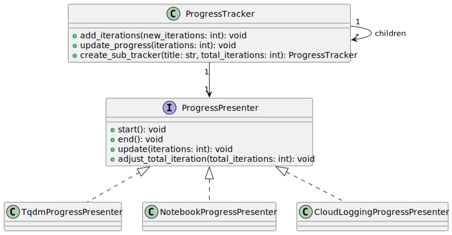
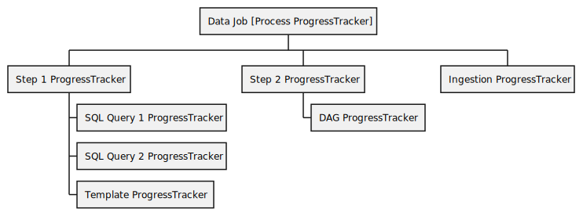
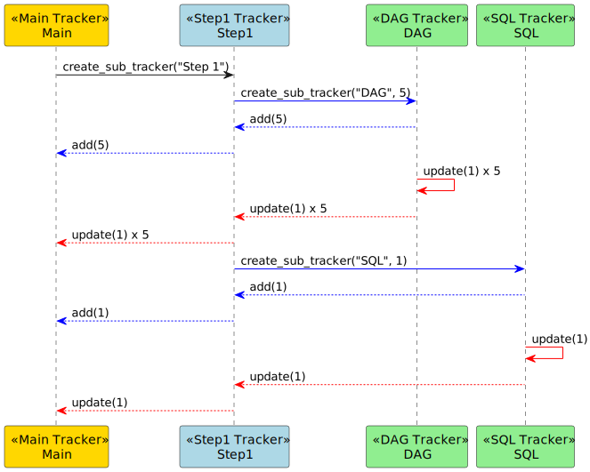

# VEP-2448: VDK Run Logs: Simplified And Readable

* **Author(s):** Dilyan Marinov (mdilyan@vmware.com), Antoni Ivanov (aivanov@vmware.com)
<!-- * **Status:** draft | implementable | implemented | rejected | withdrawn | replaced -->
* **Status:** draft

<!-- Provide table of content as it's helpful. -->

- [VEP-2448: VDK Run Logs: Simplified And Readable](#vep-2448-vdk-run-logs-simplified-and-readable)
  - [Summary](#summary)
  - [Glossary](#glossary)
  - [Motivation](#motivation)
    - [Logs on failures](#logs-on-failures)
    - [Logs on success](#logs-on-success)
    - [Debug mode](#debug-mode)
    - [Progress Tracking](#progress-tracking)
    - [VDK exception handling and  categorization](#vdk-exception-handling-and--categorization)
  - [Requirements and goals](#requirements-and-goals)
  - [High-level design](#high-level-design)
    - [Log Structure](#log-structure)
    - [Log Less](#log-less)
      - [Logs not at the apprpopriate level](#logs-not-at-the-apprpopriate-level)
      - [Multi-layered logging](#multi-layered-logging)
    - [Clean Error Handling](#clean-error-handling)
    - [Progress Indicators](#progress-indicators)
  - [API design](#api-design)
  - [Detailed design](#detailed-design)
    - [Log Structure](#log-structure-1)
    - [Log Less](#log-less-1)
    - [Clean Error Handling](#clean-error-handling-1)
    - [Progress Indicators](#progress-indicators-1)
  - [Implementation stories](#implementation-stories)
    - [Log Structure](#log-structure-2)
    - [Log Less](#log-less-2)
    - [Clean Error Handling](#clean-error-handling-2)
    - [Progress Indicators](#progress-indicators-2)
    - [Documentation](#documentation)
    - [Promotional Materials](#promotional-materials)
  - [Alternatives](#alternatives)

## Summary

<!--
Short summary of the proposal. It will be used as user-focused
documentation such as release notes or a (customer facing) development roadmap.
The tone and content of the `Summary` section should be
useful for a wide audience.
-->

<!-- TODO: Revisit this section once the all other sections are completed -->
The VDK user experience when it comes to using logs for data job runs is lacking
in several areas. This makes it hard to debug failed data job runs and get
useful information out of successful data job runs. The following sections
provide an in-depth view of improvemnts to VDK run logs which address a number
of user pain points, such as noisy logs, overly verbose error messages,
insufficient error information, lack of documentation, lack of progress tracking
features, etc. Resolving these pain points will result in a better user
experience.

## Glossary
<!--
Optional section which defines terms and abbreviations used in the rest of the document.
-->

## Motivation
<!--
It tells **why** do we need X?
Describe why the change is important and the benefits to users.
Explain the user problem that need to be solved.
-->

At the moment, VKD users face multiple challenges related to logging in data job
runs. Based on user feedback we've received, these can be split into 5 categories.

### Logs on failures

Useful information gets lost in the noise or sometimes just
missing This is especially true for user errors. There are also some error
messages that just don't contain any useful information to begin with We might
have incentivized some bad practices with our error message format. Some people
tend to just write placeholder text, e.g. "WHAT HAPPENED: An error occurred", or
"COUNTERMEASURES: Check exception". These kinds of messages are extremely
annoying from an user perspective. When a step fails, we don't point to the
actual line of the code where the failure happened Actual root causes are
sometimes buried in the stack There's lots of meta-logs, impala query logs, etc.
This leads us to believe that we have a lot of info logging that should actually
be on the debug level.

### Logs on success

Users expect little or no log output on success. Users tend to add their own
logging to signify when a step started or ended they expect these kinds of logs
to be highlighted somehow, or be the only logs they see

### Debug mode

Some users have trouble running jobs in debug mode and getting debug level logs
This points to a gap in our documentation

### Progress Tracking

Users want better tracking of job progress (for DAGs, steps, ingestion)

### VDK exception handling and  categorization

There is a need for more clarity and categorization in error messages, likely
more structured error reporting, such as knowing whether an error is a syntax
error, data error, library issue, or platform error, as very important
visibility of the steps or components where failures occur so people can quickly
find out the principal issue

Logging and error handling should be improved in ways that adress all these
challenges. This will result in less time spent troubleshooting, fewer support
queries, more data job runs that are successful and an overall better user
experience.

## Requirements and goals
<!--
It tells **what** is it trying to achieve?
List the specific goals (functional and nonfunctional requirements)? How will we
know that this has succeeded?

Specify non-goals. Clearly, the list of non-goals can't be exhaustive.
Non-goals are only features, which a contributor can reasonably assume were a goal.
One example is features that were cut during scoping.
-->
1. Data job run logs provide useful and readable information
   1. Data job run logs provide progress tracking information
      1. current step
      1. ingested data
      1. the amount of resources currently consumed
      1. progress bars for local runs
   1. User logs stand out
   1. DAGs are traceable in the logs
      1. Logs show current job name
      1. Logs show parent job name for the current job
      1. DAG jobs that run in parallel can be sorted and grouped, so that logs for a single job are extracted
   1. Debug information is at the appropriate level, e.g. impala query meta logs are at debug level and not info
1. Finding information for failed runs is straightforward
   1. The root cause is immediately visible from the logs.
   1. When an error occurs, relevant information is visible on top of the error log. This includes
      1. why it happened
      1. where it happened (data job stage and line)
      1. most common troubleshooting steps
1. Changing the logging level is straightforward
   1. Changing the logging level is documented
   1. Changing the logging level is available in the cloud
1. The above points are valid for local and cloud data job runs.

**Out of scope**

Issues related to VDK internal cloud deployments, e.g. write permissions, data
format issues, etc. These should be forwarded to the appropriate VMWare team.


## High-level design

<!--
All the rest sections tell **how** are we solving it?

This is where we get down to the specifics of what the proposal actually is.
This should have enough detail that reviewers can understand exactly what
you're proposing, but should not include things like API designs or
implementation. What is the desired outcome and how do we measure success?

Provide a valid UML Component diagram that focuses on the architecture changes
implementing the feature. For more details on how to write UML Component Spec -
see https://en.wikipedia.org/wiki/Component_diagram#External_links.

For every new component on the diagram, explain which goals does it solve.
In this context, a component is any separate software process.

-->

Based on user feedback, we've identified 4 workstreams.

### Log Structure

```
2023-07-27 17:50:44,918 [VDK] hackernews-top-stories [INFO ] vdk.plugin.control_cli_plugin. properties_plugin.py:30   initialize_job  [id:30618c1b-677b-4f96-86a3-dda26011b3d8-1690469444-20a99]- Control Service REST API URL is not configured. Will not initialize Control Service based Properties client implementation.
```

`[Local][Cloud]` The current logging format is static and looks something like `<timestamp> [VDK] <job-name> <level> <plugin:line> <step> <id> <message>`. We need a way to configure
this format dynamically on the data job and on the environment level.

A few ideas on how to do it:

- expose the logging format as an env variable that's overridable per job
- provide a configuration step that lets users call an api and configure the
  format, e.g.
```
logs.format().use()
  .timestamp()
  .job_name()
  .level()
```
  - not sure how it will work on an environment level, maybe we can provide it
    on the CLI / in the helm config
- it should be extendable, e.g. if we want to add some new classification to the
  format (parent job, team name), it should be easy to do in a modular fasion

### Log Less

#### Logs not at the apprpopriate level

`[Local][Cloud]` We have to go through every log statement in every VDK plugin and make sure it's
at the appropriate level. Judging by user feedback, we have a lot of INFO
logging that should be at the DEBUG level.

`[Local][Cloud]` There should be an easy way to for the user configure the datajob log level
dynamically.

Note: There is currently log_level_module which you can set to
a.b.c=INFO;foo.bar=ERROR. We have to decide if this level of granularity is
sufficient. We should also improve the documentation around it.

#### Multi-layered logging

`[Local]` Logs on failure should point to the problem and provide the minimum
amount of troubleshooting information to get started. Error messages in the
console should show the root cause and the line where the error happened. Any
other information, e.g. full stack trace, should be output to a temp file.

```
process_twitter_data Step 10_ingest_data.py Line: 38
File with path "./some_file.txt does not exist
Full error log /tmp/30618c1b-677b-4f96-86a3-dda26011b3d8-1690469444-20a99/error.log
```
`[Cloud]` Full error log should be output to stderr

### Clean Error Handling

`[Local][Cloud]` Do away with the log-and-throw and log-and-rethrow patterns.
Errors should be passed up the call stack to the original caller. Errors should
be caught and wrapped or replaced by other errors only if we're adding more
information to the existing error.

To preserve information, we can use an error context, parse it and dump it to
stdout or a log file, depending on configuration. Recoverable errors should not
be passed up the call stack, but just logged at the `WARN` level. Errors we
can't recover from should be added to the context and re-thrown.

`[Local][Cloud]` Error classification is good, because it eliminates firction
between users and support teams.

The current error handling mechanism has encouraged some bad practices, such as
making the caller add irrelevant information, e.g.

```
"WHAT HAPPENED: An error occurred",
"COUNTERMEASURES: Check exception"
```

We don't provide sufficient granularity in the errors that can be thrown and
rely on the caller to "do the right thing", in this case, add relevant
information. Error classification should be modified to use a class hierarchy of
generic errors. These errors should help classify the problem, e.g. we should
have UserError, PlatformError and errors that inherit from them instead of
making the caller log all the error information.

### Progress Indicators

`[Local]` Replace logs with progress indicators entirely. Give the user the
option to choose between progress indicators and logs for local jobs.

We should think about exporting progress tracking as a unified module, because
we can track progress on multiple levels. There are three levels of tracking
- DAGs
- Jobs
- Job Steps

Additonally, we could consider a fourth level - users tracking progress inside
data jobs steps, e.g. percentage of data ingested. This would require exposing
an API for the users.

`[Cloud]` If we build a progress tracking module, we should have a good way to
leverage it for cloud deployments. Cloud jobs will not use progress bars, but
could still make use of this system and display logs instead.

Resources:

- https://pypi.org/project/progress2/
- https://tqdm.github.io/
- https://joblib.readthedocs.io/en/stable/

## API design

<!--

Describe the changes and additions to the public API (if there are any).

For all API changes:

Include Swagger URL for HTTP APIs, no matter if the API is RESTful or RPC-like.
PyDoc/Javadoc (or similar) for Python/Java changes.
Explain how does the system handle API violations.
-->


## Detailed design

### Log Structure

Users should be able to override the default logging format structure so that
metadata fields they don't care about are hidden. This should happen through
standard vdk configuration, e.g. config.ini or env variables. Users should be
able to pass something like

```
[vdk]
log_config=[timestamp, vdk_tag, line_number]
```

in config.ini. Operators should also be able to pass the same kind of config
when deploying control service.

https://github.com/vmware/versatile-data-kit/blob/main/projects/control-service/projects/helm_charts/pipelines-control-service/values.yaml#L324

The user configuration should take precedence over the global one.

User should be able to do log.info("xxx") inside a data job and vdk
automatically add structure around it.

Plugins should be able to declare and inject new metadata fields, e.g. DAGs
should be able to add a dag_name field or a current_job field

The above requirements are more than likely achievable using structlog.

https://www.structlog.org/en/stable/

### Log Less

We should make sure that logs throughout vdk have the correct log level. Any
logs that don't should be moved to the appropriate level, e.g. we seem to have
lots of info logs that should be on the debug level.

Users have the ability to to change the log level for specific modules in their
data job with the `log_level_module` option. We should add documentation around
this.

### Clean Error Handling

Error messages should clearly state the problem without placeholder and repeated
logs text so that users can directly understand what went wrong. Users should be
able to see the original exception when it's passed up the call stack and is in
the user code so they can handle it.

VDK developers should be discouraged from using generic error messages like "An
error occurred". This will give more meaningful feedback to users.

### Progress Indicators

Data jobs in the CLI should display progress indicators by default instead of
logs to stdout/stderr. Users should be given the option to switch between the
progress indicator and logging using an option in config.ini. This switch should
be available at the global level when deploying vdk to production environments.

On error, the error message should give the root cause and line number of the
failure. The full logs should be available inside a temp file. The link to the
temp file should also be part of the CLI error message.

We should consider implementing an asynchronous mechanism for updating progress
indicators. This would make sure that the primary task doesn’t get interrupted
or slowed down due to progress bar updates. This is really relevant for
ingestion.

The way users ingest data is by using job_input.send_object_for_ingestion and job_input.send_tabular_data_for_ingestion
And they can use it in any step in any place in any location. Those calls are asynchronous.
That is send_xxx adds the payload to queue and returns immediately  .
The user can call send_tabular_data_for_ingestion at any time and that would add one more payload that need to be tracked.

Also as we need progress indicators in multiple places likely we need a common
encapsulation (or abstraction) for that - in a form of a python module or plugin. The progress
indicator should provide a notification callback mechanism or similar so it's
integratable with Notebook

For more detailed understanding of the user workflows [this research documented is recommended](https://github.com/vmware/versatile-data-kit/wiki/Research:-Progress-Indicators)

#### Technical Requirements

* The progress abstraction should support multi step operations. Different steps are started and ended multiple times one after another in a job.
* The abstraction should support hierarchical operations. A Step can start other long running operations (e.g a DAG sub-jobs)
* The abstraction should support operations running concurrently (that is multiple tasks are started and keep progressing concurrently - in the same thread).
  For example, this requirement comes primarily because of DAGs. Multiple sub-jobs started in a DAG can run concurrently (no multi-threading needed here though)
* The abstraction should support operations running in background threads. When you send data for ingestion, that data is processed in background while the job continue with other operations. The progress track can be updated from multiple threads as they ingest data
* The abstraction should allow for the total to change. E.g when we are ingesting data the total number of objects being ingested is changed as user adds new and new ones.
* Performance overhead should be minimal as this may be called millions of times (e.g for each ingested row in a payload)
* (Optional) The abstraction can be extended to collect metrics  about the state of operations running by the framework (bandwidth, duration, failed requests, etc).
  This is currently used by vdk-core ingestion logic.


##### Core Components



###### ProgressTracker

This is a core component designed for monitoring the progress of operations.
It will be integrated into vdk-core and will provide essential tracking features based on above technical requirements.
The Progress Tracker supports a tree-like hierarchical structure, allowing for the initiation of multiple sub-tasks under a high-level task.

Here's a breakdown illustrating how the Progress Tracker might operate during the execution of a data job with two steps:




###### API Methods

- create_sub_tracker(): To create a new sub-tracker for nested tasks.
- add_iterations(n): To add n number of new iterations (items) for tracking.
- update_progress(n): To update the progress by n iterations.


The interface expose to the user and to plugins would look like this
```python
class IProgressTracker:
    """
    A class for tracking the progress of a task and its sub-tasks.
    """

    def add_iterations(self, new_iterations: int):
        """
        Adds new iterations to the total count for this tracker.

        :param new_iterations: The number of new iterations to add.
        """


    def update_progress(self, iterations: int = 1):
        """
        Update progress with how many iteration have we completed.
        Generally only childless trackers should be directly updated.
        Parent trackers are automatically updated by their children.
        """

    def create_sub_tracker(self, title: str, total_iterations: int) -> ProgressTracker:
        """
        Create a new child tracker. The child tracker will point to its parent.
        So any iterations added to the child tracker are automatically tracked by the parent as well.
        And will update the parent automatically with any progress.
        Any tracked metric is propagated to the parent as well
        """

    def track_metric(self, key: str, value: float):
        """
        The tracked metric must be cumulative since it's aggregated in the parent.
        Non-cumulative metrics (like rate, latency, mean, median) will not provide result.
        Example of cumulative metrics are  records processed, errors, time spent, number of requests, successful requests, failed requests.
        """
        self._metrics[key] = self._metrics.get(key, 0) + value
        if self._parent:
            self._parent.track_metric(key, value)

    def get_metrics(self) -> Dict[str, int]:
        """
        Return dictionary with currently collected metrics about what is being tracked.
        """
```

###### ProgressPresenter

The ProgressPresenter is an interface in vdk-core that serves as the blueprint for different strategies to present or display the progress of operations in various environments.
In essence, ProgressPresenter abstracts the "presentation layer" of progress tracking, making it versatile enough to fit different contexts—whether that's basic logging to the standard output, graphical bars in a terminal, or interactive displays in a notebook environment.

There would be logging presenter implemented in vdk-core (used by default) while other strategies like CLI and notebook will be implemented in separate plugins like vdk-tqdm and vdk-jupyter.

###### Workflow


- On CLI execution start (and data job start) we will create progress tracker and store it in [CoreContext](https://github.com/vmware/versatile-data-kit/blob/main/projects/vdk-core/src/vdk/internal/core/context.py).
    - Then when a new data job step starts we will create child tracker to track the step.
        - (Optionally) When SQL query starts we can create a child tracker for the SQL query.
        - When A DAG job is started within a step a new subtracker is created (tracking all dag jobs). When job completes the tracker is updated.
    - When [Ingestor](https://github.com/vmware/versatile-data-kit/blob/main/projects/vdk-core/src/vdk/internal/builtin_plugins/ingestion/ingester_base.py) is initialized we can start a child tracker to track ingestion
        - Each time a new data is added in queue we can use tracker.add (# payloads, likely in _send method)
            - For this new hook could be added every time a new payload is being send (ingest_send_payload hook)
        - Each time is sent, we update progress. (we could use existing  hook : [post_ingest_process](https://github.com/vmware/versatile-data-kit/blob/main/projects/vdk-core/src/vdk/api/plugin/plugin_input.py#L486) )

The ProgressTracker would be exposed and available in JobInput interface so it can be used by DAGs .

For DAG it can be used  in this way
```python
current_step_progress_tracker = job_input.get_progress_tracker()

dag_tracker = current_step_progress_tracker.create_sub_tracker()
```

###### vdk-tqdm plugin

For implementing CLI-based progress tracking TQDM (via vdk-tqdm plugin)
It can provide capabilities for both Notebook (through tqdm.notebook package) and terminal (tqdm.tqdm package)

In tqdm, implementing nested progress bars involves using the position and leave parameters.
The position parameter sets which row the progress bar will appear in the console,
while leave controls whether the progress bar stays visible after completion.

Since trackers are never removed we can simply count all currently created trackers to set a position.

##### Pseudo code

Check out sample [implementation](./progress_tracker_pseudo_code.py) of core ProgressTracker to better understand the desgin in practice


## Implementation stories

### [Log Structure](https://github.com/vmware/versatile-data-kit/milestone/14)

### [Log Less](https://github.com/vmware/versatile-data-kit/milestone/15)

### [Clean Error Handling](https://github.com/vmware/versatile-data-kit/milestone/16)

### [Progress Indicators](https://github.com/vmware/versatile-data-kit/milestone/17)


#### Implement ProgressTracker in vdk-core
Description: As a user, I want the tracking system to automatically initialize when I start a CLI execution so that I don't have to manually set it up.
Acceptance Criteria: Progress tracking starts automatically with CLI execution.
#### Create Child Tracker for New Steps
Description: As a user, I want to see the progress for each specific step in my task so that I can understand how much work remains.
Acceptance Criteria: Separate progress tracking for each step.
#### Add SQL Query Support
Description: As a user, I want the option to track the progress of SQL queries so that I can monitor them separately if needed.
Acceptance Criteria: Progress tracking for SQL queries.
#### Track DAG Job Progress
Description: As a user, I want to monitor the progress of each sub-job in a DAG so that I can understand the status of my complex tasks.
Acceptance Criteria: Sub-task tracking for each DAG job.
#### Ingestion Tracker
Description: As a user, I want to know the progress of data ingestion so I can be aware of how much data has been processed.
Acceptance Criteria: Tracking of data ingestion progress
#### Implement Basic Logging Strategy
Description: As a user, I want to see progerss info logged in logs on some interval  so that I can debug or monitor basic activities easily. This would be used in Cloud deployment
Acceptance Criteria: Basic logging is visible and clear.
#### CLI Progress with TQDM Plugin
Description: As a user, I want a specialized, visually pleasing CLI interface for tracking progress using the TQDM library, so that my CLI experience is enhanced.
Acceptance Criteria: Progress tracking in the CLI utilizes the TQDM library through a separate vdk-tqdm plugin and offers an interactive interface.
#### TQDM Support in Notebooks
Description: As a user working in Jupyter Notebooks, I want the tracking system to also leverage the TQDM library, so that I can have a consistent, visually pleasing progress bar in notebooks.
Acceptance Criteria: TQDM is utilized for tracking progress in Jupyter Notebooks, integrated through the vdk-tqdm plugin
#### Configurable Tracking Strategy and configureable tracker
Description: As a user, I want to be able to configure which strategy to use for progress tracking (notebook, terminal, log, etc.) and specify what components I want to track (job, steps, queries, etc.), so that I can tailor the tracking to my specific needs.
Acceptance Criteria: Configuration options for specifying tracking strategy and components are available and operational.


### [Documentation](https://github.com/vmware/versatile-data-kit/milestone/18)

### [Promotional Materials](https://github.com/vmware/versatile-data-kit/milestone/19)


## Alternatives
<!--
Optionally, describe what alternatives has been considered.
Keep it short - if needed link to more detailed research document.
-->
### Progress trackers 3th party libraries research

For python there are multiple progress bars (e.g https://datagy.io/python-progress-bars/)

TQDM is chosen for its support for jupyter notebooks, lower performance overhead and high popularity.

| Feature                        | TQDM     | Alive-Progress | Progressbar2 | Notes                                                                                                                                   |
|:-------------------------------|:---------|:---------------|:-------------|:----------------------------------------------------------------------------------------------------------------------------------------|
| Ease of Use                    | High     | High           | Moderate     | TQDM and Alive-Progress have intuitive APIs. Progressbar2 requires more boilerplate code.                                               |
| Customization                  | Moderate | High           | High         | Alive-Progress and Progressbar2 offer more customization options for visualization.                                                     |
| Built-in Themes/Styles         | Yes      | Yes            | No           | TQDM has fewer styles.                                                                                                                  |
| Performance Overhead           | Low      | Moderate       | Moderate     | TQDM is designed for minimal overhead, which is beneficial for tasks that require frequent updates.                                     |
| Real-time Updates              | Yes      | Yes            | Yes          | All provide real-time updates                                                                                                           |
| Concurrency Support            | Limited  | No             | Limited      | None of the libraries excel in multi-threading or async support. TQDM and Progressbar2 offer some limited capabilities (async support). |
| Interactive Mode (Notebook)    | Yes      | No             | No           | TQDM stands out for its Jupyter Notebook integration.                                                                                   |
| Nested Progress Bars           | Yes      | Yes            | No           | TQDM and Alive-Progress support hierarchical progress tracking.                                                                         |
| Dynamic Total Updates          | Yes      | Yes            | Yes          | All allow for changing the total count dynamically.                                                                                     |
| Time Estimations               | Yes      | Yes            | Yes          | All offer time estimation for completion.                                                                                               |
| Progress Bar Custom Text       | Yes      | Yes            | Yes          | All support custom text.                                                                                                                |
| Logging Compatibility          | Yes      | Limited        | Yes          | TQDM and Progressbar2 can easily integrate with standard Python logging.                                                                |
| Community Support / Popularity | High     | Moderate       | Moderate     | TQDM is the most widely used and has a large community for support.                                                                     |
