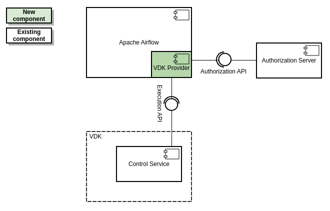
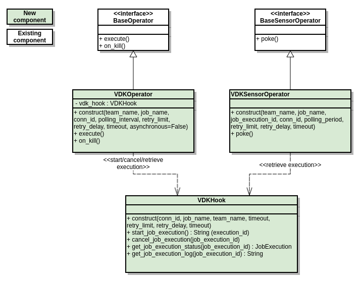
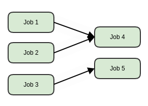

# VEP-554: Apache Airflow Integration

* **Author(s):** Miroslav Ivanov (miroslavi@vmware.com), Antoni Ivanov (
  aivanov@vmware.com), Andon Andonov (andonova@vmware.com)
* **Status:** draft

- [Summary](#summary)
- [Glossary](#glossary)
- [Motivation](#motivation)
- [Requirements and Goals](#requirements-and-goals)
    - [Goals](#goals)
    - [Non-goals](#non-goals)
- [High-level design](#high-level-design)
- [System Interface (API)](#api-design)
- [Detailed design](#detailed-design)
    - [VDK Provider](#vdk-provider)
        - [VDK Hook](#vdk-hook)
        - [VDK Operator](#vdk-operator)
        - [VDK Sensor Operator](#vdk-sensor-operator)
        - [Connection](#connection)
        - [Sample DAG](#sample-dag)
- [Security and Permissions](#security-and-permissions)
- [Implementation Stories](#implementation-stories)
- [Alternatives](#alternatives)

## Summary

This VEP outlines the architectural changes required to provide VDK users with the
ability to do multi-jobs non-linear analytics. The support for definition of dependencies
between Data Jobs will be introduced by integrating VDK with Apache Airflow.

The integration itself will be achieved through the VDK Provider implementation. The
provider will be deployed on private Airflow deployment and will be responsible for
managing Data Jobs.

## Glossary

* **VDK**: https://github.com/vmware/versatile-data-kit/wiki/dictionary#vdk
* **Control
  Service**: https://github.com/vmware/versatile-data-kit/wiki/dictionary#control-service
* **Data Job**: https://github.com/vmware/versatile-data-kit/wiki/dictionary#data-job
* **Data Job
  Step**: https://github.com/vmware/versatile-data-kit/wiki/dictionary#data-job-step
* **Data Job
  Execution**: https://github.com/vmware/versatile-data-kit/wiki/dictionary#data-job-execution
* **Apache Airflow (Airflow)**: https://airflow.apache.org/
* **Airflow
  Connection**: https://airflow.apache.org/docs/apache-airflow/stable/howto/connection.html
* **VDK Provider**: VDK Airflow Community
  Provider (https://airflow.apache.org/docs/apache-airflow-providers/)
* **DAG**: Directed Acyclic Graph
* **Data Mart**: Database with a set of tables

## Motivation

Тhe need for multi-job non-linear analytics is growing. Users need to be able to define
dependencies between Data Jobs. For instance, they need to ingest from multiple systems
into Data Lake to model the data. All lake tables are used afterwards by subsequent
processing jobs to generate Data Marts. The processing jobs start only after the
ingestion jobs are over.

Currently, VDK supports only multi-step linear analytics by defining sequential steps
within a single process (job). The steps can be written either in SQL or Python. Due to
the fact that the steps are linear and with limited ability to run in parallel, more
complex non-linear analytics cannot be done.

There are two workarounds to solve this:

1. Ingestion and processing jobs can be defined as sequential steps in a single job.
   However, this approach has several drawbacks:
    * The steps are sequential with limited ability to run in parallel.
    * The execution time of the Data Job is limited (currently up to 12 hours).

2. Ingestion and processing jobs can be scheduled at a certain time with an appropriate
   time offset between them (e.g. the ingestion jobs start at 2 p.m., as the processing
   jobs starts 8 p.m.). However, this approach is not reliable as the users need to know
   how long the jobs will take, some jobs may take more time than usual.

The support for the definition of dependencies between the jobs will be introduced, in
order to provide the ability to do multi-job non-linear analytics to our users. It will
be achieved through the integration of VDK with Apache Airflow.

Airflow has been chosen because it is a tool that can create, organize, and monitor
workflows. It is open-source, hence it is free and has a wide range of support as well.
It is one of the most trusted platforms that is used for orchestrating workflows and is
widely used and recommended by top data engineers. This tool provides many features like
a proper visualization of data pipelines and workflows, workflow status, data logs, and
codes in detail. Airflow is a distributed system that is highly scalable and can be
connected to various sources, which makes it flexible. These features allow it to be used
efficiently in the orchestration of complex workflow and data pipelining problems.

## Requirements and Goals

### Goals

#### Provide an ability to define dependencies between Data Jobs

A user wants to start a second job after the first job is over. For example, the user has
several jobs, after each job is complete, the user would like to start a common
post-processing job.

Use cases:

* Sync between multiple synchronous ingestion and processing jobs - the user needs to be
  able to ingest from multiple systems into Data Lake to model the data. All lake tables
  are used afterwards by subsequent processing jobs to generate Data Marts. The
  processing jobs start only after the ingestion jobs are over.
* Ability to restart the failed workflow - when a single workflow task fails, the user
  should be able to restart the workflow, and only failed jobs and those associated with
  them should be executed.
* Trigger a job based on previous job status in the DAG - when there is "Data Mart tables
  dependencies (DAG)", some jobs should be available as optional (e.g. DAG should not
  fail if steps fail).

#### Contribute a custom provider to Airflow Community

#### Executing Data Jobs should be enabled by private Airflow deployments

User cases:

* Users want to create operational and analytics pipelines of jobs.
* Users already own their Airflow deployment.

#### Comparison of VDK with Apache Airflow

### Non-goals

#### VDK will not be installing or managing Apache Airflow through the Helm Chart

## High-level design



Apache Airflow 2 is built in a modular way. The "Core" of Apache Airflow provides core
scheduler functionality which allows you to write some basic tasks, but the capabilities
of Apache Airflow can be extended by installing additional packages, called providers.

Providers can contain operators, sensors, hooks, and transfer operators to communicate
with a multitude of external systems, but they can also extend Airflow core with new
capabilities.

The proposed design describes the solution for supporting multi-jobs non-linear analytics
by integrating VDK with Apache Airflow. For this purpose, an Apache Airflow Provider
called "VDK Provider" will be implemented and responsible for managing Data Jobs. It will
give us the ability to define DAGs in which the tasks (jobs) will be defined by
instantiating custom operators. The operators will start and monitor Data Job executions
via the Control Service Execution API.

In order to speed up the VDK popularization and provide easier integration with Airflow
to our users, the VDK Provider will be contributed to the Airflow Community.

## API design

No changes to the public API.

## Detailed design

### VDK Provider

The integration of VDK with Apache Airflow will be accomplished by VDK Provider
implementation. It will provide an ability to the users to define Airflow Workflow that
consists of Data Jobs. Basically, it will be responsible for managing Data Job
executions (starting, canceling, retrieving). As can be seen from the below diagram the
provider will consist of a hook, operator, and sensor.



Users will be able to choose from two operating modes - synchronous and asynchronous,
depending on their Data Jobs and needs. The synchronous mode will be achieved by
providing an operator derived from `airflow.models.baseoperator.BaseOperator`, which
executes a Data Job and waits for its completion. The asynchronous mode will be achieved
by providing a sensor operator derived from `airflow.sensors.base.BaseSensorOperator`,
which polls on the specific time intervals for job execution completion and does not hold
the Airflow Worker.

#### VDK Hook

Airflow Hooks act as an interface for communication with the external shared resources in
a DAG. In our case, the VDKHook will encapsulate the logic for the communication with the
Control Service. It will provide methods for starting, canceling, and retrieving Data Job
executions. Also, it will contain a built-in HTTP client with configurable retry and
authentication mechanisms. The hook also will help to avoid storing connection
authentication parameters in a DAG by using Airflow Connection.

In this way, the implemented logic can be reused in different operators
(e.g. VDKOperator and VDKSensorOperator). Such an approach provides better decoupling and
utilization of added integration.

#### VDK Operator

The extensibility is one of the many reasons which make Apache Airflow powerful. Airflow
allows us to create a custom operator that suits our requirements to communicate with
Control Service via Execution API.

VDKOperator is responsible for the **synchronous** execution of Data Jobs. It starts a
Data Job execution and waits for its completion. While it is waiting for the job
execution completion, it does not release the Airflow Worker. For that reason, it is not
recommended for long-running Data Jobs and `VDKSensorOperator` should be used instead.

It is defined by extending the `airflow.models.baseoperator.BaseOperator`,
defining `execute` and `on_kill` methods:

* Execute - It defines the code to be executed when the Airflow Runner calls the
  operator. Based on
  `asynchronous` variable (by default=False) which indicates whether the method should
  start a data job execution and wait for its completion or just start data job execution
  and return an execution id. The `asynchronous`=True is used in combination with
  VDKSensorOperator (more on that below).
* on_kill - This method cancels the Data Job execution when an Airflow task instance gets
  killed.

Usage:

```python
from airflow import DAG
from airflow.providers.vdk.operators.vdk import VDKOperator

with DAG:
   # [START sync_data_job]
   sync_data_job = VDKOperator(
      job_name='sync_data_job',
   )
   # [END sync_data_job]

   sync_data_job
```

#### VDK Sensor Operator

Airflow provides a primitive for a special kind of operator, whose purpose is to poll
some state (e.g. data job completion) at regular intervals until a success criterion is
met. Sensors have a powerful feature called 'reschedule' mode, which allows the Airflow
Scheduler to reschedule a sensor task, rather than blocking a worker slot between pokes.
This is useful when you can tolerate a longer poll interval and expect to be polling for
a long time.

VDKSensorOperator is responsible for the **asynchronous** execution of Data Jobs in
combination with VDKOperator. As the sensors only have the ability to poll the state of
data job execution, the VDKOperator has to be used to start it. The sensor is defined by
extending the airflow.sensors.base.BaseSensorOperator and defining a `poke` method to
poll Data Job execution state and evaluate the job execution completion.

Usage:

```python
from airflow import DAG
from airflow.providers.vdk.operators.vdk import VDKOperator
from airflow.providers.vdk.sensors.vdk import VDKSensorOperator

with DAG:
   # [START async_data_job]
   start_async_data_job = VDKOperator(
      job_name='async_data_job',
      asynchronous=True,
   )

   async_data_job = VDKSensorOperator(
      job_name='async_data_job',
      job_execution_id=start_async_data_job.output,
   )
   # [END async_data_job]

   async_data_job
```

#### Sample DAG

```python
from airflow import DAG
from airflow.providers.vdk.operators.vdk import VDKOperator
from airflow.providers.vdk.sensors.vdk import VDKSensorOperator

with DAG(
   dag_id='sample_vdk_dag',
   schedule_interval=None,
   start_date=datetime(2022, 3, 3),
   catchup=False,
   default_args={'team_name': 'default_team_name', 'conn_id': 'default_conn_id'},
) as dag:
   # [START sync_data_job]
   sync_data_job = VDKOperator(
      job_name='sync_data_job',
   )
   # [END sync_data_job]

   # [START async_data_job]
   start_async_data_job = VDKOperator(
      job_name='async_data_job',
      asynchronous=True,
   )

   async_data_job = VDKSensorOperator(
      job_name='async_data_job',
      job_execution_id=start_async_data_job.output,
   )
   # [END async_data_job]

   sync_data_job >> async_data_job
```

### Availability

The availability of the VDK Provider will be managed by Airflow since it is going to be
deployed as part of the Airflow ecosystem. Possible downtime of both Authorization Server
and Control Service will be handled by implementing exponential backoff algorithm. Also,
it is going to be fully configurable through the Airflow Connection.

### Capacity Estimation and Constraints

The load to the Control Service APIs from the Provider mostly depends on the following
factors:

* Number of concurrent Data Job Executions across the Airflow Workflows
* Data Job Executions duration
* Provider polling interval (by default 30 seconds, but it is configurable)

A workflow that consists of one Data Job is going to perform 2 requests per minute to the
Control Service APIs.

For example, the following workflow consists of 5 Data Jobs like follows:

* `Job 4` depends on `Job 1` and `Job 2`
* `Job 5` depends on `Job 3`
* The execution time of each of the following jobs is about 4 hours: `Job 1`, `Job 2`
  , and `Job 3`
* The execution time of each of the following jobs is about 2 hours: `Job 4`
  and `Job 5`



During the first 4 hours of the workflow execution, the Provider will perform about 6 (
3 jobs * 2 requests/minute) requests per minute or 1440 requests in total. For the next 2
hours the Provider will perform about 4 (2 jobs * 2 requests/minute) requests per minute
or 440 requests in total. In total the Provider will perform 1880 requests for the whole
workflow execution.

### Troubleshooting

The Data Jobs within the same workflow will have the same unique operation id (op_id).
The operation id will be provided by the operators through the HTTP header `X-OPID` of
the Control Service APIs.

<!--
* Performance.
    * Consider performance of data operations for different types of workloads. Consider
      performance of control operations
    * Consider performance under steady state as well under various pathological
      scenarios, e.g., different failure cases, partitioning, recovery.
    * Performance scalability along different dimensions, e.g. #objects, network
      properties (latency, bandwidth), number of data jobs, processed/ingested data, etc.
* Telemetry and monitoring changes (new metrics).
* Configuration changes.
* Upgrade / Downgrade Strategy (especially if it might be breaking change).
* Troubleshooting
    * What are possible failure modes.
        * Detection: How can it be detected via metrics?
        * Mitigations: What can be done to stop the bleeding, especially for already
          running user workloads?
        * Diagnostics: What are the useful log messages and their required logging levels
          that could help debug the issue?
        * Testing: Are there any tests for failure mode? If not, describe why._
* Operability
    * What are the SLIs (Service Level Indicators) an operator can use to determine the
      health of the system.
    * What are the expected SLOs
* Dependencies
    * On what services the feature depends on ? Are there new (external) dependencies
      added?
-->

### Test Plan
Unit and integration tests will be introduced by following the official Airflow guides:
* https://airflow.apache.org/docs/apache-airflow-providers/howto/create-update-providers.html#initial-code-and-unit-tests
* https://github.com/apache/airflow/blob/main/TESTING.rst#airflow-integration-tests

### Security and Permissions

The communication between VDK Provider and Control Service will be secured through the
use of HTTPS and OAuth 2.0 (as defined in [RFC6749](https://datatracker.ietf.org/doc/html/rfc6749)). The most commonly used OAuth 2.0
flows will be supported by using and extending existing `vdk-control-cli`
authentication functionality. The functionality would be extracted as a stand-alone
library, which would make it more concise and lightweight, avoiding the
installation of unneeded dependencies.

Having a stand-alone authentication library would also allow for the
implementation of authentication flows like Basic Authentication with
client credentials and described in RFC6749 as [Client Credentials Grant](https://datatracker.ietf.org/doc/html/rfc6749#section-4.4), which would not
necessarily be used by vdk-control-cli.

The library would provide an authentication class, which would accept
arguments for identifying the client. For the case of the Airflow Provider
a refresh token, as defined in https://datatracker.ietf.org/doc/html/rfc6749#section-1.5
would be passed to this authentication class, though the class would be
capable of accepting other arguments like username/password and client
id/secret in case authentication flows requiring those are adopted in the
future.

Other arguments that would be accepted by the authentication class would be
authorization server endpoint as defined in https://datatracker.ietf.org/doc/html/rfc6749#section-1.1, which is to be called to obtain access token)
and a boolean flag indicating if the credentials/secrets should be cached
locally (by default this flag would be false, as in Airflow, we cannot
cache data locally).

If caching is enabled, the secrets and api tokens would need to be encrypted,
as we do not have control over user environments, and we cannot guarantee that the file
containing them would not end up in version control by mistake.

For storing the secrets in Airflow, a standard Airflow Connection object
would be used,

```python
Connection(
  conn_id="",
  conn_type="vdk_default",
  description=None,
  login="<username-or-empty>",
  password="<password-or-empty>",
  host="<Control-Service-host-URL>",
  port="<Control-Service-port>",
  schema=None,
  extra=json.dumps(
      dict(
          auth_server="<oauth2-authorization-server>",
          auth_type="<authentication-type>",
          client_id="<optional-user-client-id>",
          secret="<optional-client-secret>",
          token="<optional-oauth2/refresh-token>"
      )
  )
)
```
where the `conn_type` would be "vdk_default" to identify that this is a
Versatile Data Kit Connection. For the authentication to be successful,
users would need to provide `auth_server`, which should be a URL to the
authorization server used to authenticate the user and `auth_type` indicating
the authentication type. For this feature, the only supported
authentication flow would be through the above-mentioned Refresh Token.
However, having `auth_type` would allow us to adopt other authentication
flows, like basic authentication through username/password, in the future.

In terms of security, Airflow uses [Fernet](https://github.com/fernet/spec/)
to encrypt passwords in connection configurations, which should be sufficient.


<!--
How is access control handled?
* Is encryption in transport supported and how is it implemented?
* What data is sensitive within these components? How is this data secured?
    * In-transit?
    * At rest?
    * Is it logged?
* What secrets are needed by the components? How are these secrets secured and attained?
-->

## Implementation stories

TODO
<!--
Optionally, describe what are the implementation stories (eventually we'd create github issues out of them).
-->

## Alternatives

TODO
<!--
Optionally, describe what alternatives has been considered.
Keep it short - if needed link to more detailed research document.
-->
