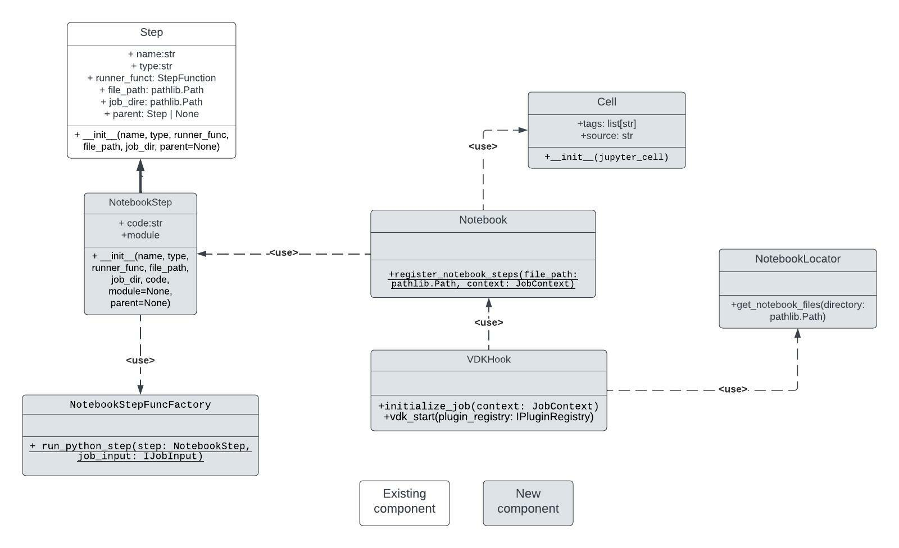
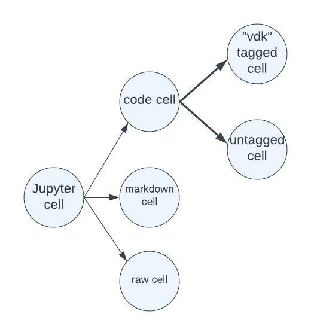

# VEP-994: Jupyter Notebook Integration

* **Author(s):** Duygu Hasan(hduyg@vmware.com)
* **Status:** draft

- [Summary](#summary)
- [Glossary](#glossary)
- [Motivation](#motivation)
- [Requirements and goals](#requirements-and-goals)
- [High-level design](#high-level-design)
- [API Design](#api-design)
- [Detailed design](#detailed-design)
- [Implementation stories](#implementation-stories)
- [Alternatives](#alternatives)

## Summary

<!--
Short summary of the proposal. It will be used as user-focused
documentation such as release notes or a (customer facing) development roadmap.
The tone and content of the `Summary` section should be
useful for a wide audience.
-->

## Glossary

* VDK: https://github.com/vmware/versatile-data-kit/wiki/dictionary#vdk
* Notebook: A .ipynb file.
* Notebook cell: a multiline text input field
* Magic: Magic functions are pre-defined functions(“magics”) in Jupyter kernel that executes supplied commands.

## Motivation

Versatile Data Kit provides utilities for developing SQL and Python data jobs and deploying them in the cloud. However, the only interface it has for development is the CLI.

As a workload users install their own IDE (PyCharm, for example) locally and configure it with VDK. However, VDK is used by people who do not want to nor need to learn how to work with CLI and install and configure IDEs.
Moreover, many of our users are data scientists who work with big data, and they prefer working with notebooks especially for visualizing and testing. After some interviews we did, and demos we watched, we saw that users switch from IDEs to notebooks in order to see how the data changes (it is easier for them to do it in notebooks since it provides better visualization) and they do some changes on the code there (they are testing small sections which can lead to changes in small sections) which leads to copy pasting the new code from the notebook to the IDE. The whole process of switching from one place to another is inconvenient and tedious. It would be much easier for the users to just open a familiar UI and enter their SQL queries or Python code, without using the CLI and without copy pasting code from one place to another.

Furthermore, currently VDK users need to rerun the whole Data job again every time they do a small change on the code, or a single unit fails. This could be rather time-consuming since the ELT process might be slow. For example, extracting and loading data again only for a small change in transformation.
By integrating VDK with Jupyter we want to make VDK more accessible and  present those users better experience and with their natural choice and make their VDK onboarding process much easier

Jupyter is chosen because it is  very well-known among the data community, it is de-facto the current standard – see:
1. https://towardsdatascience.com/top-4-python-and-data-science-ides-for-2021-and-beyond-3bbcb7b9bc44#:~:text=JupyterLab,hacks%20for%20more%20advanced%20use
2. https://businessoverbroadway.com/2020/07/14/most-popular-integrated-development-environments-ides-used-by-data-scientists/


## Requirements and goals

### Requirements
Legend (terms and table are based on Pragmatic Marketing recommendations):
* Problem - a discrete pain or issue that has been observed within the target market segment. In the below table it's a short summary name of the problem.
* Use Scenario - a description of a problem. Includes a detailed description of the typical situation that causes this problem to occur and possibly current results.
* Evidence - the percentage of interviewed users who have mentioned the problem.
* Impact - how much impact does the problem have on their work (high/moderate/low).

|                   Problem                   |                                                                                                                  Use Scenario                                                                                                                  | Evidence |  Impact  |
|:-------------------------------------------:|:----------------------------------------------------------------------------------------------------------------------------------------------------------------------------------------------------------------------------------------------:|:--------:|:--------:|
 |             1. Working with CLI             |                                                                As data engineers we do not have much experience with CLI, we need to learn how to use CLI in order to use VDK.                                                                 |   70%    |   high   |
 |   2.IDEs are not convenient for debugging   |                             As data engineers, we often use Jupyter as a debugging tool instead of using IDE debuggers because of the big data we work with. This leads to copy pasting code from IDE to Jupyter.                              |   70%    |   high   |
 |  3. IDEs are not convenient for for tests   |                              As data engineers, we test code in Jupyter quite often because small changes are more visible in graphics, we run small code blocks in many cells and watch how the graphics change.                              |   70%    | moderate |
 | 4. Moving to production from notebook files | As data engineers we  need to switch from notebooks to python files every time we are moving to production which is done either by copy pasting or using automated functions of Jupyter but might lead to syntax errors and bad coding habits. |   50%    |   low    |
 |    5. Rerun whole job for small changes     |                                                              As data engineers,when we use VDK, we need to rerun the whole job again every time we do a small change on the code.                                                              |   40%    ||     |     |
|     6. Rerun whole job for failing step     |                                                                       As data engineers, when we use VDK, we need to rerun the whole job again every time a step fails.                                                                        |   40%    ||     |     |
|    7. Too many SQL files in one data job    |                 As data engineers,we need to write one SQL statement per file which leads to creating files for simple delete/create queries and we end up creating a lot of SQL files every time we need a complex data job.                  |   30%    |   low    |


### Goals
* The users should have easy access to Jupyter notebook that is integrated with the VDK.
* Provide UI experience  for VDK which will decrease the use of CLI and solve the problems of switching from IDE to Notebook and from Notebook to IDE.
* The solution should be installable in centralized instance of jupyterhub or jupyterlab.
* The solution should provide a way to rerun only failing/changed steps and the steps after them.
* The number of files needed for job steps should be minimized.


## High-level design


JupyterLab is the next-generation user interface for Project Jupyter offering all the familiar building blocks of the classic Jupyter Notebook (notebook, terminal, text editor, file browser, rich outputs, etc.) in a flexible and powerful user interface.
Fundamentally, JupyterLab is designed as an extensible environment. JupyterLab extensions can customize or enhance any part of JupyterLab.

The proposed design describes the solution for creating a Jupyter UI for VDK.
For this purpose, a JupyterLab extension will be implemented, and it will give us the chance to create graphical elements like buttons and widgets – alternatives of currently used CLI commands.

Since JupyterLab works with notebook files the proposed design should support getting the job steps from them and executing them. To the purpose, a new VDK plugin will be introduced which will allow vdk to run steps which came from notebook files.

Since users should be able to work with data jobs directly in .ipynb files, an ipython extension package will be introduced. It will be responsible for loading the data job in the Jupyter environment.
Additionally, support for creating a job with a notebook inside will be provided.

### Ux flows
Please, before reading this section make sure you read the user [guide](https://github.com/vmware/versatile-data-kit/wiki/User-Guide).
You need to understand how VDK currently works to get a better understanding of the changes that will be done.

Pay attention: the job directory which will be mentioned bellow is the standard VDK job directory (but instead of .py and .sql files we will have ipynb files)

|                  Operation                  |                                                                                                                                                                                                                       Flow                                                                                                                                                                                                                        | Covered  use cases | Priority |
|:-------------------------------------------:|:-------------------------------------------------------------------------------------------------------------------------------------------------------------------------------------------------------------------------------------------------------------------------------------------------------------------------------------------------------------------------------------------------------------------------------------------------:|:------------------:|:--------:|
|               Run VDK Jupyter               |                                                                                                                                                                      The user runs a single CLI command which opens the web version of JupyterLab. Examples: vdk jupyter lab                                                                                                                                                                                                                                        |         1          |   high   |
|                    Help                     |                                                                                             After the user enters JupyterLab he will see the VDK drop down menu where he can find the "Help" option. There he will be able to check for more information about how to use the VDK extension and where to find specific buttons and other UI elements                                                                                                                                                                |         1          |   mid    |
|                   Log in                    |                                                                                                       After the user enters Jupyter lab he/she will see the VDK drop down menu where he can find the "Log in" option. It is for authentication against Control service. A pop out with the corresponding login options will be introduced.                                                                                                                                                                          |         1          |   mid    |
|                   Log out                   |                                                                                                                             After the user enters JupyterLab he will see the VDK drop down menu where he can find the "Log out" option. By clicking the option the user will be logged out from the Control Service.                                                                                                                                                                                                |         1          |   mid    |
|                 Create job                  | After the user enters JupyterLab he will see the VDK drop down menu where he can find the "Create job" option. After clicking that option the user gets a pop up where he should enter the needed information for the job that will be created: name, team, directory and whether it will only be created locally or in the cloud as well. After filling all the needed information for the job by clicking a "Create" button it will be created. The job will contain one single notebook file and no other steps. |         1          |   high   |
|                 Delete job                  |                                                                                                                                                                                              "Delete job" will be introduced just like "Create job".                                                                                                                                                                                                                                                                |         1          |   mid    |
|                Work with SQL                |                                                                                                                                                    SQL queries will be executed using python. Using the job_input.execute_query method. These are going to be recognised as Python steps, too.                                                                                                                                                                                                                      |      2,3,4,7       |   high   |
|       Work with Python NotebookSteps        |                                                                     One Python step can be introduced as one cell. The cells that will be part of the job should have a tag ("vdk") that shows that the cell should be included in the job. All the cells that do not have that tag will not be included in the job as a step. One notebook file can have many Python steps.                                                                                                                                        |       2,3,4        |   high   |
|                   Deploy                    |                                     It will be added as an option in the vdk drop down menu mentioned in the first column of the table (where "create", "download" will be). A pop up will be introduced asking for what the user wants to do whether he wants to latest deployed version of specific job, to disable a data job, etc. Afterwards, he will be asked about the needed information to do that.                                                                                                        |         1          |   high   |
|               Download a job                |                                                                                                                                                                                                      Similar to "Create job", "Delete job".                                                                                                                                                                                                                                                                         |         1          |   high   |
|                 Execute job                 |                                                                                                                                                                                                                Similar to "Deploy"                                                                                                                                                                                                                                                                                  |         1          |   mid    |
|             Properties command              |                                                                                                                                      Similar to execute deploy download. After the needed information is filled in the pop up, by clicking a button a window with the result information will be introduced.                                                                                                                                                                                                        |         1          |   low    |
|                List command                 |                                                                                                                                      Similar to execute deploy download. After the needed information is filled in the pop up, by clicking a button a window with the result information will be introduced.                                                                                                                                                                                                        |         1          |   low    |
|                Show command                 |                                                                                                                                      Similar to execute deploy download. After the needed information is filled in the pop up, by clicking a button a window with the result information will be introduced.                                                                                                                                                                                                        |         1          |   low    |
|                   Run job                   |                                                                                         After the user enters JupyterLab he will see the VDK drop down menu where he can find the "Run job" option. After clicking that option the user gets a pop up where he should enter the needed information for the job that will be ran: the location/name/team.                                                                                                                                                            |         1          |   high   |

This is how a notebook with 7 steps would look like:


In contrast to working with SQL and Python files, working with Notebook files would not require  having a def run function with IJobInput parameter to work with job_input.
The job_input variable will be loaded for the current notebook, so the user will have direct access to it.
Since the job_input variable will be already loaded the user can run a step during the development time, but to see how the whole job works he needs to execute the job with the "Run" command
on the VDK menu.

You can find a video presenting a few UI components in the main directory of the VEP.

## API design

A new API to access Job Input interfaces, `VDK.get_initialized_job_input()`, is available only when running a notebook. It is provided by `vdk-ipython` plugin.

Full usage would look like this:
```
%reload_ext vdk.plugin.ipython
%reload_VDK --name=myjob
job_input = VDK.get_initialized_job_input()
```

## Detailed design

### VDK Notebook plugin
 This VDK plugin will provide the functionality to run Jobs which contain notebook files instead of .py and .sql files. This plugin can be used alone without the JupyterLab extension.
As it can be seen from the below diagram the plugin will consist of a new hook and a few new classes.
<!-- Link for the diagram:
 https://lucid.app/lucidchart/f30edac7-1ed0-4e29-8cd7-99fea6aa4592/edit?viewport_loc=-408%2C-134%2C2417%2C1419%2C0_0&invitationId=inv_542e02a8-ca61-4d8b-bb93-6914817eb884
-->



#### VDK Hook
The VDK Hook will encapsulate the logic for the initialization of a job that will get the code from Notebook files. When initialized like that jobs that work with Notebooks will be run as a standard data job which works with .py and .sql files.
It will be using the Notebook and the NotebookLocator classes.
#### NotebookLocator
It is a simple class that has a method that returns the notebook files found in a given directory.
#### Cell
Before giving a proper definition to this class, we should see how we categorize the [Notebook cells](#glossary):



Jupyter itself categorizes the cells into three groups: code, markdown, and raw.
We will be looking into only the code ones since the plugin works only with them.
The code cells can be categorized into two types - ones that are tagged with "vdk" and the ones that are not.
The ones that are untagged are ignored by our plugin, and will not take part in the data job.
The "vdk" tagged cells should have only Python code in it, since VDK does not work with iPython.

The Cell class is a dataclass that encapsulates this logic.

#### Notebook
This class has one static method. The method has the responsibility to register the NotebookSteps to JobContext
from a given notebook file. The context of the job is passed to it by the VDKHook.

#### NotebookStep
As a class NotebookStep is a descendant of the [Step class](https://github.com/vmware/versatile-data-kit/blob/main/projects/vdk-core/src/vdk/internal/builtin_plugins/run/step.py)
with two additional attributes:
* code - used for saving the code gathered from Notebook cells
* module - the module the code will belong to (all the code from the current notebook will belong to that module)

Notebook Steps in a notebook file are executed from top to the bottom - the step
located on the top of the file will be run first, and the one in the bottom will be run last.

#### Python version
<!-- TODO provide a solution to this problem -->
See [issue-1438](https://github.com/vmware/versatile-data-kit/issues/1438).
Currently, the user should look for Python version discrepancies -
VDK and Jupyter Notebooks should be using the same version to avoid unwanted behaviour.

### VDK JupyterLab extension

Before reading this section make sure you fully understand what a JupyterLab extension is.
You can find more information [here](https://jupyterlab.readthedocs.io/en/stable/extension/extension_dev.html).

 This is an extension with frontend (in TypeScript) and backend (in Python) parts.
 The front-end side will be introducing the graphical elements - the VDK menu and its options, and will be responsible with sending requests for executing vdk commands to the server side extension.
 The server extension is a  package that extends to JupyterLab Server’s REST API/endpoints—i.e. adds extra request handlers to Server’s Tornado Web Application.
 It will be responsible with executing the vdk commands and functions according to the
requests sent by the front-end side.

From the diagram below you can see what the extension will consist of:


Example use case:


The extension a data contract to save the user input information. To see more details, check the 

#### Folder Structure

* [vdk-jupyterlab-extension](/projects/vdk-plugins/vdk-jupyter/vdk-jupyterlab-extension): the root folder for all the code.
* [src](/projects/vdk-plugins/vdk-jupyter/vdk-jupyterlab-extension/src): the root folder for all the front-end code
* [vdk-jupyterlab-extension](/projects/vdk-plugins/vdk-jupyter/vdk-jupyterlab-extension/vdk-jupyterlab-extension): the root folder for all the python code for the server extension
* [ui-tests](/projects/vdk-plugins/vdk-jupyter/vdk-jupyterlab-extension/ui-tests): the root folder for the e2e tests
* [schema](/projects/vdk-plugins/vdk-jupyter/vdk-jupyterlab-extension/schema): the directory contains JSON Schemas that describe the settings used by the extension
* [style](/projects/vdk-plugins/vdk-jupyter/vdk-jupyterlab-extension/style): the directory contains CSS for the front-end
* [jupyter-config](/projects/vdk-plugins/vdk-jupyter/vdk-jupyterlab-extension/jupyter-config): contains cofiguration files

### VDK iPython extension

Before reading this section make sure you fully understand what an iPython extension is.
You can find more information [here](https://ipython.readthedocs.io/en/stable/config/extensions/index.html).

This extension introduces a magic commands for Jupyter.
The main responsibilities of the extension are:
* to load a data job to a specified notebook file - the users will be able to work with initialized job_input variable during development of a data job
* to be able to finalise the loaded data job in accordance to the user's preferences

### Availability
The availability of the extension will be managed by JupyterLab since it is going to be run as part of the JupyterLab ecosystem.

### Test Plan
* The front-end extension is using Jest for JavaScript code testing.
* This extension uses Playwright for the integration tests (aka user level tests). More precisely, the JupyterLab helper Galata is used to handle testing the extension in JupyterLab.
* The server extension is using Pytest for Python code testing.
* The VDK notebook plugin will be using Pytest for Python code testing.

### Security and Permissions
In terms of security, Jupyter uses tornado to ensure only authorized user can request the Jupyter server
You can read more [here](https://jupyter-notebook.readthedocs.io/en/stable/security.html#).

VDK Control Service uses authentication in REST API, based on OAuth2 To authenticate specify OAuth2 access token as an Authorization/Bearer Header.
Access token would be generated using one of 2 approaches depending on how Jupyter server is deployed:

* Standalone JupyterLab (catered for individual users in their local environments):
   * Login:
       Initiates the [OAuth2 Authorization Flow](https://tools.ietf.org/html/rfc6749#section-4.1) upon selecting "Login" from the VDK dropdown with callback to the server
       The server would finish the authorization flow leveraging [tornado Oauth2Mixin](https://www.tornadoweb.org/en/stable/auth.html)
       Access token, once received, is securely stored within JupyterLab backend.
   * Logout: Access token data is deleted from the backend
* JupyterHub Deployment (or any other similar multi-user, centralized deployments, with users already authenticated):
   * Login: 
      * When a user wants to access a Jupyter notebook via multi-user notebook server platform (like JupyterHub), usually they would have to authenticate. Upon successful authentication, an access token is generated. VDK can re-use the same access token for authenentication against VDK Control Service. This is optional feature as it may not make sense in some deployments. 
      * The access token can be fetched from the Browser local storage using pre-configured keys specified during installation of vdk-jupyter extension.
      * It is securely sent and stored within JupyterLab backend.
      * As a backup, retains the Standalone Jupyter approach. The Login button can be hidden upon installation if desired though.
      * More information specifically for JupyterHub can be seen [here](https://jupyterhub.readthedocs.io/en/stable/reference/services.html#implementing-your-own-authentication-with-jupyterhub) and [here](https://jupyterhub.readthedocs.io/en/stable/reference/services.html#hub-authentication-and-services)
      * The design aims ot support any similar platform and not specifically JupyterHub. JupyterHub is the most famous example for such platfrom.
   * Logout: Invalidates/deletes the VDK-specific access token without logging the user out of JupyterHub

<!--
Dig deeper into each component. The section can be as long or as short as necessary.
Consider at least the below topics but you do not need to cover those that are not applicable.

### Capacity Estimation and Constraints
    * Cost of data path: CPU cost per-IO, memory footprint, network footprint.
    * Cost of control plane including cost of APIs, expected timeliness from layers above.
### Performance.
    * Consider performance of data operations for different types of workloads.
       Consider performance of control operations
    * Consider performance under steady state as well under various pathological scenarios,
       e.g., different failure cases, partitioning, recovery.
    * Performance scalability along different dimensions,
       e.g. #objects, network properties (latency, bandwidth), number of data jobs, processed/ingested data, etc.
### Database data model changes
### Telemetry and monitoring changes (new metrics).
### Configuration changes.
### Upgrade / Downgrade Strategy (especially if it might be breaking change).
  * Data migration plan (it needs to be automated or avoided - we should not require user manual actions.)
### Operability
  * What are the SLIs (Service Level Indicators) an operator can use to determine the health of the system.
  * What are the expected SLOs (Service Level Objectives).
### Dependencies
  * On what services the feature depends on ? Are there new (external) dependencies added?
-->


## Implementation stories
<!--
Optionally, describe what are the implementation stories (eventually we'd create github issues out of them).
-->

## Alternatives
<!--
Optionally, describe what alternatives has been considered.
Keep it short - if needed link to more detailed research document.
-->
