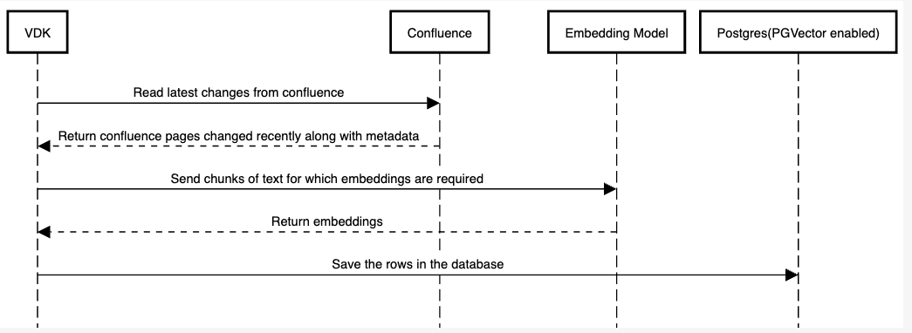

# VEP-milestone-25:  Ingestion into vector database```

* **Author(s):** Paul Murphy (murphp15@tcd.ie), Antoni Ivanov (antoni.ivanov@broadcom.com)
* **Status:** draft

- [Summary](#summary)
- [Glossary](#glossary)
- [Motivation](#motivation)
- [Requirements and goals](#requirements-and-goals)
- [High-level design](#high-level-design)
- [API Design](#api-design)
- [Detailed design](#detailed-design)
- [Implementation stories](#implementation-stories)
- [Alternatives](#alternatives)

## Summary

With the rise in popularity of LLMs and RAG we see VDK as a core component to getting the data where we need it to be.
VDK's strengths are ETL tasks. We see that its very well suited to populating the databases needed for RAG.


## Glossary

*LLM*: Large language model. The most ubiquitous example of this is chatgpt. It is a specialized type of artificial intelligence (AI) that has been trained on vast amounts of text to understand existing content and generate original content.

*RAG*: Retrival augmented generation. Additional information is passed to the LLM through the prompt. This additional information can help it generate better and more context aware responses.

*Vector database*: A database which supports storing vectors(arrays of numbers) and doing similarity searches between vectors(cosine distance, dot product etc...).

*PGVector*: A postgres extension which enables similarity searches in postgres and a vector datatype.

*Chunk*: A piece of text which it makes sense to create an embedding from. Lets look an example. In the case where we are saving confluence docs into a vector store it would be most obvious to create an embedding per paragraph.
However we might find that it really helps to include the page title along with the paragraph when creating the embeddings.

## Motivation

#### Example problem scenario:
A company has a powerful private LLM chatbot.
However they want it to be able to answer questions using the latest version of confluence docs/jira tickets etc...
Retraining every night on the latest tickets/docs is not feasible.
Instead, they opt to use RAG to improve the chatbot responses.

This leaves them with the question.
How do we populate the data?
Steps they need to complete:
1. Read data from confluence/jira or any other data source
2. Chunk into paragraphs(or something similar)
3. Embed into vector space
4. save Vector and paragraph in vector database
5. remove old information. For example if we are scraping jira every hour and we are writing details to the vector database we need to make sure we clean up all embeddings/chunks which were generated from old versions of the ticket.

We will build a datajob in VDK which reads data from confluence or jira and writes it to a postgres instance with PGVector enabled. A embedding model will be running on a different machine which will be exposed through an API.
We will make requests to the API to create embeddings for us.

After this datajob is running we will create a template from this in which we think customers will be able to adopt to meet their use cases.

#### Benefits to customers:
They will be able to follow our template to quickly create similar jobs. This gives customers the ability to get up and runnning quickly.

## Requirements and goals
1. There should be a single pipelines which given jira/confluence credentials can scrape the source
2. it should chunk up the information, embed it and then save it
3. The systems should be easily configurable
   1. Read from different sources
   2. Different chunks sizes
   3. Different embedders
   4. Extra columns saved in database
4. There should be an example on how to build your own ingestion pipeline
5. Only scraping new data and removing old data must be supported


### Non goals
1. This only populates information into a database that could be used by as RAG system. We don't handle stuffing the actual prompts.

## High-level design


## API design
The api design should be heavily influenced by: https://python.langchain.com/docs/modules/data_connection/vectorstores/.

### Vector Database table structure
The table should have a structure like

| embedding     | text chunk                  | document id | metadata |
|---------------|-----------------------------|------------- |------------- |
| [1,2,3,4,5,6] | in this document blah...    | 15 | {"groups_with_access": ["IT", "HR"]} |
| [1,2,3,3,5,6] | other content from same doc | 15 | {"groups_with_access": ["IT", "HR"]} |


### Python code

I think the python code could look something like this.
In it we:
1. delete any files that have been removed since the last scrape
2. Then in a transaction delete all information for a page and in the same transaction write all the new information page
3. The embedding api is abstracted into it own class allowing users to easily provide their own embedding API

For user it may look like that:


```python
# Initialize the Confluence to Vector Database pipeline
pipeline = vdk.ToVectorPipeline(ConfluenceReader(credentials), PostgresInstance, MyEmbeddingApi())

# Execute the pipeline to update the Vector Database with the latest Confluence data
pipeline.update_vector_database(last_timestamp)
```

The goal is to simplify the entire process into two lines of code for typical use cases, covering data extraction, chunking, embedding creation, and saving in the DB.
- Incorporates incremental updates with deduplication and deletion
- Regular updates to the Vector DB with the latest content.
- Automate data extraction, chunking, embedding, and DB storage.
- Provide defaults for easy quick start, with customization options for complex needs

Internally the ToVectorPipeline may do something like that (very simplified for bringing more clarity purpose):
```python
PostgresInstance.delete(ConfluenceReader(credentials_for_confluence).find_removed_document(last_timestamp))
raw_page_or_tickets : Iterable[Union[PageChanges]] = ConfluenceReader(credentials_for_confluence).load(last_timestamp)
with postgres_start_transaction as transaction:
   PostgresInstance.delete([a.document_id for a in raw_page_or_tickets])
   documents = CharacterTextSplitter(chunk_size=1000, chunk_overlap=0).split_documents(raw_page_or_tickets)
   PostgresInstance.from_documents(documents, MyEmbeddingApi())
```

## Detailed design
<!--
Dig deeper into each component. The section can be as long or as short as necessary.
Consider at least the below topics but you do not need to cover those that are not applicable.

### Capacity Estimation and Constraints
    * Cost of data path: CPU cost per-IO, memory footprint, network footprint.
    * Cost of control plane including cost of APIs, expected timeliness from layers above.
### Availability.
    * For example - is it tolerant to failures, What happens when the service stops working
### Performance.
    * Consider performance of data operations for different types of workloads.
       Consider performance of control operations
    * Consider performance under steady state as well under various pathological scenarios,
       e.g., different failure cases, partitioning, recovery.
    * Performance scalability along different dimensions,
       e.g. #objects, network properties (latency, bandwidth), number of data jobs, processed/ingested data, etc.
### Database data model changes
### Telemetry and monitoring changes (new metrics).
### Configuration changes.
### Upgrade / Downgrade Strategy (especially if it might be breaking change).
  * Data migration plan (it needs to be automated or avoided - we should not require user manual actions.)
### Troubleshooting
  * What are possible failure modes.
    * Detection: How can it be detected via metrics?
    * Mitigations: What can be done to stop the bleeding, especially for already
      running user workloads?
    * Diagnostics: What are the useful log messages and their required logging
      levels that could help debug the issue?
    * Testing: Are there any tests for failure mode? If not, describe why._
### Operability
  * What are the SLIs (Service Level Indicators) an operator can use to determine the health of the system.
  * What are the expected SLOs (Service Level Objectives).
### Test Plan
  * Unit tests are expected. But are end to end test necessary. Do we need to extend vdk-heartbeat ?
  * Are there changes in CICD necessary
### Dependencies
  * On what services the feature depends on ? Are there new (external) dependencies added?
### Security and Permissions
  How is access control handled?
  * Is encryption in transport supported and how is it implemented?
  * What data is sensitive within these components? How is this data secured?
      * In-transit?
      * At rest?
      * Is it logged?
  * What secrets are needed by the components? How are these secrets secured and attained?
-->


## Implementation stories
<!--
Optionally, describe what are the implementation stories. Link to Milestone or initiative in Github is fine
As part of the implementation make sure to include stories covering release/launch plan, promotional activities before the release,
-->

## Alternatives
<!--
Optionally, describe what alternatives has been considered.
Keep it short - if needed link to more detailed research document.
-->
